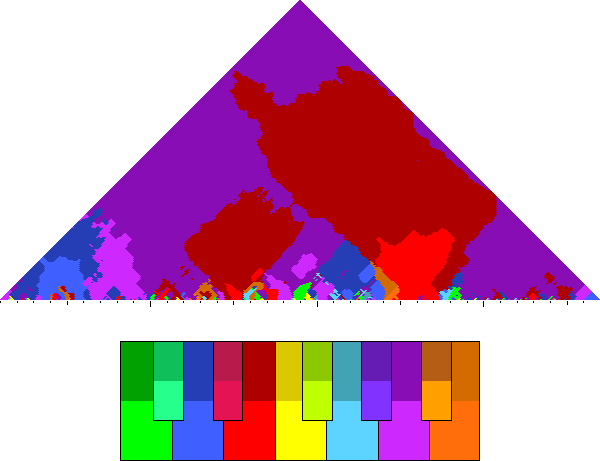
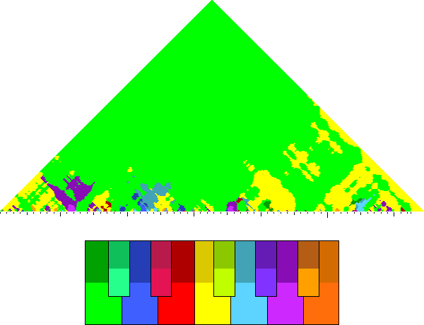
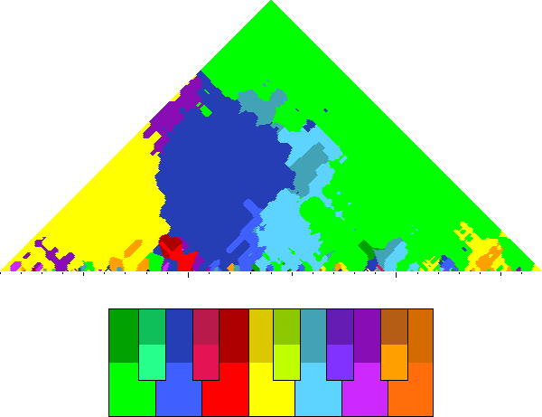
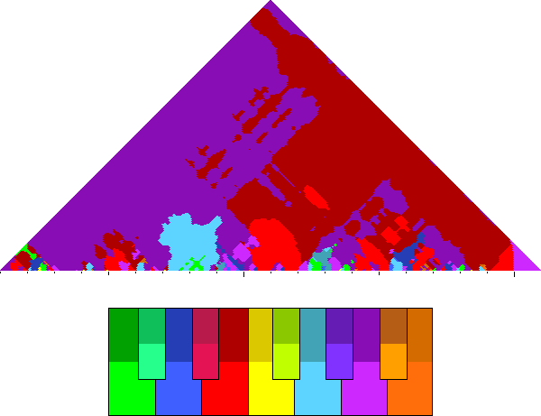
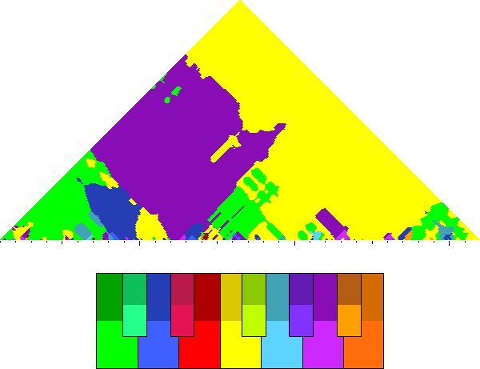
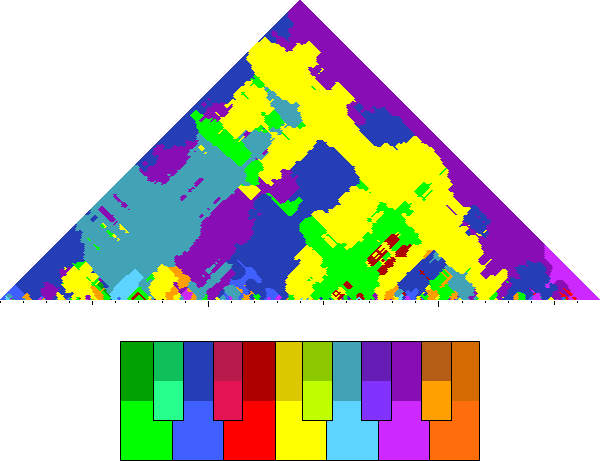
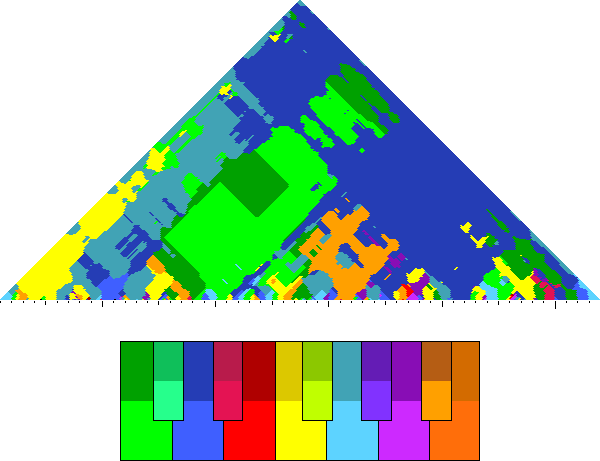
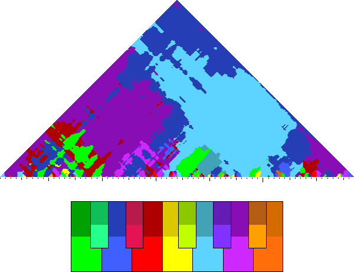

<h1> Pitchscapes </h1>

<a target="_blank"
href="http://extras.humdrum.org/man/mkeyscape">Pitchscape</a> display
the most common pitch at various timescapes in musical works.  Each
color in the following plot indicates a different pitch.  A
key-to-color map is given underneath each plot for reference.  Black
tick marks below each plot show the location of barlines in the
score, while the vertical axis shows the strength/duration of the
key region.  Click on the ID for a particular work to view the music
notation.  Only complete works with no missing parts are included
on this page.

<table style="display:inline-block; padding-left:20px; padding-right:20px; vertical-align:top; max-width:425px;">
<tr>
	<td style="position:relative" colspan="2">
		
		
play

	</td>
</tr>

<tr>
	<td>
		<b>ID:</b>
	</td>
	<td>
		<a target="_blank" href="http://tassomusic.org/work/?id=Trm0003b">Trm0003b</a>
	</td>
</tr>

<tr>
	<td>
		<b>Composer:</b>
	</td>
	<td>
		Marenzio, Luca / 1585
	</td>
</tr>

<tr>
	<td>
		<b>Title</b>
	</td>
	<td>
		<i>Su l'ampia fronte il crespo oro lucente</i> (rime 3)
	</td>
</tr>

<tr>
	<td>
		<b>Final</b>
	</td>
	<td>
		(A)D
	</td>
</tr>

</table>

<table style="display:inline-block; padding-left:20px; padding-right:20px; vertical-align:top; max-width:425px;">
<tr>
	<td style="position:relative" colspan="2">
		
		
play

	</td>
</tr>

<tr>
	<td>
		<b>ID:</b>
	</td>
	<td>
		<a target="_blank" href="http://tassomusic.org/work/?id=Trm0023c">Trm0023c</a>
	</td>
</tr>

<tr>
	<td>
		<b>Composer:</b>
	</td>
	<td>
		Felis, Stefano / 1591
	</td>
</tr>

<tr>
	<td>
		<b>Title</b>
	</td>
	<td>
		<i>Io non posso gioire</i> (rime 23)
	</td>
</tr>

<tr>
	<td>
		<b>Final</b>
	</td>
	<td>
		G
	</td>
</tr>

</table>

<table style="display:inline-block; padding-left:20px; padding-right:20px; vertical-align:top; max-width:425px;">
<tr>
	<td style="position:relative" colspan="2">
		
		
play

	</td>
</tr>

<tr>
	<td>
		<b>ID:</b>
	</td>
	<td>
		<a target="_blank" href="http://tassomusic.org/work/?id=Trm0023e">Trm0023e</a>
	</td>
</tr>

<tr>
	<td>
		<b>Composer:</b>
	</td>
	<td>
		Pallavicino, Benedetto / 1612
	</td>
</tr>

<tr>
	<td>
		<b>Title</b>
	</td>
	<td>
		<i>Io non posso gioire</i> (rime 23)
	</td>
</tr>

<tr>
	<td>
		<b>Final</b>
	</td>
	<td>
		G
	</td>
</tr>

</table>

<table style="display:inline-block; padding-left:20px; padding-right:20px; vertical-align:top; max-width:425px;">
<tr>
	<td style="position:relative" colspan="2">
		
		
play

	</td>
</tr>

<tr>
	<td>
		<b>ID:</b>
	</td>
	<td>
		<a target="_blank" href="http://tassomusic.org/work/?id=Trm0024a">Trm0024a</a>
	</td>
</tr>

<tr>
	<td>
		<b>Composer:</b>
	</td>
	<td>
		Felis, Stefano / 1591
	</td>
</tr>

<tr>
	<td>
		<b>Title</b>
	</td>
	<td>
		<i>Già non son io contento</i> (rime 24)
	</td>
</tr>

<tr>
	<td>
		<b>Final</b>
	</td>
	<td>
		G
	</td>
</tr>

</table>

<table style="display:inline-block; padding-left:20px; padding-right:20px; vertical-align:top; max-width:425px;">
<tr>
	<td style="position:relative" colspan="2">
		
		
play

	</td>
</tr>

<tr>
	<td>
		<b>ID:</b>
	</td>
	<td>
		<a target="_blank" href="http://tassomusic.org/work/?id=Trm0025b">Trm0025b</a>
	</td>
</tr>

<tr>
	<td>
		<b>Composer:</b>
	</td>
	<td>
		Pallavicino, Benedetto / 1600
	</td>
</tr>

<tr>
	<td>
		<b>Title</b>
	</td>
	<td>
		<i>Come vivrò ne le mie pene, Amore</i> (rime 25)
	</td>
</tr>

<tr>
	<td>
		<b>Final</b>
	</td>
	<td>
		G
	</td>
</tr>

</table>

<table style="display:inline-block; padding-left:20px; padding-right:20px; vertical-align:top; max-width:425px;">
<tr>
	<td style="position:relative" colspan="2">
		
		
play

	</td>
</tr>

<tr>
	<td>
		<b>ID:</b>
	</td>
	<td>
		<a target="_blank" href="http://tassomusic.org/work/?id=Trm0028a">Trm0028a</a>
	</td>
</tr>

<tr>
	<td>
		<b>Composer:</b>
	</td>
	<td>
		Zanotti, Camillo / 1587
	</td>
</tr>

<tr>
	<td>
		<b>Title</b>
	</td>
	<td>
		<i>Giacea la mia virtù vinta e smarrita</i> (rime 28)
	</td>
</tr>

<tr>
	<td>
		<b>Final</b>
	</td>
	<td>
		(A)D
	</td>
</tr>

</table>

<table style="display:inline-block; padding-left:20px; padding-right:20px; vertical-align:top; max-width:425px;">
<tr>
	<td style="position:relative" colspan="2">
		
		
play

	</td>
</tr>

<tr>
	<td>
		<b>ID:</b>
	</td>
	<td>
		<a target="_blank" href="http://tassomusic.org/work/?id=Trm0038a">Trm0038a</a>
	</td>
</tr>

<tr>
	<td>
		<b>Composer:</b>
	</td>
	<td>
		Porta, Costanzo / 1573
	</td>
</tr>

<tr>
	<td>
		<b>Title</b>
	</td>
	<td>
		<i>Stavasi Amor quasi in regno assiso</i> (rime 38)
	</td>
</tr>

<tr>
	<td>
		<b>Final</b>
	</td>
	<td>
		E
	</td>
</tr>

</table>

<table style="display:inline-block; padding-left:20px; padding-right:20px; vertical-align:top; max-width:425px;">
<tr>
	<td style="position:relative" colspan="2">
		
		
play

	</td>
</tr>

<tr>
	<td>
		<b>ID:</b>
	</td>
	<td>
		<a target="_blank" href="http://tassomusic.org/work/?id=Trm0047a">Trm0047a</a>
	</td>
</tr>

<tr>
	<td>
		<b>Composer:</b>
	</td>
	<td>
		Pallavicino, Benedetto / 1579
	</td>
</tr>

<tr>
	<td>
		<b>Title</b>
	</td>
	<td>
		<i>Non è questa la mano</i> (rime 47)
	</td>
</tr>

<tr>
	<td>
		<b>Final</b>
	</td>
	<td>
		D
	</td>
</tr>

</table>

<table style="display:inline-block; padding-left:20px; padding-right:20px; vertical-align:top; max-width:425px;">
<tr>
	<td style="position:relative" colspan="2">
		
		
play

	</td>
</tr>

<tr>
	<td>
		<b>ID:</b>
	</td>
	<td>
		<a target="_blank" href="http://tassomusic.org/work/?id=Trm0047l">Trm0047l</a>
	</td>
</tr>

<tr>
	<td>
		<b>Composer:</b>
	</td>
	<td>
		Gastoldi, Giovanni Giacomo / 1588
	</td>
</tr>

<tr>
	<td>
		<b>Title</b>
	</td>
	<td>
		<i>Non è questa la mano</i> (rime 47)
	</td>
</tr>

<tr>
	<td>
		<b>Final</b>
	</td>
	<td>
		D
	</td>
</tr>

</table>

<table style="display:inline-block; padding-left:20px; padding-right:20px; vertical-align:top; max-width:425px;">
<tr>
	<td style="position:relative" colspan="2">
		
		
play

	</td>
</tr>

<tr>
	<td>
		<b>ID:</b>
	</td>
	<td>
		<a target="_blank" href="http://tassomusic.org/work/?id=Trm0047m">Trm0047m</a>
	</td>
</tr>

<tr>
	<td>
		<b>Composer:</b>
	</td>
	<td>
		Giovannelli, Ruggiero / 1588
	</td>
</tr>

<tr>
	<td>
		<b>Title</b>
	</td>
	<td>
		<i>Non è questa la mano</i> (rime 47)
	</td>
</tr>

<tr>
	<td>
		<b>Final</b>
	</td>
	<td>
		G
	</td>
</tr>

</table>

<table style="display:inline-block; padding-left:20px; padding-right:20px; vertical-align:top; max-width:425px;">
<tr>
	<td style="position:relative" colspan="2">
		
		
play

	</td>
</tr>

<tr>
	<td>
		<b>ID:</b>
	</td>
	<td>
		<a target="_blank" href="http://tassomusic.org/work/?id=Trm0047n">Trm0047n</a>
	</td>
</tr>

<tr>
	<td>
		<b>Composer:</b>
	</td>
	<td>
		Castro, Jean de / 1591
	</td>
</tr>

<tr>
	<td>
		<b>Title</b>
	</td>
	<td>
		<i>Non è questa la mano</i> (rime 47)
	</td>
</tr>

<tr>
	<td>
		<b>Final</b>
	</td>
	<td>
		G
	</td>
</tr>

</table>

<table style="display:inline-block; padding-left:20px; padding-right:20px; vertical-align:top; max-width:425px;">
<tr>
	<td style="position:relative" colspan="2">
		
		
play

	</td>
</tr>

<tr>
	<td>
		<b>ID:</b>
	</td>
	<td>
		<a target="_blank" href="http://tassomusic.org/work/?id=Trm0047q">Trm0047q</a>
	</td>
</tr>

<tr>
	<td>
		<b>Composer:</b>
	</td>
	<td>
		Gesualdo, Carlo / 1594 
	</td>
</tr>

<tr>
	<td>
		<b>Title</b>
	</td>
	<td>
		<i>Non è questa la mano</i> (rime 47)
	</td>
</tr>

<tr>
	<td>
		<b>Final</b>
	</td>
	<td>
		(D)A
	</td>
</tr>

</table>

<table style="display:inline-block; padding-left:20px; padding-right:20px; vertical-align:top; max-width:425px;">
<tr>
	<td style="position:relative" colspan="2">
		
		
play

	</td>
</tr>

<tr>
	<td>
		<b>ID:</b>
	</td>
	<td>
		<a target="_blank" href="http://tassomusic.org/work/?id=Trm0047s">Trm0047s</a>
	</td>
</tr>

<tr>
	<td>
		<b>Composer:</b>
	</td>
	<td>
		Montella, Giovan Domenico / 1604
	</td>
</tr>

<tr>
	<td>
		<b>Title</b>
	</td>
	<td>
		<i>Non è questa la mano</i> (rime 47)
	</td>
</tr>

<tr>
	<td>
		<b>Final</b>
	</td>
	<td>
		F
	</td>
</tr>

</table>

<table style="display:inline-block; padding-left:20px; padding-right:20px; vertical-align:top; max-width:425px;">
<tr>
	<td style="position:relative" colspan="2">
		
		
play

	</td>
</tr>

<tr>
	<td>
		<b>ID:</b>
	</td>
	<td>
		<a target="_blank" href="http://tassomusic.org/work/?id=Trm0048a">Trm0048a</a>
	</td>
</tr>

<tr>
	<td>
		<b>Composer:</b>
	</td>
	<td>
		Meldert, Leonardo / 1575
	</td>
</tr>

<tr>
	<td>
		<b>Title</b>
	</td>
	<td>
		<i>Amor l'alma m'allaccia</i> (rime 48)
	</td>
</tr>

<tr>
	<td>
		<b>Final</b>
	</td>
	<td>
		F
	</td>
</tr>

</table>

<table style="display:inline-block; padding-left:20px; padding-right:20px; vertical-align:top; max-width:425px;">
<tr>
	<td style="position:relative" colspan="2">
		
		
play

	</td>
</tr>

<tr>
	<td>
		<b>ID:</b>
	</td>
	<td>
		<a target="_blank" href="http://tassomusic.org/work/?id=Trm0048e">Trm0048e</a>
	</td>
</tr>

<tr>
	<td>
		<b>Composer:</b>
	</td>
	<td>
		Monte, Filippo di / 1590
	</td>
</tr>

<tr>
	<td>
		<b>Title</b>
	</td>
	<td>
		<i>Amor l'alma m'allaccia</i> (rime 48)
	</td>
</tr>

<tr>
	<td>
		<b>Final</b>
	</td>
	<td>
		G
	</td>
</tr>

</table>

<table style="display:inline-block; padding-left:20px; padding-right:20px; vertical-align:top; max-width:425px;">
<tr>
	<td style="position:relative" colspan="2">
		
		
play

	</td>
</tr>

<tr>
	<td>
		<b>ID:</b>
	</td>
	<td>
		<a target="_blank" href="http://tassomusic.org/work/?id=Trm0048f">Trm0048f</a>
	</td>
</tr>

<tr>
	<td>
		<b>Composer:</b>
	</td>
	<td>
		Bonini, Pietro Andrea / 1591
	</td>
</tr>

<tr>
	<td>
		<b>Title</b>
	</td>
	<td>
		<i>Amor l'alma m'allaccia</i> (rime 48)
	</td>
</tr>

<tr>
	<td>
		<b>Final</b>
	</td>
	<td>
		D
	</td>
</tr>

</table>

<table style="display:inline-block; padding-left:20px; padding-right:20px; vertical-align:top; max-width:425px;">
<tr>
	<td style="position:relative" colspan="2">
		
		
play

	</td>
</tr>

<tr>
	<td>
		<b>ID:</b>
	</td>
	<td>
		<a target="_blank" href="http://tassomusic.org/work/?id=Trm0052a">Trm0052a</a>
	</td>
</tr>

<tr>
	<td>
		<b>Composer:</b>
	</td>
	<td>
		Zanotti, Camillo / 1587
	</td>
</tr>

<tr>
	<td>
		<b>Title</b>
	</td>
	<td>
		<i>O nemica d'Amor, che sì ti rendi</i> (rime 52)
	</td>
</tr>

<tr>
	<td>
		<b>Final</b>
	</td>
	<td>
		(A)E
	</td>
</tr>

</table>

<table style="display:inline-block; padding-left:20px; padding-right:20px; vertical-align:top; max-width:425px;">
<tr>
	<td style="position:relative" colspan="2">
		
		
play

	</td>
</tr>

<tr>
	<td>
		<b>ID:</b>
	</td>
	<td>
		<a target="_blank" href="http://tassomusic.org/work/?id=Trm0059b">Trm0059b</a>
	</td>
</tr>

<tr>
	<td>
		<b>Composer:</b>
	</td>
	<td>
		Felis, Stefano / 1591
	</td>
</tr>

<tr>
	<td>
		<b>Title</b>
	</td>
	<td>
		<i>Lunge da voi, ben mio</i> (rime 59)
	</td>
</tr>

<tr>
	<td>
		<b>Final</b>
	</td>
	<td>
		A
	</td>
</tr>

</table>

<table style="display:inline-block; padding-left:20px; padding-right:20px; vertical-align:top; max-width:425px;">
<tr>
	<td style="position:relative" colspan="2">
		
		
play

	</td>
</tr>

<tr>
	<td>
		<b>ID:</b>
	</td>
	<td>
		<a target="_blank" href="http://tassomusic.org/work/?id=Trm0059c">Trm0059c</a>
	</td>
</tr>

<tr>
	<td>
		<b>Composer:</b>
	</td>
	<td>
		Pallavicino, Benedetto / 1600
	</td>
</tr>

<tr>
	<td>
		<b>Title</b>
	</td>
	<td>
		<i>Lunge da voi, ben mio</i> (rime 59)
	</td>
</tr>

<tr>
	<td>
		<b>Final</b>
	</td>
	<td>
		G
	</td>
</tr>

</table>

<table style="display:inline-block; padding-left:20px; padding-right:20px; vertical-align:top; max-width:425px;">
<tr>
	<td style="position:relative" colspan="2">
		
		
play

	</td>
</tr>

<tr>
	<td>
		<b>ID:</b>
	</td>
	<td>
		<a target="_blank" href="http://tassomusic.org/work/?id=Trm0060c">Trm0060c</a>
	</td>
</tr>

<tr>
	<td>
		<b>Composer:</b>
	</td>
	<td>
		Felis, Stefano / 1591
	</td>
</tr>

<tr>
	<td>
		<b>Title</b>
	</td>
	<td>
		<i>Lunge da voi, mio core</i> (rime 60)
	</td>
</tr>

<tr>
	<td>
		<b>Final</b>
	</td>
	<td>
		A
	</td>
</tr>

</table>

<table style="display:inline-block; padding-left:20px; padding-right:20px; vertical-align:top; max-width:425px;">
<tr>
	<td style="position:relative" colspan="2">
		
		
play

	</td>
</tr>

<tr>
	<td>
		<b>ID:</b>
	</td>
	<td>
		<a target="_blank" href="http://tassomusic.org/work/?id=Trm0088a">Trm0088a</a>
	</td>
</tr>

<tr>
	<td>
		<b>Composer:</b>
	</td>
	<td>
		Meldert, Leonardo / 1575
	</td>
</tr>

<tr>
	<td>
		<b>Title</b>
	</td>
	<td>
		<i>M'apre talor madonna il suo celeste</i> (rime 88)
	</td>
</tr>

<tr>
	<td>
		<b>Final</b>
	</td>
	<td>
		G
	</td>
</tr>

</table>

<table style="display:inline-block; padding-left:20px; padding-right:20px; vertical-align:top; max-width:425px;">
<tr>
	<td style="position:relative" colspan="2">
		
		
play

	</td>
</tr>

<tr>
	<td>
		<b>ID:</b>
	</td>
	<td>
		<a target="_blank" href="http://tassomusic.org/work/?id=Trm0089a">Trm0089a</a>
	</td>
</tr>

<tr>
	<td>
		<b>Composer:</b>
	</td>
	<td>
		Gesualdo, Carlo / 1594
	</td>
</tr>

<tr>
	<td>
		<b>Title</b>
	</td>
	<td>
		<i>Mentre Madonna s'appoggiò pensosa</i> (rime 89)
	</td>
</tr>

<tr>
	<td>
		<b>Final</b>
	</td>
	<td>
		G
	</td>
</tr>

</table>

<table style="display:inline-block; padding-left:20px; padding-right:20px; vertical-align:top; max-width:425px;">
<tr>
	<td style="position:relative" colspan="2">
		
		
play

	</td>
</tr>

<tr>
	<td>
		<b>ID:</b>
	</td>
	<td>
		<a target="_blank" href="http://tassomusic.org/work/?id=Trm0090b">Trm0090b</a>
	</td>
</tr>

<tr>
	<td>
		<b>Composer:</b>
	</td>
	<td>
		Monte, Filippo di / 1588
	</td>
</tr>

<tr>
	<td>
		<b>Title</b>
	</td>
	<td>
		<i>Mentre nubi di sdegno</i> (rime 90)
	</td>
</tr>

<tr>
	<td>
		<b>Final</b>
	</td>
	<td>
		G
	</td>
</tr>

</table>

<table style="display:inline-block; padding-left:20px; padding-right:20px; vertical-align:top; max-width:425px;">
<tr>
	<td style="position:relative" colspan="2">
		
		
play

	</td>
</tr>

<tr>
	<td>
		<b>ID:</b>
	</td>
	<td>
		<a target="_blank" href="http://tassomusic.org/work/?id=Trm0090c">Trm0090c</a>
	</td>
</tr>

<tr>
	<td>
		<b>Composer:</b>
	</td>
	<td>
		Cancineo, Michelangelo / 1590
	</td>
</tr>

<tr>
	<td>
		<b>Title</b>
	</td>
	<td>
		<i>Mentre nubi di sdegno</i> (rime 90)
	</td>
</tr>

<tr>
	<td>
		<b>Final</b>
	</td>
	<td>
		G
	</td>
</tr>

</table>

<table style="display:inline-block; padding-left:20px; padding-right:20px; vertical-align:top; max-width:425px;">
<tr>
	<td style="position:relative" colspan="2">
		
		
play

	</td>
</tr>

<tr>
	<td>
		<b>ID:</b>
	</td>
	<td>
		<a target="_blank" href="http://tassomusic.org/work/?id=Trm0093a">Trm0093a</a>
	</td>
</tr>

<tr>
	<td>
		<b>Composer:</b>
	</td>
	<td>
		Marenzio, Luca / 1584
	</td>
</tr>

<tr>
	<td>
		<b>Title</b>
	</td>
	<td>
		<i>Disdegno e gelosia</i> (rime 93)
	</td>
</tr>

<tr>
	<td>
		<b>Final</b>
	</td>
	<td>
		(C)F
	</td>
</tr>

</table>

<table style="display:inline-block; padding-left:20px; padding-right:20px; vertical-align:top; max-width:425px;">
<tr>
	<td style="position:relative" colspan="2">
		
		
play

	</td>
</tr>

<tr>
	<td>
		<b>ID:</b>
	</td>
	<td>
		<a target="_blank" href="http://tassomusic.org/work/?id=Trm0096a">Trm0096a</a>
	</td>
</tr>

<tr>
	<td>
		<b>Composer:</b>
	</td>
	<td>
		D'India, Sigismondo / 1615
	</td>
</tr>

<tr>
	<td>
		<b>Title</b>
	</td>
	<td>
		<i>Donna quanto più a dentro</i> (rime 96)
	</td>
</tr>

<tr>
	<td>
		<b>Final</b>
	</td>
	<td>
		D
	</td>
</tr>

</table>

<table style="display:inline-block; padding-left:20px; padding-right:20px; vertical-align:top; max-width:425px;">
<tr>
	<td style="position:relative" colspan="2">
		
		
play

	</td>
</tr>

<tr>
	<td>
		<b>ID:</b>
	</td>
	<td>
		<a target="_blank" href="http://tassomusic.org/work/?id=Trm0097b">Trm0097b</a>
	</td>
</tr>

<tr>
	<td>
		<b>Composer:</b>
	</td>
	<td>
		Hassler, Hans Leo / 1596
	</td>
</tr>

<tr>
	<td>
		<b>Title</b>
	</td>
	<td>
		<i>A chi creder degg'io</i> (rime 97)
	</td>
</tr>

<tr>
	<td>
		<b>Final</b>
	</td>
	<td>
		G
	</td>
</tr>

</table>

<table style="display:inline-block; padding-left:20px; padding-right:20px; vertical-align:top; max-width:425px;">
<tr>
	<td style="position:relative" colspan="2">
		
		
play

	</td>
</tr>

<tr>
	<td>
		<b>ID:</b>
	</td>
	<td>
		<a target="_blank" href="http://tassomusic.org/work/?id=Trm0099a">Trm0099a</a>
	</td>
</tr>

<tr>
	<td>
		<b>Composer:</b>
	</td>
	<td>
		Luzzaschi, Luzzasco / 1576
	</td>
</tr>

<tr>
	<td>
		<b>Title</b>
	</td>
	<td>
		<i>Geloso amante apro mill'occhi e giro</i> (rime 99)
	</td>
</tr>

<tr>
	<td>
		<b>Final</b>
	</td>
	<td>
		(E)A
	</td>
</tr>

</table>

<table style="display:inline-block; padding-left:20px; padding-right:20px; vertical-align:top; max-width:425px;">
<tr>
	<td style="position:relative" colspan="2">
		
		
play

	</td>
</tr>

<tr>
	<td>
		<b>ID:</b>
	</td>
	<td>
		<a target="_blank" href="http://tassomusic.org/work/?id=Trm0107a">Trm0107a</a>
	</td>
</tr>

<tr>
	<td>
		<b>Composer:</b>
	</td>
	<td>
		Marenzio, Luca / 1587
	</td>
</tr>

<tr>
	<td>
		<b>Title</b>
	</td>
	<td>
		<i>Arsi gran tempo, e del mio foco indegno</i> (rime 107)
	</td>
</tr>

<tr>
	<td>
		<b>Final</b>
	</td>
	<td>
		(D)G
	</td>
</tr>

</table>

<table style="display:inline-block; padding-left:20px; padding-right:20px; vertical-align:top; max-width:425px;">
<tr>
	<td style="position:relative" colspan="2">
		
		
play

	</td>
</tr>

<tr>
	<td>
		<b>ID:</b>
	</td>
	<td>
		<a target="_blank" href="http://tassomusic.org/work/?id=Trm0126a">Trm0126a</a>
	</td>
</tr>

<tr>
	<td>
		<b>Composer:</b>
	</td>
	<td>
		Gabella, Giovanni Battista / 1585
	</td>
</tr>

<tr>
	<td>
		<b>Title</b>
	</td>
	<td>
		<i>Tre gran donne vid'io ch'in esser belle</i> (rime 126)
	</td>
</tr>

<tr>
	<td>
		<b>Final</b>
	</td>
	<td>
		G
	</td>
</tr>

</table>

<table style="display:inline-block; padding-left:20px; padding-right:20px; vertical-align:top; max-width:425px;">
<tr>
	<td style="position:relative" colspan="2">
		
		
play

	</td>
</tr>

<tr>
	<td>
		<b>ID:</b>
	</td>
	<td>
		<a target="_blank" href="http://tassomusic.org/work/?id=Trm0137a">Trm0137a</a>
	</td>
</tr>

<tr>
	<td>
		<b>Composer:</b>
	</td>
	<td>
		Virchi, Paolo / 1584
	</td>
</tr>

<tr>
	<td>
		<b>Title</b>
	</td>
	<td>
		<i>Non fonte o fiume od aura</i> (rime 137)
	</td>
</tr>

<tr>
	<td>
		<b>Final</b>
	</td>
	<td>
		G
	</td>
</tr>

</table>

<table style="display:inline-block; padding-left:20px; padding-right:20px; vertical-align:top; max-width:425px;">
<tr>
	<td style="position:relative" colspan="2">
		
		
play

	</td>
</tr>

<tr>
	<td>
		<b>ID:</b>
	</td>
	<td>
		<a target="_blank" href="http://tassomusic.org/work/?id=Trm0137b">Trm0137b</a>
	</td>
</tr>

<tr>
	<td>
		<b>Composer:</b>
	</td>
	<td>
		Bozi, Paolo / 1591
	</td>
</tr>

<tr>
	<td>
		<b>Title</b>
	</td>
	<td>
		<i>Non fonte o fiume od aura</i> (rime 137)
	</td>
</tr>

<tr>
	<td>
		<b>Final</b>
	</td>
	<td>
		G
	</td>
</tr>

</table>

<table style="display:inline-block; padding-left:20px; padding-right:20px; vertical-align:top; max-width:425px;">
<tr>
	<td style="position:relative" colspan="2">
		
		
play

	</td>
</tr>

<tr>
	<td>
		<b>ID:</b>
	</td>
	<td>
		<a target="_blank" href="http://tassomusic.org/work/?id=Trm0139a">Trm0139a</a>
	</td>
</tr>

<tr>
	<td>
		<b>Composer:</b>
	</td>
	<td>
		Villani, Gabriele / 1591
	</td>
</tr>

<tr>
	<td>
		<b>Title</b>
	</td>
	<td>
		<i>Messaggera de l'alba</i> (rime 139)
	</td>
</tr>

<tr>
	<td>
		<b>Final</b>
	</td>
	<td>
		D
	</td>
</tr>

</table>

<table style="display:inline-block; padding-left:20px; padding-right:20px; vertical-align:top; max-width:425px;">
<tr>
	<td style="position:relative" colspan="2">
		
		
play

	</td>
</tr>

<tr>
	<td>
		<b>ID:</b>
	</td>
	<td>
		<a target="_blank" href="http://tassomusic.org/work/?id=Trm0143a">Trm0143a</a>
	</td>
</tr>

<tr>
	<td>
		<b>Composer:</b>
	</td>
	<td>
		Dueto, Antonio / 1586
	</td>
</tr>

<tr>
	<td>
		<b>Title</b>
	</td>
	<td>
		<i>Ecco mormorar l'onde</i> (rime 143)
	</td>
</tr>

<tr>
	<td>
		<b>Final</b>
	</td>
	<td>
		C
	</td>
</tr>

</table>

<table style="display:inline-block; padding-left:20px; padding-right:20px; vertical-align:top; max-width:425px;">
<tr>
	<td style="position:relative" colspan="2">
		
		
play

	</td>
</tr>

<tr>
	<td>
		<b>ID:</b>
	</td>
	<td>
		<a target="_blank" href="http://tassomusic.org/work/?id=Trm0144a">Trm0144a</a>
	</td>
</tr>

<tr>
	<td>
		<b>Composer:</b>
	</td>
	<td>
		Dueto, Antonio / 1586
	</td>
</tr>

<tr>
	<td>
		<b>Title</b>
	</td>
	<td>
		<i>Ore fermate il volo</i> (rime 144)
	</td>
</tr>

<tr>
	<td>
		<b>Final</b>
	</td>
	<td>
		D
	</td>
</tr>

</table>

<table style="display:inline-block; padding-left:20px; padding-right:20px; vertical-align:top; max-width:425px;">
<tr>
	<td style="position:relative" colspan="2">
		
		
play

	</td>
</tr>

<tr>
	<td>
		<b>ID:</b>
	</td>
	<td>
		<a target="_blank" href="http://tassomusic.org/work/?id=Trm0152a">Trm0152a</a>
	</td>
</tr>

<tr>
	<td>
		<b>Composer:</b>
	</td>
	<td>
		Pallavicino, Benedetto / 1604
	</td>
</tr>

<tr>
	<td>
		<b>Title</b>
	</td>
	<td>
		<i>Voi mi chiedeste il core</i> (rime 152)
	</td>
</tr>

<tr>
	<td>
		<b>Final</b>
	</td>
	<td>
		G
	</td>
</tr>

</table>

<table style="display:inline-block; padding-left:20px; padding-right:20px; vertical-align:top; max-width:425px;">
<tr>
	<td style="position:relative" colspan="2">
		
		
play

	</td>
</tr>

<tr>
	<td>
		<b>ID:</b>
	</td>
	<td>
		<a target="_blank" href="http://tassomusic.org/work/?id=Trm0159a">Trm0159a</a>
	</td>
</tr>

<tr>
	<td>
		<b>Composer:</b>
	</td>
	<td>
		Veggio, Giovanni Agostino / 1574
	</td>
</tr>

<tr>
	<td>
		<b>Title</b>
	</td>
	<td>
		<i>D'aria un tempo nudrimmi, e cibo e vita</i> (rime 159)
	</td>
</tr>

<tr>
	<td>
		<b>Final</b>
	</td>
	<td>
		E
	</td>
</tr>

</table>

<table style="display:inline-block; padding-left:20px; padding-right:20px; vertical-align:top; max-width:425px;">
<tr>
	<td style="position:relative" colspan="2">
		
		
play

	</td>
</tr>

<tr>
	<td>
		<b>ID:</b>
	</td>
	<td>
		<a target="_blank" href="http://tassomusic.org/work/?id=Trm0159b">Trm0159b</a>
	</td>
</tr>

<tr>
	<td>
		<b>Composer:</b>
	</td>
	<td>
		Feliciani, Andrea / 1579
	</td>
</tr>

<tr>
	<td>
		<b>Title</b>
	</td>
	<td>
		<i>D'aria un tempo nudrimmi, e cibo e vita</i> (rime 159)
	</td>
</tr>

<tr>
	<td>
		<b>Final</b>
	</td>
	<td>
		G
	</td>
</tr>

</table>

<table style="display:inline-block; padding-left:20px; padding-right:20px; vertical-align:top; max-width:425px;">
<tr>
	<td style="position:relative" colspan="2">
		
		
play

	</td>
</tr>

<tr>
	<td>
		<b>ID:</b>
	</td>
	<td>
		<a target="_blank" href="http://tassomusic.org/work/?id=Trm0164a">Trm0164a</a>
	</td>
</tr>

<tr>
	<td>
		<b>Composer:</b>
	</td>
	<td>
		Barbarino, Bartolomeo / 1616
	</td>
</tr>

<tr>
	<td>
		<b>Title</b>
	</td>
	<td>
		<i>Vuol che l'ami costei, ma duro freno</i> (rime 164)
	</td>
</tr>

<tr>
	<td>
		<b>Final</b>
	</td>
	<td>
		F
	</td>
</tr>

</table>

<table style="display:inline-block; padding-left:20px; padding-right:20px; vertical-align:top; max-width:425px;">
<tr>
	<td style="position:relative" colspan="2">
		
		
play

	</td>
</tr>

<tr>
	<td>
		<b>ID:</b>
	</td>
	<td>
		<a target="_blank" href="http://tassomusic.org/work/?id=Trm0165d">Trm0165d</a>
	</td>
</tr>

<tr>
	<td>
		<b>Composer:</b>
	</td>
	<td>
		Bozi, Paolo / 1591
	</td>
</tr>

<tr>
	<td>
		<b>Title</b>
	</td>
	<td>
		<i>Vorrei lagnarmi a pieno</i> (rime 165)
	</td>
</tr>

<tr>
	<td>
		<b>Final</b>
	</td>
	<td>
		F
	</td>
</tr>

</table>

<table style="display:inline-block; padding-left:20px; padding-right:20px; vertical-align:top; max-width:425px;">
<tr>
	<td style="position:relative" colspan="2">
		
		
play

	</td>
</tr>

<tr>
	<td>
		<b>ID:</b>
	</td>
	<td>
		<a target="_blank" href="http://tassomusic.org/work/?id=Trm0166g">Trm0166g</a>
	</td>
</tr>

<tr>
	<td>
		<b>Composer:</b>
	</td>
	<td>
		Gesualdo, Carlo / 1594
	</td>
</tr>

<tr>
	<td>
		<b>Title</b>
	</td>
	<td>
		<i>Se taccio, il duol s'avanza</i> (rime 166)
	</td>
</tr>

<tr>
	<td>
		<b>Final</b>
	</td>
	<td>
		A
	</td>
</tr>

</table>

<table style="display:inline-block; padding-left:20px; padding-right:20px; vertical-align:top; max-width:425px;">
<tr>
	<td style="position:relative" colspan="2">
		
		
play

	</td>
</tr>

<tr>
	<td>
		<b>ID:</b>
	</td>
	<td>
		<a target="_blank" href="http://tassomusic.org/work/?id=Trm0166k">Trm0166k</a>
	</td>
</tr>

<tr>
	<td>
		<b>Composer:</b>
	</td>
	<td>
		Nenna, Pomponio / 1613
	</td>
</tr>

<tr>
	<td>
		<b>Title</b>
	</td>
	<td>
		<i>Se taccio, il duol s'avanza</i> (rime 166)
	</td>
</tr>

<tr>
	<td>
		<b>Final</b>
	</td>
	<td>
		A
	</td>
</tr>

</table>

<table style="display:inline-block; padding-left:20px; padding-right:20px; vertical-align:top; max-width:425px;">
<tr>
	<td style="position:relative" colspan="2">
		
		
play

	</td>
</tr>

<tr>
	<td>
		<b>ID:</b>
	</td>
	<td>
		<a target="_blank" href="http://tassomusic.org/work/?id=Trm0174a">Trm0174a</a>
	</td>
</tr>

<tr>
	<td>
		<b>Composer:</b>
	</td>
	<td>
		Pozzo, Vincenzo dal / 1585
	</td>
</tr>

<tr>
	<td>
		<b>Title</b>
	</td>
	<td>
		<i>Or che l'aura mia dolce altrove spira</i> (rime 174)
	</td>
</tr>

<tr>
	<td>
		<b>Final</b>
	</td>
	<td>
		D
	</td>
</tr>

</table>

<table style="display:inline-block; padding-left:20px; padding-right:20px; vertical-align:top; max-width:425px;">
<tr>
	<td style="position:relative" colspan="2">
		
		
play

	</td>
</tr>

<tr>
	<td>
		<b>ID:</b>
	</td>
	<td>
		<a target="_blank" href="http://tassomusic.org/work/?id=Trm0175b">Trm0175b</a>
	</td>
</tr>

<tr>
	<td>
		<b>Composer:</b>
	</td>
	<td>
		Il Verso, Antonio / 1605
	</td>
</tr>

<tr>
	<td>
		<b>Title</b>
	</td>
	<td>
		<i>Vaghe Ninfe del Po, Ninfe sorelle</i> (rime 175)
	</td>
</tr>

<tr>
	<td>
		<b>Final</b>
	</td>
	<td>
		F
	</td>
</tr>

</table>

<table style="display:inline-block; padding-left:20px; padding-right:20px; vertical-align:top; max-width:425px;">
<tr>
	<td style="position:relative" colspan="2">
		
		
play

	</td>
</tr>

<tr>
	<td>
		<b>ID:</b>
	</td>
	<td>
		<a target="_blank" href="http://tassomusic.org/work/?id=Trm0183b">Trm0183b</a>
	</td>
</tr>

<tr>
	<td>
		<b>Composer:</b>
	</td>
	<td>
		Marenzio, Luca / 1587
	</td>
</tr>

<tr>
	<td>
		<b>Title</b>
	</td>
	<td>
		<i>Di nettare amoroso ebro la mente</i> (rime 183)
	</td>
</tr>

<tr>
	<td>
		<b>Final</b>
	</td>
	<td>
		(A)D
	</td>
</tr>

</table>

<table style="display:inline-block; padding-left:20px; padding-right:20px; vertical-align:top; max-width:425px;">
<tr>
	<td style="position:relative" colspan="2">
		
		
play

	</td>
</tr>

<tr>
	<td>
		<b>ID:</b>
	</td>
	<td>
		<a target="_blank" href="http://tassomusic.org/work/?id=Trm0189b">Trm0189b</a>
	</td>
</tr>

<tr>
	<td>
		<b>Composer:</b>
	</td>
	<td>
		Tosone, Marcello / 1590
	</td>
</tr>

<tr>
	<td>
		<b>Title</b>
	</td>
	<td>
		<i>Secco è l'arbor gentile</i> (rime 189)
	</td>
</tr>

<tr>
	<td>
		<b>Final</b>
	</td>
	<td>
		F
	</td>
</tr>

</table>

<table style="display:inline-block; padding-left:20px; padding-right:20px; vertical-align:top; max-width:425px;">
<tr>
	<td style="position:relative" colspan="2">
		
		
play

	</td>
</tr>

<tr>
	<td>
		<b>ID:</b>
	</td>
	<td>
		<a target="_blank" href="http://tassomusic.org/work/?id=Trm0191b">Trm0191b</a>
	</td>
</tr>

<tr>
	<td>
		<b>Composer:</b>
	</td>
	<td>
		Tosone, Marcello / 1590
	</td>
</tr>

<tr>
	<td>
		<b>Title</b>
	</td>
	<td>
		<i>Arsi mentre m'amaste</i> (rime 191)
	</td>
</tr>

<tr>
	<td>
		<b>Final</b>
	</td>
	<td>
		A
	</td>
</tr>

</table>

<table style="display:inline-block; padding-left:20px; padding-right:20px; vertical-align:top; max-width:425px;">
<tr>
	<td style="position:relative" colspan="2">
		
		
play

	</td>
</tr>

<tr>
	<td>
		<b>ID:</b>
	</td>
	<td>
		<a target="_blank" href="http://tassomusic.org/work/?id=Trm0194b">Trm0194b</a>
	</td>
</tr>

<tr>
	<td>
		<b>Composer:</b>
	</td>
	<td>
		Naldi, Romolo / 1589
	</td>
</tr>

<tr>
	<td>
		<b>Title</b>
	</td>
	<td>
		<i>La giovinetta scorza</i> (rime 194)
	</td>
</tr>

<tr>
	<td>
		<b>Final</b>
	</td>
	<td>
		F
	</td>
</tr>

</table>

<table style="display:inline-block; padding-left:20px; padding-right:20px; vertical-align:top; max-width:425px;">
<tr>
	<td style="position:relative" colspan="2">
		
		
play

	</td>
</tr>

<tr>
	<td>
		<b>ID:</b>
	</td>
	<td>
		<a target="_blank" href="http://tassomusic.org/work/?id=Trm0198a">Trm0198a</a>
	</td>
</tr>

<tr>
	<td>
		<b>Composer:</b>
	</td>
	<td>
		Vecoli, Regolo / 1586
	</td>
</tr>

<tr>
	<td>
		<b>Title</b>
	</td>
	<td>
		<i>Chi la felice pianta d'orïente</i> (rime 198)
	</td>
</tr>

<tr>
	<td>
		<b>Final</b>
	</td>
	<td>
		D
	</td>
</tr>

</table>

<table style="display:inline-block; padding-left:20px; padding-right:20px; vertical-align:top; max-width:425px;">
<tr>
	<td style="position:relative" colspan="2">
		
		
play

	</td>
</tr>

<tr>
	<td>
		<b>ID:</b>
	</td>
	<td>
		<a target="_blank" href="http://tassomusic.org/work/?id=Trm0202a">Trm0202a</a>
	</td>
</tr>

<tr>
	<td>
		<b>Composer:</b>
	</td>
	<td>
		Agostini, Lodovico / 1582
	</td>
</tr>

<tr>
	<td>
		<b>Title</b>
	</td>
	<td>
		<i>Picciola verga e bella</i> (rime 202)
	</td>
</tr>

<tr>
	<td>
		<b>Final</b>
	</td>
	<td>
		E
	</td>
</tr>

</table>

<table style="display:inline-block; padding-left:20px; padding-right:20px; vertical-align:top; max-width:425px;">
<tr>
	<td style="position:relative" colspan="2">
		
		
play

	</td>
</tr>

<tr>
	<td>
		<b>ID:</b>
	</td>
	<td>
		<a target="_blank" href="http://tassomusic.org/work/?id=Trm0237a">Trm0237a</a>
	</td>
</tr>

<tr>
	<td>
		<b>Composer:</b>
	</td>
	<td>
		Meldert, Leonardo / 1575
	</td>
</tr>

<tr>
	<td>
		<b>Title</b>
	</td>
	<td>
		<i>Negro era intorno e 'n bianche falde il cielo</i> (rime 237)
	</td>
</tr>

<tr>
	<td>
		<b>Final</b>
	</td>
	<td>
		(E)A
	</td>
</tr>

</table>

<table style="display:inline-block; padding-left:20px; padding-right:20px; vertical-align:top; max-width:425px;">
<tr>
	<td style="position:relative" colspan="2">
		
		
play

	</td>
</tr>

<tr>
	<td>
		<b>ID:</b>
	</td>
	<td>
		<a target="_blank" href="http://tassomusic.org/work/?id=Trm0241a">Trm0241a</a>
	</td>
</tr>

<tr>
	<td>
		<b>Composer:</b>
	</td>
	<td>
		Nielsen, Hans / 1606
	</td>
</tr>

<tr>
	<td>
		<b>Title</b>
	</td>
	<td>
		<i>Mentre i dipinti augelli</i> (rime 241)
	</td>
</tr>

<tr>
	<td>
		<b>Final</b>
	</td>
	<td>
		G
	</td>
</tr>

</table>

<table style="display:inline-block; padding-left:20px; padding-right:20px; vertical-align:top; max-width:425px;">
<tr>
	<td style="position:relative" colspan="2">
		
		
play

	</td>
</tr>

<tr>
	<td>
		<b>ID:</b>
	</td>
	<td>
		<a target="_blank" href="http://tassomusic.org/work/?id=Trm0242a">Trm0242a</a>
	</td>
</tr>

<tr>
	<td>
		<b>Composer:</b>
	</td>
	<td>
		Zenaro, Giulio / 1589
	</td>
</tr>

<tr>
	<td>
		<b>Title</b>
	</td>
	<td>
		<i>Sovra l'erbetta e i fiori</i> (rime 242)
	</td>
</tr>

<tr>
	<td>
		<b>Final</b>
	</td>
	<td>
		G
	</td>
</tr>

</table>

<table style="display:inline-block; padding-left:20px; padding-right:20px; vertical-align:top; max-width:425px;">
<tr>
	<td style="position:relative" colspan="2">
		
		
play

	</td>
</tr>

<tr>
	<td>
		<b>ID:</b>
	</td>
	<td>
		<a target="_blank" href="http://tassomusic.org/work/?id=Trm0243a">Trm0243a</a>
	</td>
</tr>

<tr>
	<td>
		<b>Composer:</b>
	</td>
	<td>
		Eremita, Giulio / 1589
	</td>
</tr>

<tr>
	<td>
		<b>Title</b>
	</td>
	<td>
		<i>Fuggìa di poggio in poggio</i> (rime 243)
	</td>
</tr>

<tr>
	<td>
		<b>Final</b>
	</td>
	<td>
		D
	</td>
</tr>

</table>

<table style="display:inline-block; padding-left:20px; padding-right:20px; vertical-align:top; max-width:425px;">
<tr>
	<td style="position:relative" colspan="2">
		
		
play

	</td>
</tr>

<tr>
	<td>
		<b>ID:</b>
	</td>
	<td>
		<a target="_blank" href="http://tassomusic.org/work/?id=Trm0244a">Trm0244a</a>
	</td>
</tr>

<tr>
	<td>
		<b>Composer:</b>
	</td>
	<td>
		Virchi, Paolo / 1584
	</td>
</tr>

<tr>
	<td>
		<b>Title</b>
	</td>
	<td>
		<i>Qual cervo errando suole</i> (rime 244)
	</td>
</tr>

<tr>
	<td>
		<b>Final</b>
	</td>
	<td>
		G
	</td>
</tr>

</table>

<table style="display:inline-block; padding-left:20px; padding-right:20px; vertical-align:top; max-width:425px;">
<tr>
	<td style="position:relative" colspan="2">
		
		
play

	</td>
</tr>

<tr>
	<td>
		<b>ID:</b>
	</td>
	<td>
		<a target="_blank" href="http://tassomusic.org/work/?id=Trm0246a">Trm0246a</a>
	</td>
</tr>

<tr>
	<td>
		<b>Composer:</b>
	</td>
	<td>
		Marenzio, Luca / 1595
	</td>
</tr>

<tr>
	<td>
		<b>Title</b>
	</td>
	<td>
		<i>Al lume delle stelle</i> (rime 246)
	</td>
</tr>

<tr>
	<td>
		<b>Final</b>
	</td>
	<td>
		A
	</td>
</tr>

</table>

<table style="display:inline-block; padding-left:20px; padding-right:20px; vertical-align:top; max-width:425px;">
<tr>
	<td style="position:relative" colspan="2">
		
		
play

	</td>
</tr>

<tr>
	<td>
		<b>ID:</b>
	</td>
	<td>
		<a target="_blank" href="http://tassomusic.org/work/?id=Trm0247a">Trm0247a</a>
	</td>
</tr>

<tr>
	<td>
		<b>Composer:</b>
	</td>
	<td>
		Marenzio, Luca / 1584
	</td>
</tr>

<tr>
	<td>
		<b>Title</b>
	</td>
	<td>
		<i>Io vidi già sotto l'ardente sole</i> (rime 247)
	</td>
</tr>

<tr>
	<td>
		<b>Final</b>
	</td>
	<td>
		G
	</td>
</tr>

</table>

<table style="display:inline-block; padding-left:20px; padding-right:20px; vertical-align:top; max-width:425px;">
<tr>
	<td style="position:relative" colspan="2">
		
		
play

	</td>
</tr>

<tr>
	<td>
		<b>ID:</b>
	</td>
	<td>
		<a target="_blank" href="http://tassomusic.org/work/?id=Trm0248a">Trm0248a</a>
	</td>
</tr>

<tr>
	<td>
		<b>Composer:</b>
	</td>
	<td>
		Marenzio, Luca / 1584
	</td>
</tr>

<tr>
	<td>
		<b>Title</b>
	</td>
	<td>
		<i>Vita de la mia vita</i> (rime 248)
	</td>
</tr>

<tr>
	<td>
		<b>Final</b>
	</td>
	<td>
		F
	</td>
</tr>

</table>

<table style="display:inline-block; padding-left:20px; padding-right:20px; vertical-align:top; max-width:425px;">
<tr>
	<td style="position:relative" colspan="2">
		
		
play

	</td>
</tr>

<tr>
	<td>
		<b>ID:</b>
	</td>
	<td>
		<a target="_blank" href="http://tassomusic.org/work/?id=Trm0248d">Trm0248d</a>
	</td>
</tr>

<tr>
	<td>
		<b>Composer:</b>
	</td>
	<td>
		Genvino, Francesco / 1605
	</td>
</tr>

<tr>
	<td>
		<b>Title</b>
	</td>
	<td>
		<i>Vita de la mia vita</i> (rime 248)
	</td>
</tr>

<tr>
	<td>
		<b>Final</b>
	</td>
	<td>
		D
	</td>
</tr>

</table>

<table style="display:inline-block; padding-left:20px; padding-right:20px; vertical-align:top; max-width:425px;">
<tr>
	<td style="position:relative" colspan="2">
		
		
play

	</td>
</tr>

<tr>
	<td>
		<b>ID:</b>
	</td>
	<td>
		<a target="_blank" href="http://tassomusic.org/work/?id=Trm0255a">Trm0255a</a>
	</td>
</tr>

<tr>
	<td>
		<b>Composer:</b>
	</td>
	<td>
		Giovannelli, Ruggiero / 1599
	</td>
</tr>

<tr>
	<td>
		<b>Title</b>
	</td>
	<td>
		<i>Mentre in grembo a la madre Amore un giorno</i> (rime 255)
	</td>
</tr>

<tr>
	<td>
		<b>Final</b>
	</td>
	<td>
		(C)F
	</td>
</tr>

</table>

<table style="display:inline-block; padding-left:20px; padding-right:20px; vertical-align:top; max-width:425px;">
<tr>
	<td style="position:relative" colspan="2">
		
		
play

	</td>
</tr>

<tr>
	<td>
		<b>ID:</b>
	</td>
	<td>
		<a target="_blank" href="http://tassomusic.org/work/?id=Trm0257a">Trm0257a</a>
	</td>
</tr>

<tr>
	<td>
		<b>Composer:</b>
	</td>
	<td>
		Monte, Filippo di / 1588
	</td>
</tr>

<tr>
	<td>
		<b>Title</b>
	</td>
	<td>
		<i>Ardi, Amor, se ti piace</i> (rime 257)
	</td>
</tr>

<tr>
	<td>
		<b>Final</b>
	</td>
	<td>
		E
	</td>
</tr>

</table>

<table style="display:inline-block; padding-left:20px; padding-right:20px; vertical-align:top; max-width:425px;">
<tr>
	<td style="position:relative" colspan="2">
		
		
play

	</td>
</tr>

<tr>
	<td>
		<b>ID:</b>
	</td>
	<td>
		<a target="_blank" href="http://tassomusic.org/work/?id=Trm0261b">Trm0261b</a>
	</td>
</tr>

<tr>
	<td>
		<b>Composer:</b>
	</td>
	<td>
		Macque, Giovanni de / 1610
	</td>
</tr>

<tr>
	<td>
		<b>Title</b>
	</td>
	<td>
		<i>Mentre volgea il mio sole</i> (rime 261)
	</td>
</tr>

<tr>
	<td>
		<b>Final</b>
	</td>
	<td>
		F
	</td>
</tr>

</table>

<table style="display:inline-block; padding-left:20px; padding-right:20px; vertical-align:top; max-width:425px;">
<tr>
	<td style="position:relative" colspan="2">
		
		
play

	</td>
</tr>

<tr>
	<td>
		<b>ID:</b>
	</td>
	<td>
		<a target="_blank" href="http://tassomusic.org/work/?id=Trm0265a">Trm0265a</a>
	</td>
</tr>

<tr>
	<td>
		<b>Composer:</b>
	</td>
	<td>
		Hassler, Hans Leo / 1596
	</td>
</tr>

<tr>
	<td>
		<b>Title</b>
	</td>
	<td>
		<i>Mentre la donna mia cangiando aspetto</i> (rime 265)
	</td>
</tr>

<tr>
	<td>
		<b>Final</b>
	</td>
	<td>
		G
	</td>
</tr>

</table>

<table style="display:inline-block; padding-left:20px; padding-right:20px; vertical-align:top; max-width:425px;">
<tr>
	<td style="position:relative" colspan="2">
		
		
play

	</td>
</tr>

<tr>
	<td>
		<b>ID:</b>
	</td>
	<td>
		<a target="_blank" href="http://tassomusic.org/work/?id=Trm0267a">Trm0267a</a>
	</td>
</tr>

<tr>
	<td>
		<b>Composer:</b>
	</td>
	<td>
		Zenaro, Giulio / 1589
	</td>
</tr>

<tr>
	<td>
		<b>Title</b>
	</td>
	<td>
		<i>Bella non è costei</i> (rime 267)
	</td>
</tr>

<tr>
	<td>
		<b>Final</b>
	</td>
	<td>
		G
	</td>
</tr>

</table>

<table style="display:inline-block; padding-left:20px; padding-right:20px; vertical-align:top; max-width:425px;">
<tr>
	<td style="position:relative" colspan="2">
		
		
play

	</td>
</tr>

<tr>
	<td>
		<b>ID:</b>
	</td>
	<td>
		<a target="_blank" href="http://tassomusic.org/work/?id=Trm0272b">Trm0272b</a>
	</td>
</tr>

<tr>
	<td>
		<b>Composer:</b>
	</td>
	<td>
		Gastoldi, Giovanni Giacomo / 1588
	</td>
</tr>

<tr>
	<td>
		<b>Title</b>
	</td>
	<td>
		<i>Occhi leggiadri e belli,/Nel vostro dolce nero</i> (rime 272)
	</td>
</tr>

<tr>
	<td>
		<b>Final</b>
	</td>
	<td>
		C
	</td>
</tr>

</table>

<table style="display:inline-block; padding-left:20px; padding-right:20px; vertical-align:top; max-width:425px;">
<tr>
	<td style="position:relative" colspan="2">
		
		
play

	</td>
</tr>

<tr>
	<td>
		<b>ID:</b>
	</td>
	<td>
		<a target="_blank" href="http://tassomusic.org/work/?id=Trm0275a">Trm0275a</a>
	</td>
</tr>

<tr>
	<td>
		<b>Composer:</b>
	</td>
	<td>
		Recalchi, Giovanni Battista / 1588
	</td>
</tr>

<tr>
	<td>
		<b>Title</b>
	</td>
	<td>
		<i>O via più bianca e fredda</i> (rime 275)
	</td>
</tr>

<tr>
	<td>
		<b>Final</b>
	</td>
	<td>
		D
	</td>
</tr>

</table>

<table style="display:inline-block; padding-left:20px; padding-right:20px; vertical-align:top; max-width:425px;">
<tr>
	<td style="position:relative" colspan="2">
		
		
play

	</td>
</tr>

<tr>
	<td>
		<b>ID:</b>
	</td>
	<td>
		<a target="_blank" href="http://tassomusic.org/work/?id=Trm0276a">Trm0276a</a>
	</td>
</tr>

<tr>
	<td>
		<b>Composer:</b>
	</td>
	<td>
		Bacchini, Giovanni Maria / 1588
	</td>
</tr>

<tr>
	<td>
		<b>Title</b>
	</td>
	<td>
		<i>Più che Dïana è bella e più mi piace</i> (rime 276)
	</td>
</tr>

<tr>
	<td>
		<b>Final</b>
	</td>
	<td>
		G
	</td>
</tr>

</table>

<table style="display:inline-block; padding-left:20px; padding-right:20px; vertical-align:top; max-width:425px;">
<tr>
	<td style="position:relative" colspan="2">
		
		
play

	</td>
</tr>

<tr>
	<td>
		<b>ID:</b>
	</td>
	<td>
		<a target="_blank" href="http://tassomusic.org/work/?id=Trm0277a">Trm0277a</a>
	</td>
</tr>

<tr>
	<td>
		<b>Composer:</b>
	</td>
	<td>
		Cantino, Paolo / 1588
	</td>
</tr>

<tr>
	<td>
		<b>Title</b>
	</td>
	<td>
		<i>Perché la mia Dïana, anzi 'l mio sole</i> (rime 277)
	</td>
</tr>

<tr>
	<td>
		<b>Final</b>
	</td>
	<td>
		A
	</td>
</tr>

</table>

<table style="display:inline-block; padding-left:20px; padding-right:20px; vertical-align:top; max-width:425px;">
<tr>
	<td style="position:relative" colspan="2">
		
		
play

	</td>
</tr>

<tr>
	<td>
		<b>ID:</b>
	</td>
	<td>
		<a target="_blank" href="http://tassomusic.org/work/?id=Trm0279a">Trm0279a</a>
	</td>
</tr>

<tr>
	<td>
		<b>Composer:</b>
	</td>
	<td>
		Monte, Filippo di / 1591
	</td>
</tr>

<tr>
	<td>
		<b>Title</b>
	</td>
	<td>
		<i>Al discioglier d'un groppo</i> (rime 279)
	</td>
</tr>

<tr>
	<td>
		<b>Final</b>
	</td>
	<td>
		A
	</td>
</tr>

</table>

<table style="display:inline-block; padding-left:20px; padding-right:20px; vertical-align:top; max-width:425px;">
<tr>
	<td style="position:relative" colspan="2">
		
		
play

	</td>
</tr>

<tr>
	<td>
		<b>ID:</b>
	</td>
	<td>
		<a target="_blank" href="http://tassomusic.org/work/?id=Trm0284c">Trm0284c</a>
	</td>
</tr>

<tr>
	<td>
		<b>Composer:</b>
	</td>
	<td>
		Macque, Giovanni de / 1587
	</td>
</tr>

<tr>
	<td>
		<b>Title</b>
	</td>
	<td>
		<i>Questa vostra pietate</i> (rime 284)
	</td>
</tr>

<tr>
	<td>
		<b>Final</b>
	</td>
	<td>
		F
	</td>
</tr>

</table>

<table style="display:inline-block; padding-left:20px; padding-right:20px; vertical-align:top; max-width:425px;">
<tr>
	<td style="position:relative" colspan="2">
		
		
play

	</td>
</tr>

<tr>
	<td>
		<b>ID:</b>
	</td>
	<td>
		<a target="_blank" href="http://tassomusic.org/work/?id=Trm0288g">Trm0288g</a>
	</td>
</tr>

<tr>
	<td>
		<b>Composer:</b>
	</td>
	<td>
		Bozi, Paolo / 1591
	</td>
</tr>

<tr>
	<td>
		<b>Title</b>
	</td>
	<td>
		<i>Amatemi, ben mio</i> (rime 288)
	</td>
</tr>

<tr>
	<td>
		<b>Final</b>
	</td>
	<td>
		G
	</td>
</tr>

</table>

<table style="display:inline-block; padding-left:20px; padding-right:20px; vertical-align:top; max-width:425px;">
<tr>
	<td style="position:relative" colspan="2">
		
		
play

	</td>
</tr>

<tr>
	<td>
		<b>ID:</b>
	</td>
	<td>
		<a target="_blank" href="http://tassomusic.org/work/?id=Trm0288h">Trm0288h</a>
	</td>
</tr>

<tr>
	<td>
		<b>Composer:</b>
	</td>
	<td>
		Marenzio, Luca / 1591
	</td>
</tr>

<tr>
	<td>
		<b>Title</b>
	</td>
	<td>
		<i>Amatemi, ben mio</i> (rime 288)
	</td>
</tr>

<tr>
	<td>
		<b>Final</b>
	</td>
	<td>
		F
	</td>
</tr>

</table>

<table style="display:inline-block; padding-left:20px; padding-right:20px; vertical-align:top; max-width:425px;">
<tr>
	<td style="position:relative" colspan="2">
		
		
play

	</td>
</tr>

<tr>
	<td>
		<b>ID:</b>
	</td>
	<td>
		<a target="_blank" href="http://tassomusic.org/work/?id=Trm0288i">Trm0288i</a>
	</td>
</tr>

<tr>
	<td>
		<b>Composer:</b>
	</td>
	<td>
		Montella, Giovan Domenico / 1595
	</td>
</tr>

<tr>
	<td>
		<b>Title</b>
	</td>
	<td>
		<i>Amatemi, ben mio</i> (rime 288)
	</td>
</tr>

<tr>
	<td>
		<b>Final</b>
	</td>
	<td>
		(E)A
	</td>
</tr>

</table>

<table style="display:inline-block; padding-left:20px; padding-right:20px; vertical-align:top; max-width:425px;">
<tr>
	<td style="position:relative" colspan="2">
		
		
play

	</td>
</tr>

<tr>
	<td>
		<b>ID:</b>
	</td>
	<td>
		<a target="_blank" href="http://tassomusic.org/work/?id=Trm0289a">Trm0289a</a>
	</td>
</tr>

<tr>
	<td>
		<b>Composer:</b>
	</td>
	<td>
		Bonini, Pietro Andrea / 1591
	</td>
</tr>

<tr>
	<td>
		<b>Title</b>
	</td>
	<td>
		<i>Già tu volasti quattro volte e sei</i> (rime 289)
	</td>
</tr>

<tr>
	<td>
		<b>Final</b>
	</td>
	<td>
		C
	</td>
</tr>

</table>

<table style="display:inline-block; padding-left:20px; padding-right:20px; vertical-align:top; max-width:425px;">
<tr>
	<td style="position:relative" colspan="2">
		
		
play

	</td>
</tr>

<tr>
	<td>
		<b>ID:</b>
	</td>
	<td>
		<a target="_blank" href="http://tassomusic.org/work/?id=Trm0297a">Trm0297a</a>
	</td>
</tr>

<tr>
	<td>
		<b>Composer:</b>
	</td>
	<td>
		Vecchi, Orazio / 1580
	</td>
</tr>

<tr>
	<td>
		<b>Title</b>
	</td>
	<td>
		<i>Se 'l vostro volto è d'un'aria gentile</i> (rime 297)
	</td>
</tr>

<tr>
	<td>
		<b>Final</b>
	</td>
	<td>
		A
	</td>
</tr>

</table>

<table style="display:inline-block; padding-left:20px; padding-right:20px; vertical-align:top; max-width:425px;">
<tr>
	<td style="position:relative" colspan="2">
		
		
play

	</td>
</tr>

<tr>
	<td>
		<b>ID:</b>
	</td>
	<td>
		<a target="_blank" href="http://tassomusic.org/work/?id=Trm0302a">Trm0302a</a>
	</td>
</tr>

<tr>
	<td>
		<b>Composer:</b>
	</td>
	<td>
		Felis, Stefano / 1591
	</td>
</tr>

<tr>
	<td>
		<b>Title</b>
	</td>
	<td>
		<i>Siepe, che gli orti vaghi</i> (rime 302)
	</td>
</tr>

<tr>
	<td>
		<b>Final</b>
	</td>
	<td>
		A
	</td>
</tr>

</table>

<table style="display:inline-block; padding-left:20px; padding-right:20px; vertical-align:top; max-width:425px;">
<tr>
	<td style="position:relative" colspan="2">
		
		
play

	</td>
</tr>

<tr>
	<td>
		<b>ID:</b>
	</td>
	<td>
		<a target="_blank" href="http://tassomusic.org/work/?id=Trm0303a">Trm0303a</a>
	</td>
</tr>

<tr>
	<td>
		<b>Composer:</b>
	</td>
	<td>
		Felis, Stefano / 1591
	</td>
</tr>

<tr>
	<td>
		<b>Title</b>
	</td>
	<td>
		<i>Sarai termine ancora</i> (rime 303)
	</td>
</tr>

<tr>
	<td>
		<b>Final</b>
	</td>
	<td>
		A
	</td>
</tr>

</table>

<table style="display:inline-block; padding-left:20px; padding-right:20px; vertical-align:top; max-width:425px;">
<tr>
	<td style="position:relative" colspan="2">
		
		
play

	</td>
</tr>

<tr>
	<td>
		<b>ID:</b>
	</td>
	<td>
		<a target="_blank" href="http://tassomusic.org/work/?id=Trm0307a">Trm0307a</a>
	</td>
</tr>

<tr>
	<td>
		<b>Composer:</b>
	</td>
	<td>
		Zenaro, Giulio / 1589
	</td>
</tr>

<tr>
	<td>
		<b>Title</b>
	</td>
	<td>
		<i>Non sono in queste rive</i> (rime 307)
	</td>
</tr>

<tr>
	<td>
		<b>Final</b>
	</td>
	<td>
		G
	</td>
</tr>

</table>

<table style="display:inline-block; padding-left:20px; padding-right:20px; vertical-align:top; max-width:425px;">
<tr>
	<td style="position:relative" colspan="2">
		
		
play

	</td>
</tr>

<tr>
	<td>
		<b>ID:</b>
	</td>
	<td>
		<a target="_blank" href="http://tassomusic.org/work/?id=Trm0309a">Trm0309a</a>
	</td>
</tr>

<tr>
	<td>
		<b>Composer:</b>
	</td>
	<td>
		Marenzio, Luca / 1595
	</td>
</tr>

<tr>
	<td>
		<b>Title</b>
	</td>
	<td>
		<i>O verdi selve, o dolci fonti, o rivi</i> (rime 309)
	</td>
</tr>

<tr>
	<td>
		<b>Final</b>
	</td>
	<td>
		G
	</td>
</tr>

</table>

<table style="display:inline-block; padding-left:20px; padding-right:20px; vertical-align:top; max-width:425px;">
<tr>
	<td style="position:relative" colspan="2">
		
		
play

	</td>
</tr>

<tr>
	<td>
		<b>ID:</b>
	</td>
	<td>
		<a target="_blank" href="http://tassomusic.org/work/?id=Trm0315b">Trm0315b</a>
	</td>
</tr>

<tr>
	<td>
		<b>Composer:</b>
	</td>
	<td>
		Nenna, Pomponio / 1607
	</td>
</tr>

<tr>
	<td>
		<b>Title</b>
	</td>
	<td>
		<i>Quella candida mano/Ch'a mezzo il verno i vaghi fiori accinse</i> (rime 315)
	</td>
</tr>

<tr>
	<td>
		<b>Final</b>
	</td>
	<td>
		A
	</td>
</tr>

</table>

<table style="display:inline-block; padding-left:20px; padding-right:20px; vertical-align:top; max-width:425px;">
<tr>
	<td style="position:relative" colspan="2">
		
		
play

	</td>
</tr>

<tr>
	<td>
		<b>ID:</b>
	</td>
	<td>
		<a target="_blank" href="http://tassomusic.org/work/?id=Trm0318a">Trm0318a</a>
	</td>
</tr>

<tr>
	<td>
		<b>Composer:</b>
	</td>
	<td>
		Marenzio, Luca / 1585
	</td>
</tr>

<tr>
	<td>
		<b>Title</b>
	</td>
	<td>
		<i>Sovra un lucido rio</i> (rime 318)
	</td>
</tr>

<tr>
	<td>
		<b>Final</b>
	</td>
	<td>
		C
	</td>
</tr>

</table>

<table style="display:inline-block; padding-left:20px; padding-right:20px; vertical-align:top; max-width:425px;">
<tr>
	<td style="position:relative" colspan="2">
		
		
play

	</td>
</tr>

<tr>
	<td>
		<b>ID:</b>
	</td>
	<td>
		<a target="_blank" href="http://tassomusic.org/work/?id=Trm0318c">Trm0318c</a>
	</td>
</tr>

<tr>
	<td>
		<b>Composer:</b>
	</td>
	<td>
		Zenaro, Giulio / 1589
	</td>
</tr>

<tr>
	<td>
		<b>Title</b>
	</td>
	<td>
		<i>Sovra un lucido rio</i> (rime 318)
	</td>
</tr>

<tr>
	<td>
		<b>Final</b>
	</td>
	<td>
		G
	</td>
</tr>

</table>

<table style="display:inline-block; padding-left:20px; padding-right:20px; vertical-align:top; max-width:425px;">
<tr>
	<td style="position:relative" colspan="2">
		
		
play

	</td>
</tr>

<tr>
	<td>
		<b>ID:</b>
	</td>
	<td>
		<a target="_blank" href="http://tassomusic.org/work/?id=Trm0319a">Trm0319a</a>
	</td>
</tr>

<tr>
	<td>
		<b>Composer:</b>
	</td>
	<td>
		Gastoldi, Giovanni Giacomo / 1588
	</td>
</tr>

<tr>
	<td>
		<b>Title</b>
	</td>
	<td>
		<i>Non può l'angusto loco</i> (rime 319)
	</td>
</tr>

<tr>
	<td>
		<b>Final</b>
	</td>
	<td>
		A
	</td>
</tr>

</table>

<table style="display:inline-block; padding-left:20px; padding-right:20px; vertical-align:top; max-width:425px;">
<tr>
	<td style="position:relative" colspan="2">
		
		
play

	</td>
</tr>

<tr>
	<td>
		<b>ID:</b>
	</td>
	<td>
		<a target="_blank" href="http://tassomusic.org/work/?id=Trm0322a">Trm0322a</a>
	</td>
</tr>

<tr>
	<td>
		<b>Composer:</b>
	</td>
	<td>
		D'India, Sigismondo / 1616
	</td>
</tr>

<tr>
	<td>
		<b>Title</b>
	</td>
	<td>
		<i>Donna, lunge da voi</i> (rime 322)
	</td>
</tr>

<tr>
	<td>
		<b>Final</b>
	</td>
	<td>
		E
	</td>
</tr>

</table>

<table style="display:inline-block; padding-left:20px; padding-right:20px; vertical-align:top; max-width:425px;">
<tr>
	<td style="position:relative" colspan="2">
		
		
play

	</td>
</tr>

<tr>
	<td>
		<b>ID:</b>
	</td>
	<td>
		<a target="_blank" href="http://tassomusic.org/work/?id=Trm0323a">Trm0323a</a>
	</td>
</tr>

<tr>
	<td>
		<b>Composer:</b>
	</td>
	<td>
		Garzi, Pietro Francesco / 1629
	</td>
</tr>

<tr>
	<td>
		<b>Title</b>
	</td>
	<td>
		<i>Lontano dal mio cuore</i> (rime 323)
	</td>
</tr>

<tr>
	<td>
		<b>Final</b>
	</td>
	<td>
		G
	</td>
</tr>

</table>

<table style="display:inline-block; padding-left:20px; padding-right:20px; vertical-align:top; max-width:425px;">
<tr>
	<td style="position:relative" colspan="2">
		
		
play

	</td>
</tr>

<tr>
	<td>
		<b>ID:</b>
	</td>
	<td>
		<a target="_blank" href="http://tassomusic.org/work/?id=Trm0325c">Trm0325c</a>
	</td>
</tr>

<tr>
	<td>
		<b>Composer:</b>
	</td>
	<td>
		Salzilli, Crescenzio / 1611
	</td>
</tr>

<tr>
	<td>
		<b>Title</b>
	</td>
	<td>
		<i>O dolci lagrimette</i> (rime 325)
	</td>
</tr>

<tr>
	<td>
		<b>Final</b>
	</td>
	<td>
		A
	</td>
</tr>

</table>

<table style="display:inline-block; padding-left:20px; padding-right:20px; vertical-align:top; max-width:425px;">
<tr>
	<td style="position:relative" colspan="2">
		
		
play

	</td>
</tr>

<tr>
	<td>
		<b>ID:</b>
	</td>
	<td>
		<a target="_blank" href="http://tassomusic.org/work/?id=Trm0326d">Trm0326d</a>
	</td>
</tr>

<tr>
	<td>
		<b>Composer:</b>
	</td>
	<td>
		Dentice, Scipione / 1607
	</td>
</tr>

<tr>
	<td>
		<b>Title</b>
	</td>
	<td>
		<i>Lunge da gli occhi vostri</i> (rime 326)
	</td>
</tr>

<tr>
	<td>
		<b>Final</b>
	</td>
	<td>
		A
	</td>
</tr>

</table>

<table style="display:inline-block; padding-left:20px; padding-right:20px; vertical-align:top; max-width:425px;">
<tr>
	<td style="position:relative" colspan="2">
		
		
play

	</td>
</tr>

<tr>
	<td>
		<b>ID:</b>
	</td>
	<td>
		<a target="_blank" href="http://tassomusic.org/work/?id=Trm0333a">Trm0333a</a>
	</td>
</tr>

<tr>
	<td>
		<b>Composer:</b>
	</td>
	<td>
		Bellasio, Paolo / 1578
	</td>
</tr>

<tr>
	<td>
		<b>Title</b>
	</td>
	<td>
		<i>Gelo ha Madonna il seno</i> (rime 333)
	</td>
</tr>

<tr>
	<td>
		<b>Final</b>
	</td>
	<td>
		F
	</td>
</tr>

</table>

<table style="display:inline-block; padding-left:20px; padding-right:20px; vertical-align:top; max-width:425px;">
<tr>
	<td style="position:relative" colspan="2">
		
		
play

	</td>
</tr>

<tr>
	<td>
		<b>ID:</b>
	</td>
	<td>
		<a target="_blank" href="http://tassomusic.org/work/?id=Trm0333b">Trm0333b</a>
	</td>
</tr>

<tr>
	<td>
		<b>Composer:</b>
	</td>
	<td>
		Merulo, Claudio / 1579
	</td>
</tr>

<tr>
	<td>
		<b>Title</b>
	</td>
	<td>
		<i>Gelo ha Madonna il seno</i> (rime 333)
	</td>
</tr>

<tr>
	<td>
		<b>Final</b>
	</td>
	<td>
		A
	</td>
</tr>

</table>

<table style="display:inline-block; padding-left:20px; padding-right:20px; vertical-align:top; max-width:425px;">
<tr>
	<td style="position:relative" colspan="2">
		
		
play

	</td>
</tr>

<tr>
	<td>
		<b>ID:</b>
	</td>
	<td>
		<a target="_blank" href="http://tassomusic.org/work/?id=Trm0333e">Trm0333e</a>
	</td>
</tr>

<tr>
	<td>
		<b>Composer:</b>
	</td>
	<td>
		Macque, Giovanni de / 1587
	</td>
</tr>

<tr>
	<td>
		<b>Title</b>
	</td>
	<td>
		<i>Gelo ha Madonna il seno</i> (rime 333)
	</td>
</tr>

<tr>
	<td>
		<b>Final</b>
	</td>
	<td>
		G
	</td>
</tr>

</table>

<table style="display:inline-block; padding-left:20px; padding-right:20px; vertical-align:top; max-width:425px;">
<tr>
	<td style="position:relative" colspan="2">
		
		
play

	</td>
</tr>

<tr>
	<td>
		<b>ID:</b>
	</td>
	<td>
		<a target="_blank" href="http://tassomusic.org/work/?id=Trm0333g">Trm0333g</a>
	</td>
</tr>

<tr>
	<td>
		<b>Composer:</b>
	</td>
	<td>
		Monte, Filippo di / 1590
	</td>
</tr>

<tr>
	<td>
		<b>Title</b>
	</td>
	<td>
		<i>Gelo ha Madonna il seno</i> (rime 333)
	</td>
</tr>

<tr>
	<td>
		<b>Final</b>
	</td>
	<td>
		D
	</td>
</tr>

</table>

<table style="display:inline-block; padding-left:20px; padding-right:20px; vertical-align:top; max-width:425px;">
<tr>
	<td style="position:relative" colspan="2">
		
		
play

	</td>
</tr>

<tr>
	<td>
		<b>ID:</b>
	</td>
	<td>
		<a target="_blank" href="http://tassomusic.org/work/?id=Trm0333i">Trm0333i</a>
	</td>
</tr>

<tr>
	<td>
		<b>Composer:</b>
	</td>
	<td>
		Gesualdo, Carlo / 1594
	</td>
</tr>

<tr>
	<td>
		<b>Title</b>
	</td>
	<td>
		<i>Gelo ha Madonna il seno</i> (rime 333)
	</td>
</tr>

<tr>
	<td>
		<b>Final</b>
	</td>
	<td>
		G
	</td>
</tr>

</table>

<table style="display:inline-block; padding-left:20px; padding-right:20px; vertical-align:top; max-width:425px;">
<tr>
	<td style="position:relative" colspan="2">
		
		
play

	</td>
</tr>

<tr>
	<td>
		<b>ID:</b>
	</td>
	<td>
		<a target="_blank" href="http://tassomusic.org/work/?id=Trm0335d">Trm0335d</a>
	</td>
</tr>

<tr>
	<td>
		<b>Composer:</b>
	</td>
	<td>
		Zenaro, Giulio / 1589
	</td>
</tr>

<tr>
	<td>
		<b>Title</b>
	</td>
	<td>
		<i>Voi bramate, ben mio</i> (rime 335)
	</td>
</tr>

<tr>
	<td>
		<b>Final</b>
	</td>
	<td>
		G
	</td>
</tr>

</table>

<table style="display:inline-block; padding-left:20px; padding-right:20px; vertical-align:top; max-width:425px;">
<tr>
	<td style="position:relative" colspan="2">
		
		
play

	</td>
</tr>

<tr>
	<td>
		<b>ID:</b>
	</td>
	<td>
		<a target="_blank" href="http://tassomusic.org/work/?id=Trm0335f">Trm0335f</a>
	</td>
</tr>

<tr>
	<td>
		<b>Composer:</b>
	</td>
	<td>
		Fonghetti, Paolo / 1598
	</td>
</tr>

<tr>
	<td>
		<b>Title</b>
	</td>
	<td>
		<i>Voi bramate, ben mio</i> (rime 335)
	</td>
</tr>

<tr>
	<td>
		<b>Final</b>
	</td>
	<td>
		A
	</td>
</tr>

</table>

<table style="display:inline-block; padding-left:20px; padding-right:20px; vertical-align:top; max-width:425px;">
<tr>
	<td style="position:relative" colspan="2">
		
		
play

	</td>
</tr>

<tr>
	<td>
		<b>ID:</b>
	</td>
	<td>
		<a target="_blank" href="http://tassomusic.org/work/?id=Trm0339b">Trm0339b</a>
	</td>
</tr>

<tr>
	<td>
		<b>Composer:</b>
	</td>
	<td>
		Giovannelli, Ruggiero / 1593
	</td>
</tr>

<tr>
	<td>
		<b>Title</b>
	</td>
	<td>
		<i>Dolcissimi legami</i> (rime 339)
	</td>
</tr>

<tr>
	<td>
		<b>Final</b>
	</td>
	<td>
		A
	</td>
</tr>

</table>

<table style="display:inline-block; padding-left:20px; padding-right:20px; vertical-align:top; max-width:425px;">
<tr>
	<td style="position:relative" colspan="2">
		
		
play

	</td>
</tr>

<tr>
	<td>
		<b>ID:</b>
	</td>
	<td>
		<a target="_blank" href="http://tassomusic.org/work/?id=Trm0341a">Trm0341a</a>
	</td>
</tr>

<tr>
	<td>
		<b>Composer:</b>
	</td>
	<td>
		Guami, Giuseppe / 1588
	</td>
</tr>

<tr>
	<td>
		<b>Title</b>
	</td>
	<td>
		<i>Fuggi, fuggi, dolor, da questo petto</i> (rime 341)
	</td>
</tr>

<tr>
	<td>
		<b>Final</b>
	</td>
	<td>
		F
	</td>
</tr>

</table>

<table style="display:inline-block; padding-left:20px; padding-right:20px; vertical-align:top; max-width:425px;">
<tr>
	<td style="position:relative" colspan="2">
		
		
play

	</td>
</tr>

<tr>
	<td>
		<b>ID:</b>
	</td>
	<td>
		<a target="_blank" href="http://tassomusic.org/work/?id=Trm0343a">Trm0343a</a>
	</td>
</tr>

<tr>
	<td>
		<b>Composer:</b>
	</td>
	<td>
		Bellasio, Paolo / 1591
	</td>
</tr>

<tr>
	<td>
		<b>Title</b>
	</td>
	<td>
		<i>Soavissimo canto</i> (rime 343)
	</td>
</tr>

<tr>
	<td>
		<b>Final</b>
	</td>
	<td>
		A
	</td>
</tr>

</table>

<table style="display:inline-block; padding-left:20px; padding-right:20px; vertical-align:top; max-width:425px;">
<tr>
	<td style="position:relative" colspan="2">
		
		
play

	</td>
</tr>

<tr>
	<td>
		<b>ID:</b>
	</td>
	<td>
		<a target="_blank" href="http://tassomusic.org/work/?id=Trm0345a">Trm0345a</a>
	</td>
</tr>

<tr>
	<td>
		<b>Composer:</b>
	</td>
	<td>
		Preti, Alfonso / 1588
	</td>
</tr>

<tr>
	<td>
		<b>Title</b>
	</td>
	<td>
		<i>Tra mille fior già colti in dolce speco</i> (rime 345)
	</td>
</tr>

<tr>
	<td>
		<b>Final</b>
	</td>
	<td>
		D
	</td>
</tr>

</table>

<table style="display:inline-block; padding-left:20px; padding-right:20px; vertical-align:top; max-width:425px;">
<tr>
	<td style="position:relative" colspan="2">
		
		
play

	</td>
</tr>

<tr>
	<td>
		<b>ID:</b>
	</td>
	<td>
		<a target="_blank" href="http://tassomusic.org/work/?id=Trm0358b">Trm0358b</a>
	</td>
</tr>

<tr>
	<td>
		<b>Composer:</b>
	</td>
	<td>
		Cerbello, Giovanni Battista / 1619
	</td>
</tr>

<tr>
	<td>
		<b>Title</b>
	</td>
	<td>
		<i>Amarilli s'io te miro</i> (rime 358)
	</td>
</tr>

<tr>
	<td>
		<b>Final</b>
	</td>
	<td>
		G
	</td>
</tr>

</table>

<table style="display:inline-block; padding-left:20px; padding-right:20px; vertical-align:top; max-width:425px;">
<tr>
	<td style="position:relative" colspan="2">
		
		
play

	</td>
</tr>

<tr>
	<td>
		<b>ID:</b>
	</td>
	<td>
		<a target="_blank" href="http://tassomusic.org/work/?id=Trm0361a">Trm0361a</a>
	</td>
</tr>

<tr>
	<td>
		<b>Composer:</b>
	</td>
	<td>
		Lambardi, Francesco / 1614
	</td>
</tr>

<tr>
	<td>
		<b>Title</b>
	</td>
	<td>
		<i>Io son la Primavera</i> (rime 361)
	</td>
</tr>

<tr>
	<td>
		<b>Final</b>
	</td>
	<td>
		F
	</td>
</tr>

</table>

<table style="display:inline-block; padding-left:20px; padding-right:20px; vertical-align:top; max-width:425px;">
<tr>
	<td style="position:relative" colspan="2">
		
		
play

	</td>
</tr>

<tr>
	<td>
		<b>ID:</b>
	</td>
	<td>
		<a target="_blank" href="http://tassomusic.org/work/?id=Trm0361b">Trm0361b</a>
	</td>
</tr>

<tr>
	<td>
		<b>Composer:</b>
	</td>
	<td>
		Hodemont, Leonard Collet de / 1625
	</td>
</tr>

<tr>
	<td>
		<b>Title</b>
	</td>
	<td>
		<i>Io son la Primavera</i> (rime 361)
	</td>
</tr>

<tr>
	<td>
		<b>Final</b>
	</td>
	<td>
		A
	</td>
</tr>

</table>

<table style="display:inline-block; padding-left:20px; padding-right:20px; vertical-align:top; max-width:425px;">
<tr>
	<td style="position:relative" colspan="2">
		
		
play

	</td>
</tr>

<tr>
	<td>
		<b>ID:</b>
	</td>
	<td>
		<a target="_blank" href="http://tassomusic.org/work/?id=Trm0361c">Trm0361c</a>
	</td>
</tr>

<tr>
	<td>
		<b>Composer:</b>
	</td>
	<td>
		Stefani, Giovanni ? / 1620
	</td>
</tr>

<tr>
	<td>
		<b>Title</b>
	</td>
	<td>
		<i>Io son la Primavera</i> (rime 361)
	</td>
</tr>

<tr>
	<td>
		<b>Final</b>
	</td>
	<td>
		F
	</td>
</tr>

</table>

<table style="display:inline-block; padding-left:20px; padding-right:20px; vertical-align:top; max-width:425px;">
<tr>
	<td style="position:relative" colspan="2">
		
		
play

	</td>
</tr>

<tr>
	<td>
		<b>ID:</b>
	</td>
	<td>
		<a target="_blank" href="http://tassomusic.org/work/?id=Trm0362a">Trm0362a</a>
	</td>
</tr>

<tr>
	<td>
		<b>Composer:</b>
	</td>
	<td>
		Dueto, Antonio / 1586
	</td>
</tr>

<tr>
	<td>
		<b>Title</b>
	</td>
	<td>
		<i>Questo riposto bel vago boschetto</i> (rime 362)
	</td>
</tr>

<tr>
	<td>
		<b>Final</b>
	</td>
	<td>
		A
	</td>
</tr>

</table>

<table style="display:inline-block; padding-left:20px; padding-right:20px; vertical-align:top; max-width:425px;">
<tr>
	<td style="position:relative" colspan="2">
		
		
play

	</td>
</tr>

<tr>
	<td>
		<b>ID:</b>
	</td>
	<td>
		<a target="_blank" href="http://tassomusic.org/work/?id=Trm0363a">Trm0363a</a>
	</td>
</tr>

<tr>
	<td>
		<b>Composer:</b>
	</td>
	<td>
		Hassler, Hans Leo / 1596
	</td>
</tr>

<tr>
	<td>
		<b>Title</b>
	</td>
	<td>
		<i>Qui dove i sacri e verdeggianti allori</i> (rime 363)
	</td>
</tr>

<tr>
	<td>
		<b>Final</b>
	</td>
	<td>
		(A)G
	</td>
</tr>

</table>

<table style="display:inline-block; padding-left:20px; padding-right:20px; vertical-align:top; max-width:425px;">
<tr>
	<td style="position:relative" colspan="2">
		
		
play

	</td>
</tr>

<tr>
	<td>
		<b>ID:</b>
	</td>
	<td>
		<a target="_blank" href="http://tassomusic.org/work/?id=Trm0366a">Trm0366a</a>
	</td>
</tr>

<tr>
	<td>
		<b>Composer:</b>
	</td>
	<td>
		Monte, Filippo di / 1586
	</td>
</tr>

<tr>
	<td>
		<b>Title</b>
	</td>
	<td>
		<i>Odi, Filli, che tuona; odi che 'n gelo</i> (rime 366)
	</td>
</tr>

<tr>
	<td>
		<b>Final</b>
	</td>
	<td>
		(C)F
	</td>
</tr>

</table>

<table style="display:inline-block; padding-left:20px; padding-right:20px; vertical-align:top; max-width:425px;">
<tr>
	<td style="position:relative" colspan="2">
		
		
play

	</td>
</tr>

<tr>
	<td>
		<b>ID:</b>
	</td>
	<td>
		<a target="_blank" href="http://tassomusic.org/work/?id=Trm0367a">Trm0367a</a>
	</td>
</tr>

<tr>
	<td>
		<b>Composer:</b>
	</td>
	<td>
		Luzzaschi. Luzzasco / 1576
	</td>
</tr>

<tr>
	<td>
		<b>Title</b>
	</td>
	<td>
		<i>Aminta poi ch'a Filli non dispiacque</i> (rime 367)
	</td>
</tr>

<tr>
	<td>
		<b>Final</b>
	</td>
	<td>
		(E)A
	</td>
</tr>

</table>

<table style="display:inline-block; padding-left:20px; padding-right:20px; vertical-align:top; max-width:425px;">
<tr>
	<td style="position:relative" colspan="2">
		
		
play

	</td>
</tr>

<tr>
	<td>
		<b>ID:</b>
	</td>
	<td>
		<a target="_blank" href="http://tassomusic.org/work/?id=Trm0371b">Trm0371b</a>
	</td>
</tr>

<tr>
	<td>
		<b>Composer:</b>
	</td>
	<td>
		Bozi, Paolo / 1591
	</td>
</tr>

<tr>
	<td>
		<b>Title</b>
	</td>
	<td>
		<i>Tre son le Grazie ancelle</i> (rime 371)
	</td>
</tr>

<tr>
	<td>
		<b>Final</b>
	</td>
	<td>
		G
	</td>
</tr>

</table>

<table style="display:inline-block; padding-left:20px; padding-right:20px; vertical-align:top; max-width:425px;">
<tr>
	<td style="position:relative" colspan="2">
		
		
play

	</td>
</tr>

<tr>
	<td>
		<b>ID:</b>
	</td>
	<td>
		<a target="_blank" href="http://tassomusic.org/work/?id=Trm0372b">Trm0372b</a>
	</td>
</tr>

<tr>
	<td>
		<b>Composer:</b>
	</td>
	<td>
		Mancini, Curzio / 1605
	</td>
</tr>

<tr>
	<td>
		<b>Title</b>
	</td>
	<td>
		<i>Bruna sei tu ma bella</i> (rime 372)
	</td>
</tr>

<tr>
	<td>
		<b>Final</b>
	</td>
	<td>
		D
	</td>
</tr>

</table>

<table style="display:inline-block; padding-left:20px; padding-right:20px; vertical-align:top; max-width:425px;">
<tr>
	<td style="position:relative" colspan="2">
		
		
play

	</td>
</tr>

<tr>
	<td>
		<b>ID:</b>
	</td>
	<td>
		<a target="_blank" href="http://tassomusic.org/work/?id=Trm0373a">Trm0373a</a>
	</td>
</tr>

<tr>
	<td>
		<b>Composer:</b>
	</td>
	<td>
		Vignali, Francesco / 1640
	</td>
</tr>

<tr>
	<td>
		<b>Title</b>
	</td>
	<td>
		<i>Bella e vaga brunetta</i> (rime 373)
	</td>
</tr>

<tr>
	<td>
		<b>Final</b>
	</td>
	<td>
		G
	</td>
</tr>

</table>

<table style="display:inline-block; padding-left:20px; padding-right:20px; vertical-align:top; max-width:425px;">
<tr>
	<td style="position:relative" colspan="2">
		
		
play

	</td>
</tr>

<tr>
	<td>
		<b>ID:</b>
	</td>
	<td>
		<a target="_blank" href="http://tassomusic.org/work/?id=Trm0378f">Trm0378f</a>
	</td>
</tr>

<tr>
	<td>
		<b>Composer:</b>
	</td>
	<td>
		Marenzio, Luca / 1591
	</td>
</tr>

<tr>
	<td>
		<b>Title</b>
	</td>
	<td>
		<i>Nel dolce seno de la bella Clori</i> (rime 378)
	</td>
</tr>

<tr>
	<td>
		<b>Final</b>
	</td>
	<td>
		(E)A
	</td>
</tr>

</table>

<table style="display:inline-block; padding-left:20px; padding-right:20px; vertical-align:top; max-width:425px;">
<tr>
	<td style="position:relative" colspan="2">
		
		
play

	</td>
</tr>

<tr>
	<td>
		<b>ID:</b>
	</td>
	<td>
		<a target="_blank" href="http://tassomusic.org/work/?id=Trm0379b">Trm0379b</a>
	</td>
</tr>

<tr>
	<td>
		<b>Composer:</b>
	</td>
	<td>
		Gallo, Vincenzo / 1598
	</td>
</tr>

<tr>
	<td>
		<b>Title</b>
	</td>
	<td>
		<i>Non si levava ancor l'alba novella</i> (rime 379)
	</td>
</tr>

<tr>
	<td>
		<b>Final</b>
	</td>
	<td>
		(A)A
	</td>
</tr>

</table>

<table style="display:inline-block; padding-left:20px; padding-right:20px; vertical-align:top; max-width:425px;">
<tr>
	<td style="position:relative" colspan="2">
		
		
play

	</td>
</tr>

<tr>
	<td>
		<b>ID:</b>
	</td>
	<td>
		<a target="_blank" href="http://tassomusic.org/work/?id=Trm0380b">Trm0380b</a>
	</td>
</tr>

<tr>
	<td>
		<b>Composer:</b>
	</td>
	<td>
		Nenna, Pomponio / 1607
	</td>
</tr>

<tr>
	<td>
		<b>Title</b>
	</td>
	<td>
		<i>Viviamo, amianci, o mia gradita Jelle</i> (rime 380)
	</td>
</tr>

<tr>
	<td>
		<b>Final</b>
	</td>
	<td>
		G
	</td>
</tr>

</table>

<table style="display:inline-block; padding-left:20px; padding-right:20px; vertical-align:top; max-width:425px;">
<tr>
	<td style="position:relative" colspan="2">
		
		
play

	</td>
</tr>

<tr>
	<td>
		<b>ID:</b>
	</td>
	<td>
		<a target="_blank" href="http://tassomusic.org/work/?id=Trm0389b">Trm0389b</a>
	</td>
</tr>

<tr>
	<td>
		<b>Composer:</b>
	</td>
	<td>
		Monte, Filippo di / 1586
	</td>
</tr>

<tr>
	<td>
		<b>Title</b>
	</td>
	<td>
		<i>Donna, se ben le chiome ho già ripiene</i> (rime 389)
	</td>
</tr>

<tr>
	<td>
		<b>Final</b>
	</td>
	<td>
		G
	</td>
</tr>

</table>

<table style="display:inline-block; padding-left:20px; padding-right:20px; vertical-align:top; max-width:425px;">
<tr>
	<td style="position:relative" colspan="2">
		
		
play

	</td>
</tr>

<tr>
	<td>
		<b>ID:</b>
	</td>
	<td>
		<a target="_blank" href="http://tassomusic.org/work/?id=Trm0395b">Trm0395b</a>
	</td>
</tr>

<tr>
	<td>
		<b>Composer:</b>
	</td>
	<td>
		Marenzio, Luca / 1584
	</td>
</tr>

<tr>
	<td>
		<b>Title</b>
	</td>
	<td>
		<i>In un bel bosco leggiadre fronde</i> (rime 395)
	</td>
</tr>

<tr>
	<td>
		<b>Final</b>
	</td>
	<td>
		(E)C
	</td>
</tr>

</table>

<table style="display:inline-block; padding-left:20px; padding-right:20px; vertical-align:top; max-width:425px;">
<tr>
	<td style="position:relative" colspan="2">
		
		
play

	</td>
</tr>

<tr>
	<td>
		<b>ID:</b>
	</td>
	<td>
		<a target="_blank" href="http://tassomusic.org/work/?id=Trm0395c">Trm0395c</a>
	</td>
</tr>

<tr>
	<td>
		<b>Composer:</b>
	</td>
	<td>
		Monte, Filippo di / 1586
	</td>
</tr>

<tr>
	<td>
		<b>Title</b>
	</td>
	<td>
		<i>In un bel bosco leggiadre fronde</i> (rime 395)
	</td>
</tr>

<tr>
	<td>
		<b>Final</b>
	</td>
	<td>
		(G)G
	</td>
</tr>

</table>

<table style="display:inline-block; padding-left:20px; padding-right:20px; vertical-align:top; max-width:425px;">
<tr>
	<td style="position:relative" colspan="2">
		
		
play

	</td>
</tr>

<tr>
	<td>
		<b>ID:</b>
	</td>
	<td>
		<a target="_blank" href="http://tassomusic.org/work/?id=Trm0399b">Trm0399b</a>
	</td>
</tr>

<tr>
	<td>
		<b>Composer:</b>
	</td>
	<td>
		Marini, Biagio / 1635
	</td>
</tr>

<tr>
	<td>
		<b>Title</b>
	</td>
	<td>
		<i>O vaga tortorella</i> (rime 399)
	</td>
</tr>

<tr>
	<td>
		<b>Final</b>
	</td>
	<td>
		F
	</td>
</tr>

</table>

<table style="display:inline-block; padding-left:20px; padding-right:20px; vertical-align:top; max-width:425px;">
<tr>
	<td style="position:relative" colspan="2">
		
		
play

	</td>
</tr>

<tr>
	<td>
		<b>ID:</b>
	</td>
	<td>
		<a target="_blank" href="http://tassomusic.org/work/?id=Trm0407a">Trm0407a</a>
	</td>
</tr>

<tr>
	<td>
		<b>Composer:</b>
	</td>
	<td>
		Mel, Rinaldo del / 1584
	</td>
</tr>

<tr>
	<td>
		<b>Title</b>
	</td>
	<td>
		<i>La natura compose</i> (rime 407)
	</td>
</tr>

<tr>
	<td>
		<b>Final</b>
	</td>
	<td>
		G
	</td>
</tr>

</table>

<table style="display:inline-block; padding-left:20px; padding-right:20px; vertical-align:top; max-width:425px;">
<tr>
	<td style="position:relative" colspan="2">
		
		
play

	</td>
</tr>

<tr>
	<td>
		<b>ID:</b>
	</td>
	<td>
		<a target="_blank" href="http://tassomusic.org/work/?id=Trm0408a">Trm0408a</a>
	</td>
</tr>

<tr>
	<td>
		<b>Composer:</b>
	</td>
	<td>
		Bozi, Paolo / 1591
	</td>
</tr>

<tr>
	<td>
		<b>Title</b>
	</td>
	<td>
		<i>Questo tra gli altri fiori</i> (rime 408)
	</td>
</tr>

<tr>
	<td>
		<b>Final</b>
	</td>
	<td>
		G
	</td>
</tr>

</table>

<table style="display:inline-block; padding-left:20px; padding-right:20px; vertical-align:top; max-width:425px;">
<tr>
	<td style="position:relative" colspan="2">
		
		
play

	</td>
</tr>

<tr>
	<td>
		<b>ID:</b>
	</td>
	<td>
		<a target="_blank" href="http://tassomusic.org/work/?id=Trm0418g">Trm0418g</a>
	</td>
</tr>

<tr>
	<td>
		<b>Composer:</b>
	</td>
	<td>
		Monte, Filippo di / 1586
	</td>
</tr>

<tr>
	<td>
		<b>Title</b>
	</td>
	<td>
		<i>Ardi e gela a tua voglia</i> (rime 418)
	</td>
</tr>

<tr>
	<td>
		<b>Final</b>
	</td>
	<td>
		F
	</td>
</tr>

</table>

<table style="display:inline-block; padding-left:20px; padding-right:20px; vertical-align:top; max-width:425px;">
<tr>
	<td style="position:relative" colspan="2">
		
		
play

	</td>
</tr>

<tr>
	<td>
		<b>ID:</b>
	</td>
	<td>
		<a target="_blank" href="http://tassomusic.org/work/?id=Trm0418w">Trm0418w</a>
	</td>
</tr>

<tr>
	<td>
		<b>Composer:</b>
	</td>
	<td>
		Fornaci, Giacomo / 1617
	</td>
</tr>

<tr>
	<td>
		<b>Title</b>
	</td>
	<td>
		<i>Ardi e gela a tua voglia</i> (rime 418)
	</td>
</tr>

<tr>
	<td>
		<b>Final</b>
	</td>
	<td>
		G
	</td>
</tr>

</table>

<table style="display:inline-block; padding-left:20px; padding-right:20px; vertical-align:top; max-width:425px;">
<tr>
	<td style="position:relative" colspan="2">
		
		
play

	</td>
</tr>

<tr>
	<td>
		<b>ID:</b>
	</td>
	<td>
		<a target="_blank" href="http://tassomusic.org/work/?id=Trm0433a">Trm0433a</a>
	</td>
</tr>

<tr>
	<td>
		<b>Composer:</b>
	</td>
	<td>
		Marenzio, Luca / 1583
	</td>
</tr>

<tr>
	<td>
		<b>Title</b>
	</td>
	<td>
		<i>Se tu mi lasci, perfida, tuo danno</i> (rime 433)
	</td>
</tr>

<tr>
	<td>
		<b>Final</b>
	</td>
	<td>
		G
	</td>
</tr>

</table>

<table style="display:inline-block; padding-left:20px; padding-right:20px; vertical-align:top; max-width:425px;">
<tr>
	<td style="position:relative" colspan="2">
		
		
play

	</td>
</tr>

<tr>
	<td>
		<b>ID:</b>
	</td>
	<td>
		<a target="_blank" href="http://tassomusic.org/work/?id=Trm0433b">Trm0433b</a>
	</td>
</tr>

<tr>
	<td>
		<b>Composer:</b>
	</td>
	<td>
		Stivori, Francesco / 1588
	</td>
</tr>

<tr>
	<td>
		<b>Title</b>
	</td>
	<td>
		<i>Se tu mi lasci, perfida, tuo danno</i> (rime 433)
	</td>
</tr>

<tr>
	<td>
		<b>Final</b>
	</td>
	<td>
		A
	</td>
</tr>

</table>

<table style="display:inline-block; padding-left:20px; padding-right:20px; vertical-align:top; max-width:425px;">
<tr>
	<td style="position:relative" colspan="2">
		
		
play

	</td>
</tr>

<tr>
	<td>
		<b>ID:</b>
	</td>
	<td>
		<a target="_blank" href="http://tassomusic.org/work/?id=Trm0443c">Trm0443c</a>
	</td>
</tr>

<tr>
	<td>
		<b>Composer:</b>
	</td>
	<td>
		Bozi, Paolo / 1591
	</td>
</tr>

<tr>
	<td>
		<b>Title</b>
	</td>
	<td>
		<i>Questa vita è la selva, il verde e l'ombra</i> (rime 443)
	</td>
</tr>

<tr>
	<td>
		<b>Final</b>
	</td>
	<td>
		A
	</td>
</tr>

</table>

<table style="display:inline-block; padding-left:20px; padding-right:20px; vertical-align:top; max-width:425px;">
<tr>
	<td style="position:relative" colspan="2">
		
		
play

	</td>
</tr>

<tr>
	<td>
		<b>ID:</b>
	</td>
	<td>
		<a target="_blank" href="http://tassomusic.org/work/?id=Trm0495a">Trm0495a</a>
	</td>
</tr>

<tr>
	<td>
		<b>Composer:</b>
	</td>
	<td>
		Gesualdo, Carlo / 1594
	</td>
</tr>

<tr>
	<td>
		<b>Title</b>
	</td>
	<td>
		<i>Se così dolce è il duolo</i> (rime 495)
	</td>
</tr>

<tr>
	<td>
		<b>Final</b>
	</td>
	<td>
		(B-)G
	</td>
</tr>

</table>

<table style="display:inline-block; padding-left:20px; padding-right:20px; vertical-align:top; max-width:425px;">
<tr>
	<td style="position:relative" colspan="2">
		
		
play

	</td>
</tr>

<tr>
	<td>
		<b>ID:</b>
	</td>
	<td>
		<a target="_blank" href="http://tassomusic.org/work/?id=Trm0541a">Trm0541a</a>
	</td>
</tr>

<tr>
	<td>
		<b>Composer:</b>
	</td>
	<td>
		Wert, Giaches de / 1577
	</td>
</tr>

<tr>
	<td>
		<b>Title</b>
	</td>
	<td>
		<i>Tolse BARBARA gente il pregio a Roma</i> (rime 541)
	</td>
</tr>

<tr>
	<td>
		<b>Final</b>
	</td>
	<td>
		F
	</td>
</tr>

</table>

<table style="display:inline-block; padding-left:20px; padding-right:20px; vertical-align:top; max-width:425px;">
<tr>
	<td style="position:relative" colspan="2">
		
		
play

	</td>
</tr>

<tr>
	<td>
		<b>ID:</b>
	</td>
	<td>
		<a target="_blank" href="http://tassomusic.org/work/?id=Trm0549a">Trm0549a</a>
	</td>
</tr>

<tr>
	<td>
		<b>Composer:</b>
	</td>
	<td>
		Isnardi, Paolo / 1577
	</td>
</tr>

<tr>
	<td>
		<b>Title</b>
	</td>
	<td>
		<i>Quel labbro che le rose han colorito</i> (rime 549)
	</td>
</tr>

<tr>
	<td>
		<b>Final</b>
	</td>
	<td>
		G
	</td>
</tr>

</table>

<table style="display:inline-block; padding-left:20px; padding-right:20px; vertical-align:top; max-width:425px;">
<tr>
	<td style="position:relative" colspan="2">
		
		
play

	</td>
</tr>

<tr>
	<td>
		<b>ID:</b>
	</td>
	<td>
		<a target="_blank" href="http://tassomusic.org/work/?id=Trm0553a">Trm0553a</a>
	</td>
</tr>

<tr>
	<td>
		<b>Composer:</b>
	</td>
	<td>
		Marenzio, Luca / 1585
	</td>
</tr>

<tr>
	<td>
		<b>Title</b>
	</td>
	<td>
		<i>Sul carro de la mente auriga siedi</i> (rime 553)
	</td>
</tr>

<tr>
	<td>
		<b>Final</b>
	</td>
	<td>
		(F)C
	</td>
</tr>

</table>

<table style="display:inline-block; padding-left:20px; padding-right:20px; vertical-align:top; max-width:425px;">
<tr>
	<td style="position:relative" colspan="2">
		
		
play

	</td>
</tr>

<tr>
	<td>
		<b>ID:</b>
	</td>
	<td>
		<a target="_blank" href="http://tassomusic.org/work/?id=Trm0558a">Trm0558a</a>
	</td>
</tr>

<tr>
	<td>
		<b>Composer:</b>
	</td>
	<td>
		Meldert, Leonardo / 1575
	</td>
</tr>

<tr>
	<td>
		<b>Title</b>
	</td>
	<td>
		<i>Facelle son d'immortal luce ardenti</i> (rime 558)
	</td>
</tr>

<tr>
	<td>
		<b>Final</b>
	</td>
	<td>
		G
	</td>
</tr>

</table>

<table style="display:inline-block; padding-left:20px; padding-right:20px; vertical-align:top; max-width:425px;">
<tr>
	<td style="position:relative" colspan="2">
		
		
play

	</td>
</tr>

<tr>
	<td>
		<b>ID:</b>
	</td>
	<td>
		<a target="_blank" href="http://tassomusic.org/work/?id=Trm0560a">Trm0560a</a>
	</td>
</tr>

<tr>
	<td>
		<b>Composer:</b>
	</td>
	<td>
		Vinci, Pietro / 1573
	</td>
</tr>

<tr>
	<td>
		<b>Title</b>
	</td>
	<td>
		<i>Tarquinia, se rimiri</i> (rime 560)
	</td>
</tr>

<tr>
	<td>
		<b>Final</b>
	</td>
	<td>
		A
	</td>
</tr>

</table>

<table style="display:inline-block; padding-left:20px; padding-right:20px; vertical-align:top; max-width:425px;">
<tr>
	<td style="position:relative" colspan="2">
		
		
play

	</td>
</tr>

<tr>
	<td>
		<b>ID:</b>
	</td>
	<td>
		<a target="_blank" href="http://tassomusic.org/work/?id=Trm0560b">Trm0560b</a>
	</td>
</tr>

<tr>
	<td>
		<b>Composer:</b>
	</td>
	<td>
		Bellasio, Paolo / 1578
	</td>
</tr>

<tr>
	<td>
		<b>Title</b>
	</td>
	<td>
		<i>Tarquinia, se rimiri</i> (rime 560)
	</td>
</tr>

<tr>
	<td>
		<b>Final</b>
	</td>
	<td>
		D
	</td>
</tr>

</table>

<table style="display:inline-block; padding-left:20px; padding-right:20px; vertical-align:top; max-width:425px;">
<tr>
	<td style="position:relative" colspan="2">
		
		
play

	</td>
</tr>

<tr>
	<td>
		<b>ID:</b>
	</td>
	<td>
		<a target="_blank" href="http://tassomusic.org/work/?id=Trm0560c">Trm0560c</a>
	</td>
</tr>

<tr>
	<td>
		<b>Composer:</b>
	</td>
	<td>
		Merulo, Claudio / 1579
	</td>
</tr>

<tr>
	<td>
		<b>Title</b>
	</td>
	<td>
		<i>Tarquinia, se rimiri</i> (rime 560)
	</td>
</tr>

<tr>
	<td>
		<b>Final</b>
	</td>
	<td>
		G
	</td>
</tr>

</table>

<table style="display:inline-block; padding-left:20px; padding-right:20px; vertical-align:top; max-width:425px;">
<tr>
	<td style="position:relative" colspan="2">
		
		
play

	</td>
</tr>

<tr>
	<td>
		<b>ID:</b>
	</td>
	<td>
		<a target="_blank" href="http://tassomusic.org/work/?id=Trm0560f">Trm0560f</a>
	</td>
</tr>

<tr>
	<td>
		<b>Composer:</b>
	</td>
	<td>
		Macque, Giovanni de / 1587
	</td>
</tr>

<tr>
	<td>
		<b>Title</b>
	</td>
	<td>
		<i>Tarquinia, se rimiri</i> (rime 560)
	</td>
</tr>

<tr>
	<td>
		<b>Final</b>
	</td>
	<td>
		C
	</td>
</tr>

</table>

<table style="display:inline-block; padding-left:20px; padding-right:20px; vertical-align:top; max-width:425px;">
<tr>
	<td style="position:relative" colspan="2">
		
		
play

	</td>
</tr>

<tr>
	<td>
		<b>ID:</b>
	</td>
	<td>
		<a target="_blank" href="http://tassomusic.org/work/?id=Trm0560i">Trm0560i</a>
	</td>
</tr>

<tr>
	<td>
		<b>Composer:</b>
	</td>
	<td>
		Gesualdo, Carlo / 1594
	</td>
</tr>

<tr>
	<td>
		<b>Title</b>
	</td>
	<td>
		<i>Tarquinia, se rimiri</i> (rime 560)
	</td>
</tr>

<tr>
	<td>
		<b>Final</b>
	</td>
	<td>
		A
	</td>
</tr>

</table>

<table style="display:inline-block; padding-left:20px; padding-right:20px; vertical-align:top; max-width:425px;">
<tr>
	<td style="position:relative" colspan="2">
		
		
play

	</td>
</tr>

<tr>
	<td>
		<b>ID:</b>
	</td>
	<td>
		<a target="_blank" href="http://tassomusic.org/work/?id=Trm0560m">Trm0560m</a>
	</td>
</tr>

<tr>
	<td>
		<b>Composer:</b>
	</td>
	<td>
		Alberti, Innocenzo / 1603
	</td>
</tr>

<tr>
	<td>
		<b>Title</b>
	</td>
	<td>
		<i>Tarquinia, se rimiri</i> (rime 560)
	</td>
</tr>

<tr>
	<td>
		<b>Final</b>
	</td>
	<td>
		F
	</td>
</tr>

</table>

<table style="display:inline-block; padding-left:20px; padding-right:20px; vertical-align:top; max-width:425px;">
<tr>
	<td style="position:relative" colspan="2">
		
		
play

	</td>
</tr>

<tr>
	<td>
		<b>ID:</b>
	</td>
	<td>
		<a target="_blank" href="http://tassomusic.org/work/?id=Trm0560o">Trm0560o</a>
	</td>
</tr>

<tr>
	<td>
		<b>Composer:</b>
	</td>
	<td>
		Spano, Donato Antonio / 1608
	</td>
</tr>

<tr>
	<td>
		<b>Title</b>
	</td>
	<td>
		<i>Tarquinia, se rimiri</i> (rime 560)
	</td>
</tr>

<tr>
	<td>
		<b>Final</b>
	</td>
	<td>
		G
	</td>
</tr>

</table>

<table style="display:inline-block; padding-left:20px; padding-right:20px; vertical-align:top; max-width:425px;">
<tr>
	<td style="position:relative" colspan="2">
		
		
play

	</td>
</tr>

<tr>
	<td>
		<b>ID:</b>
	</td>
	<td>
		<a target="_blank" href="http://tassomusic.org/work/?id=Trm0571b">Trm0571b</a>
	</td>
</tr>

<tr>
	<td>
		<b>Composer:</b>
	</td>
	<td>
		Gesualdo, Carlo / 1594
	</td>
</tr>

<tr>
	<td>
		<b>Title</b>
	</td>
	<td>
		<i>Se da sì nobil mano</i> (rime 571)
	</td>
</tr>

<tr>
	<td>
		<b>Final</b>
	</td>
	<td>
		(C)G
	</td>
</tr>

</table>

<table style="display:inline-block; padding-left:20px; padding-right:20px; vertical-align:top; max-width:425px;">
<tr>
	<td style="position:relative" colspan="2">
		
		
play

	</td>
</tr>

<tr>
	<td>
		<b>ID:</b>
	</td>
	<td>
		<a target="_blank" href="http://tassomusic.org/work/?id=Trm0592a">Trm0592a</a>
	</td>
</tr>

<tr>
	<td>
		<b>Composer:</b>
	</td>
	<td>
		Monte, Filippo di / 1588
	</td>
</tr>

<tr>
	<td>
		<b>Title</b>
	</td>
	<td>
		<i>Negli anni acerbi tua purpurea rosa</i> (rime 592)
	</td>
</tr>

<tr>
	<td>
		<b>Final</b>
	</td>
	<td>
		D
	</td>
</tr>

</table>

<table style="display:inline-block; padding-left:20px; padding-right:20px; vertical-align:top; max-width:425px;">
<tr>
	<td style="position:relative" colspan="2">
		
		
play

	</td>
</tr>

<tr>
	<td>
		<b>ID:</b>
	</td>
	<td>
		<a target="_blank" href="http://tassomusic.org/work/?id=Trm0602c">Trm0602c</a>
	</td>
</tr>

<tr>
	<td>
		<b>Composer:</b>
	</td>
	<td>
		Monte, Filippo di / 1590
	</td>
</tr>

<tr>
	<td>
		<b>Title</b>
	</td>
	<td>
		<i>Caro amoroso neo</i> (rime 602)
	</td>
</tr>

<tr>
	<td>
		<b>Final</b>
	</td>
	<td>
		A
	</td>
</tr>

</table>

<table style="display:inline-block; padding-left:20px; padding-right:20px; vertical-align:top; max-width:425px;">
<tr>
	<td style="position:relative" colspan="2">
		
		
play

	</td>
</tr>

<tr>
	<td>
		<b>ID:</b>
	</td>
	<td>
		<a target="_blank" href="http://tassomusic.org/work/?id=Trm0602d">Trm0602d</a>
	</td>
</tr>

<tr>
	<td>
		<b>Composer:</b>
	</td>
	<td>
		Effrem, Muzio / 1591
	</td>
</tr>

<tr>
	<td>
		<b>Title</b>
	</td>
	<td>
		<i>Caro amoroso neo</i> (rime 602)
	</td>
</tr>

<tr>
	<td>
		<b>Final</b>
	</td>
	<td>
		G
	</td>
</tr>

</table>

<table style="display:inline-block; padding-left:20px; padding-right:20px; vertical-align:top; max-width:425px;">
<tr>
	<td style="position:relative" colspan="2">
		
		
play

	</td>
</tr>

<tr>
	<td>
		<b>ID:</b>
	</td>
	<td>
		<a target="_blank" href="http://tassomusic.org/work/?id=Trm0602e">Trm0602e</a>
	</td>
</tr>

<tr>
	<td>
		<b>Composer:</b>
	</td>
	<td>
		Gesualdo, Carlo / 1594
	</td>
</tr>

<tr>
	<td>
		<b>Title</b>
	</td>
	<td>
		<i>Caro amoroso neo</i> (rime 602)
	</td>
</tr>

<tr>
	<td>
		<b>Final</b>
	</td>
	<td>
		F
	</td>
</tr>

</table>

<table style="display:inline-block; padding-left:20px; padding-right:20px; vertical-align:top; max-width:425px;">
<tr>
	<td style="position:relative" colspan="2">
		
		
play

	</td>
</tr>

<tr>
	<td>
		<b>ID:</b>
	</td>
	<td>
		<a target="_blank" href="http://tassomusic.org/work/?id=Trm0611a">Trm0611a</a>
	</td>
</tr>

<tr>
	<td>
		<b>Composer:</b>
	</td>
	<td>
		Corfini, Jacopo / 1575
	</td>
</tr>

<tr>
	<td>
		<b>Title</b>
	</td>
	<td>
		<i>La bella pargoletta</i> (rime 611)
	</td>
</tr>

<tr>
	<td>
		<b>Final</b>
	</td>
	<td>
		G
	</td>
</tr>

</table>

<table style="display:inline-block; padding-left:20px; padding-right:20px; vertical-align:top; max-width:425px;">
<tr>
	<td style="position:relative" colspan="2">
		
		
play

	</td>
</tr>

<tr>
	<td>
		<b>ID:</b>
	</td>
	<td>
		<a target="_blank" href="http://tassomusic.org/work/?id=Trm0611b">Trm0611b</a>
	</td>
</tr>

<tr>
	<td>
		<b>Composer:</b>
	</td>
	<td>
		Dragoni, Giovanni Andrea / 1575
	</td>
</tr>

<tr>
	<td>
		<b>Title</b>
	</td>
	<td>
		<i>La bella pargoletta</i> (rime 611)
	</td>
</tr>

<tr>
	<td>
		<b>Final</b>
	</td>
	<td>
		G
	</td>
</tr>

</table>

<table style="display:inline-block; padding-left:20px; padding-right:20px; vertical-align:top; max-width:425px;">
<tr>
	<td style="position:relative" colspan="2">
		
		
play

	</td>
</tr>

<tr>
	<td>
		<b>ID:</b>
	</td>
	<td>
		<a target="_blank" href="http://tassomusic.org/work/?id=Trm0611c">Trm0611c</a>
	</td>
</tr>

<tr>
	<td>
		<b>Composer:</b>
	</td>
	<td>
		Feliciani, Andrea / 1575
	</td>
</tr>

<tr>
	<td>
		<b>Title</b>
	</td>
	<td>
		<i>La bella pargoletta</i> (rime 611)
	</td>
</tr>

<tr>
	<td>
		<b>Final</b>
	</td>
	<td>
		G
	</td>
</tr>

</table>

<table style="display:inline-block; padding-left:20px; padding-right:20px; vertical-align:top; max-width:425px;">
<tr>
	<td style="position:relative" colspan="2">
		
		
play

	</td>
</tr>

<tr>
	<td>
		<b>ID:</b>
	</td>
	<td>
		<a target="_blank" href="http://tassomusic.org/work/?id=Trm0611d">Trm0611d</a>
	</td>
</tr>

<tr>
	<td>
		<b>Composer:</b>
	</td>
	<td>
		Isnardi, Paolo / 1577
	</td>
</tr>

<tr>
	<td>
		<b>Title</b>
	</td>
	<td>
		<i>La bella pargoletta</i> (rime 611)
	</td>
</tr>

<tr>
	<td>
		<b>Final</b>
	</td>
	<td>
		G
	</td>
</tr>

</table>

<table style="display:inline-block; padding-left:20px; padding-right:20px; vertical-align:top; max-width:425px;">
<tr>
	<td style="position:relative" colspan="2">
		
		
play

	</td>
</tr>

<tr>
	<td>
		<b>ID:</b>
	</td>
	<td>
		<a target="_blank" href="http://tassomusic.org/work/?id=Trm0611m">Trm0611m</a>
	</td>
</tr>

<tr>
	<td>
		<b>Composer:</b>
	</td>
	<td>
		Bellaver, Vincenzo / 1587
	</td>
</tr>

<tr>
	<td>
		<b>Title</b>
	</td>
	<td>
		<i>La bella pargoletta</i> (rime 611)
	</td>
</tr>

<tr>
	<td>
		<b>Final</b>
	</td>
	<td>
		G
	</td>
</tr>

</table>

<table style="display:inline-block; padding-left:20px; padding-right:20px; vertical-align:top; max-width:425px;">
<tr>
	<td style="position:relative" colspan="2">
		
		
play

	</td>
</tr>

<tr>
	<td>
		<b>ID:</b>
	</td>
	<td>
		<a target="_blank" href="http://tassomusic.org/work/?id=Trm0612a">Trm0612a</a>
	</td>
</tr>

<tr>
	<td>
		<b>Composer:</b>
	</td>
	<td>
		Porta, Costanzo / 1573
	</td>
</tr>

<tr>
	<td>
		<b>Title</b>
	</td>
	<td>
		<i>Del puro lume onde i celesti giri</i> (rime 612)
	</td>
</tr>

<tr>
	<td>
		<b>Final</b>
	</td>
	<td>
		E
	</td>
</tr>

</table>

<table style="display:inline-block; padding-left:20px; padding-right:20px; vertical-align:top; max-width:425px;">
<tr>
	<td style="position:relative" colspan="2">
		
		
play

	</td>
</tr>

<tr>
	<td>
		<b>ID:</b>
	</td>
	<td>
		<a target="_blank" href="http://tassomusic.org/work/?id=Trm0614a">Trm0614a</a>
	</td>
</tr>

<tr>
	<td>
		<b>Composer:</b>
	</td>
	<td>
		Pordenon, Marco Antonio / 1573
	</td>
</tr>

<tr>
	<td>
		<b>Title</b>
	</td>
	<td>
		<i>Al vostro dolce azzurro</i> (rime 614)
	</td>
</tr>

<tr>
	<td>
		<b>Final</b>
	</td>
	<td>
		D
	</td>
</tr>

</table>

<table style="display:inline-block; padding-left:20px; padding-right:20px; vertical-align:top; max-width:425px;">
<tr>
	<td style="position:relative" colspan="2">
		
		
play

	</td>
</tr>

<tr>
	<td>
		<b>ID:</b>
	</td>
	<td>
		<a target="_blank" href="http://tassomusic.org/work/?id=Trm0614b">Trm0614b</a>
	</td>
</tr>

<tr>
	<td>
		<b>Composer:</b>
	</td>
	<td>
		Felis, Stefano / 1579
	</td>
</tr>

<tr>
	<td>
		<b>Title</b>
	</td>
	<td>
		<i>Al vostro dolce azzurro</i> (rime 614)
	</td>
</tr>

<tr>
	<td>
		<b>Final</b>
	</td>
	<td>
		G
	</td>
</tr>

</table>

<table style="display:inline-block; padding-left:20px; padding-right:20px; vertical-align:top; max-width:425px;">
<tr>
	<td style="position:relative" colspan="2">
		
		
play

	</td>
</tr>

<tr>
	<td>
		<b>ID:</b>
	</td>
	<td>
		<a target="_blank" href="http://tassomusic.org/work/?id=Trm0614c">Trm0614c</a>
	</td>
</tr>

<tr>
	<td>
		<b>Composer:</b>
	</td>
	<td>
		Ingegneri, Marco Antonio / 1579
	</td>
</tr>

<tr>
	<td>
		<b>Title</b>
	</td>
	<td>
		<i>Al vostro dolce azzurro</i> (rime 614)
	</td>
</tr>

<tr>
	<td>
		<b>Final</b>
	</td>
	<td>
		F
	</td>
</tr>

</table>

<table style="display:inline-block; padding-left:20px; padding-right:20px; vertical-align:top; max-width:425px;">
<tr>
	<td style="position:relative" colspan="2">
		
		
play

	</td>
</tr>

<tr>
	<td>
		<b>ID:</b>
	</td>
	<td>
		<a target="_blank" href="http://tassomusic.org/work/?id=Trm0614h">Trm0614h</a>
	</td>
</tr>

<tr>
	<td>
		<b>Composer:</b>
	</td>
	<td>
		Monte, Filippo di / 1590
	</td>
</tr>

<tr>
	<td>
		<b>Title</b>
	</td>
	<td>
		<i>Al vostro dolce azzurro</i> (rime 614)
	</td>
</tr>

<tr>
	<td>
		<b>Final</b>
	</td>
	<td>
		D
	</td>
</tr>

</table>

<table style="display:inline-block; padding-left:20px; padding-right:20px; vertical-align:top; max-width:425px;">
<tr>
	<td style="position:relative" colspan="2">
		
		
play

	</td>
</tr>

<tr>
	<td>
		<b>ID:</b>
	</td>
	<td>
		<a target="_blank" href="http://tassomusic.org/work/?id=Trm0614j">Trm0614j</a>
	</td>
</tr>

<tr>
	<td>
		<b>Composer:</b>
	</td>
	<td>
		Genvino, Francesco / 1605
	</td>
</tr>

<tr>
	<td>
		<b>Title</b>
	</td>
	<td>
		<i>Al vostro dolce azzurro</i> (rime 614)
	</td>
</tr>

<tr>
	<td>
		<b>Final</b>
	</td>
	<td>
		C
	</td>
</tr>

</table>

<table style="display:inline-block; padding-left:20px; padding-right:20px; vertical-align:top; max-width:425px;">
<tr>
	<td style="position:relative" colspan="2">
		
		
play

	</td>
</tr>

<tr>
	<td>
		<b>ID:</b>
	</td>
	<td>
		<a target="_blank" href="http://tassomusic.org/work/?id=Trm0615b">Trm0615b</a>
	</td>
</tr>

<tr>
	<td>
		<b>Composer:</b>
	</td>
	<td>
		Monte, Filippo di / 1586
	</td>
</tr>

<tr>
	<td>
		<b>Title</b>
	</td>
	<td>
		<i>Al tuo vago pallore</i> (rime 615)
	</td>
</tr>

<tr>
	<td>
		<b>Final</b>
	</td>
	<td>
		A
	</td>
</tr>

</table>

<table style="display:inline-block; padding-left:20px; padding-right:20px; vertical-align:top; max-width:425px;">
<tr>
	<td style="position:relative" colspan="2">
		
		
play

	</td>
</tr>

<tr>
	<td>
		<b>ID:</b>
	</td>
	<td>
		<a target="_blank" href="http://tassomusic.org/work/?id=Trm0707a">Trm0707a</a>
	</td>
</tr>

<tr>
	<td>
		<b>Composer:</b>
	</td>
	<td>
		Agostini, Lodovico / 1582
	</td>
</tr>

<tr>
	<td>
		<b>Title</b>
	</td>
	<td>
		<i>Tra Giove in cielo e 'l mio signor in terra</i> (rime 707)
	</td>
</tr>

<tr>
	<td>
		<b>Final</b>
	</td>
	<td>
		(C)F
	</td>
</tr>

</table>

<table style="display:inline-block; padding-left:20px; padding-right:20px; vertical-align:top; max-width:425px;">
<tr>
	<td style="position:relative" colspan="2">
		
		
play

	</td>
</tr>

<tr>
	<td>
		<b>ID:</b>
	</td>
	<td>
		<a target="_blank" href="http://tassomusic.org/work/?id=Trm0734b">Trm0734b</a>
	</td>
</tr>

<tr>
	<td>
		<b>Composer:</b>
	</td>
	<td>
		Dueto, Antonio / 1586
	</td>
</tr>

<tr>
	<td>
		<b>Title</b>
	</td>
	<td>
		<i>ANGIOLETTA cortese</i> (rime 734)
	</td>
</tr>

<tr>
	<td>
		<b>Final</b>
	</td>
	<td>
		G
	</td>
</tr>

</table>

<table style="display:inline-block; padding-left:20px; padding-right:20px; vertical-align:top; max-width:425px;">
<tr>
	<td style="position:relative" colspan="2">
		
		
play

	</td>
</tr>

<tr>
	<td>
		<b>ID:</b>
	</td>
	<td>
		<a target="_blank" href="http://tassomusic.org/work/?id=Trm0735b">Trm0735b</a>
	</td>
</tr>

<tr>
	<td>
		<b>Composer:</b>
	</td>
	<td>
		Gesualdo, Carlo / 1594
	</td>
</tr>

<tr>
	<td>
		<b>Title</b>
	</td>
	<td>
		<i>Bella ANGIOLETTA da le vaghe piume</i> (rime 735)
	</td>
</tr>

<tr>
	<td>
		<b>Final</b>
	</td>
	<td>
		C
	</td>
</tr>

</table>

<table style="display:inline-block; padding-left:20px; padding-right:20px; vertical-align:top; max-width:425px;">
<tr>
	<td style="position:relative" colspan="2">
		
		
play

	</td>
</tr>

<tr>
	<td>
		<b>ID:</b>
	</td>
	<td>
		<a target="_blank" href="http://tassomusic.org/work/?id=Trm0760a">Trm0760a</a>
	</td>
</tr>

<tr>
	<td>
		<b>Composer:</b>
	</td>
	<td>
		Ferrabosco, Alfonso / 1587
	</td>
</tr>

<tr>
	<td>
		<b>Title</b>
	</td>
	<td>
		<i>Quant'io sono infelice</i> (rime 760)
	</td>
</tr>

<tr>
	<td>
		<b>Final</b>
	</td>
	<td>
		(D)G
	</td>
</tr>

</table>

<table style="display:inline-block; padding-left:20px; padding-right:20px; vertical-align:top; max-width:425px;">
<tr>
	<td style="position:relative" colspan="2">
		
		
play

	</td>
</tr>

<tr>
	<td>
		<b>ID:</b>
	</td>
	<td>
		<a target="_blank" href="http://tassomusic.org/work/?id=Trm0770a">Trm0770a</a>
	</td>
</tr>

<tr>
	<td>
		<b>Composer:</b>
	</td>
	<td>
		Verdonck, Cornelis / 1603
	</td>
</tr>

<tr>
	<td>
		<b>Title</b>
	</td>
	<td>
		<i>Né di feconda conca in ricco mare</i> (rime 770)
	</td>
</tr>

<tr>
	<td>
		<b>Final</b>
	</td>
	<td>
		(G)C
	</td>
</tr>

</table>

<table style="display:inline-block; padding-left:20px; padding-right:20px; vertical-align:top; max-width:425px;">
<tr>
	<td style="position:relative" colspan="2">
		
		
play

	</td>
</tr>

<tr>
	<td>
		<b>ID:</b>
	</td>
	<td>
		<a target="_blank" href="http://tassomusic.org/work/?id=Trm0862a">Trm0862a</a>
	</td>
</tr>

<tr>
	<td>
		<b>Composer:</b>
	</td>
	<td>
		Raval, Sebastiano / 1593
	</td>
</tr>

<tr>
	<td>
		<b>Title</b>
	</td>
	<td>
		<i>La bella e vaga man che le sonore </i> (rime 862)
	</td>
</tr>

<tr>
	<td>
		<b>Final</b>
	</td>
	<td>
		F
	</td>
</tr>

</table>

<table style="display:inline-block; padding-left:20px; padding-right:20px; vertical-align:top; max-width:425px;">
<tr>
	<td style="position:relative" colspan="2">
		
		
play

	</td>
</tr>

<tr>
	<td>
		<b>ID:</b>
	</td>
	<td>
		<a target="_blank" href="http://tassomusic.org/work/?id=Trm0865a">Trm0865a</a>
	</td>
</tr>

<tr>
	<td>
		<b>Composer:</b>
	</td>
	<td>
		Monte, Filippo di / 1590
	</td>
</tr>

<tr>
	<td>
		<b>Title</b>
	</td>
	<td>
		<i>Deh! perché amar chi voi con pari affetto</i> (rime 865)
	</td>
</tr>

<tr>
	<td>
		<b>Final</b>
	</td>
	<td>
		G
	</td>
</tr>

</table>

<table style="display:inline-block; padding-left:20px; padding-right:20px; vertical-align:top; max-width:425px;">
<tr>
	<td style="position:relative" colspan="2">
		
		
play

	</td>
</tr>

<tr>
	<td>
		<b>ID:</b>
	</td>
	<td>
		<a target="_blank" href="http://tassomusic.org/work/?id=Trm0896b">Trm0896b</a>
	</td>
</tr>

<tr>
	<td>
		<b>Composer:</b>
	</td>
	<td>
		Felis, Stefano / 1591
	</td>
</tr>

<tr>
	<td>
		<b>Title</b>
	</td>
	<td>
		<i>Forse è cagion l'aurora</i> (rime 896)
	</td>
</tr>

<tr>
	<td>
		<b>Final</b>
	</td>
	<td>
		G
	</td>
</tr>

</table>

<table style="display:inline-block; padding-left:20px; padding-right:20px; vertical-align:top; max-width:425px;">
<tr>
	<td style="position:relative" colspan="2">
		
		
play

	</td>
</tr>

<tr>
	<td>
		<b>ID:</b>
	</td>
	<td>
		<a target="_blank" href="http://tassomusic.org/work/?id=Trm0901a">Trm0901a</a>
	</td>
</tr>

<tr>
	<td>
		<b>Composer:</b>
	</td>
	<td>
		Giovannelli, Ruggiero / 1593
	</td>
</tr>

<tr>
	<td>
		<b>Title</b>
	</td>
	<td>
		<i>O timida lepretta</i> (rime 901)
	</td>
</tr>

<tr>
	<td>
		<b>Final</b>
	</td>
	<td>
		G
	</td>
</tr>

</table>

<table style="display:inline-block; padding-left:20px; padding-right:20px; vertical-align:top; max-width:425px;">
<tr>
	<td style="position:relative" colspan="2">
		
		
play

	</td>
</tr>

<tr>
	<td>
		<b>ID:</b>
	</td>
	<td>
		<a target="_blank" href="http://tassomusic.org/work/?id=Trm0903a">Trm0903a</a>
	</td>
</tr>

<tr>
	<td>
		<b>Composer:</b>
	</td>
	<td>
		Zenaro, Giulio / 1589
	</td>
</tr>

<tr>
	<td>
		<b>Title</b>
	</td>
	<td>
		<i>O fuggitiva e timidetta fiera</i> (rime 903)
	</td>
</tr>

<tr>
	<td>
		<b>Final</b>
	</td>
	<td>
		G
	</td>
</tr>

</table>

<table style="display:inline-block; padding-left:20px; padding-right:20px; vertical-align:top; max-width:425px;">
<tr>
	<td style="position:relative" colspan="2">
		
		
play

	</td>
</tr>

<tr>
	<td>
		<b>ID:</b>
	</td>
	<td>
		<a target="_blank" href="http://tassomusic.org/work/?id=Trm0929a">Trm0929a</a>
	</td>
</tr>

<tr>
	<td>
		<b>Composer:</b>
	</td>
	<td>
		Wert, Giaches de / 1588
	</td>
</tr>

<tr>
	<td>
		<b>Title</b>
	</td>
	<td>
		<i>Mesola, il Po da' lati e 'l mar a fronte</i> (rime 929)
	</td>
</tr>

<tr>
	<td>
		<b>Final</b>
	</td>
	<td>
		G
	</td>
</tr>

</table>

<table style="display:inline-block; padding-left:20px; padding-right:20px; vertical-align:top; max-width:425px;">
<tr>
	<td style="position:relative" colspan="2">
		
		
play

	</td>
</tr>

<tr>
	<td>
		<b>ID:</b>
	</td>
	<td>
		<a target="_blank" href="http://tassomusic.org/work/?id=Trm0930a">Trm0930a</a>
	</td>
</tr>

<tr>
	<td>
		<b>Composer:</b>
	</td>
	<td>
		Wert, Giaches de / 1588
	</td>
</tr>

<tr>
	<td>
		<b>Title</b>
	</td>
	<td>
		<i>Ha ninfe adorne e belle</i> (rime 930)
	</td>
</tr>

<tr>
	<td>
		<b>Final</b>
	</td>
	<td>
		(G)C
	</td>
</tr>

</table>

<table style="display:inline-block; padding-left:20px; padding-right:20px; vertical-align:top; max-width:425px;">
<tr>
	<td style="position:relative" colspan="2">
		
		
play

	</td>
</tr>

<tr>
	<td>
		<b>ID:</b>
	</td>
	<td>
		<a target="_blank" href="http://tassomusic.org/work/?id=Trm1021a">Trm1021a</a>
	</td>
</tr>

<tr>
	<td>
		<b>Composer:</b>
	</td>
	<td>
		Marenzio, Luca / 1595
	</td>
</tr>

<tr>
	<td>
		<b>Title</b>
	</td>
	<td>
		<i>Là dove sono i pargoletti Amori</i> (rime 1021)
	</td>
</tr>

<tr>
	<td>
		<b>Final</b>
	</td>
	<td>
		G
	</td>
</tr>

</table>

<table style="display:inline-block; padding-left:20px; padding-right:20px; vertical-align:top; max-width:425px;">
<tr>
	<td style="position:relative" colspan="2">
		
		
play

	</td>
</tr>

<tr>
	<td>
		<b>ID:</b>
	</td>
	<td>
		<a target="_blank" href="http://tassomusic.org/work/?id=Trm1022a">Trm1022a</a>
	</td>
</tr>

<tr>
	<td>
		<b>Composer:</b>
	</td>
	<td>
		Felis, Stefano / 1591
	</td>
</tr>

<tr>
	<td>
		<b>Title</b>
	</td>
	<td>
		<i>Voi sete bella, ma fugage e presta</i> (rime 1022)
	</td>
</tr>

<tr>
	<td>
		<b>Final</b>
	</td>
	<td>
		(G)(G)(G)G
	</td>
</tr>

</table>

<table style="display:inline-block; padding-left:20px; padding-right:20px; vertical-align:top; max-width:425px;">
<tr>
	<td style="position:relative" colspan="2">
		
		
play

	</td>
</tr>

<tr>
	<td>
		<b>ID:</b>
	</td>
	<td>
		<a target="_blank" href="http://tassomusic.org/work/?id=Trm1032a">Trm1032a</a>
	</td>
</tr>

<tr>
	<td>
		<b>Composer:</b>
	</td>
	<td>
		Giovannelli, Ruggiero / 1592
	</td>
</tr>

<tr>
	<td>
		<b>Title</b>
	</td>
	<td>
		<i>Tu nascesti di furto</i> (rime 1032)
	</td>
</tr>

<tr>
	<td>
		<b>Final</b>
	</td>
	<td>
		G
	</td>
</tr>

</table>

<table style="display:inline-block; padding-left:20px; padding-right:20px; vertical-align:top; max-width:425px;">
<tr>
	<td style="position:relative" colspan="2">
		
		
play

	</td>
</tr>

<tr>
	<td>
		<b>ID:</b>
	</td>
	<td>
		<a target="_blank" href="http://tassomusic.org/work/?id=Trm1048a">Trm1048a</a>
	</td>
</tr>

<tr>
	<td>
		<b>Composer:</b>
	</td>
	<td>
		Guami, Giuseppe / 1588
	</td>
</tr>

<tr>
	<td>
		<b>Title</b>
	</td>
	<td>
		<i>Queste note io vi dono</i> (rime 1048)
	</td>
</tr>

<tr>
	<td>
		<b>Final</b>
	</td>
	<td>
		G
	</td>
</tr>

</table>

<table style="display:inline-block; padding-left:20px; padding-right:20px; vertical-align:top; max-width:425px;">
<tr>
	<td style="position:relative" colspan="2">
		
		
play

	</td>
</tr>

<tr>
	<td>
		<b>ID:</b>
	</td>
	<td>
		<a target="_blank" href="http://tassomusic.org/work/?id=Trm1049a">Trm1049a</a>
	</td>
</tr>

<tr>
	<td>
		<b>Composer:</b>
	</td>
	<td>
		Zenaro, Giulio / 1589
	</td>
</tr>

<tr>
	<td>
		<b>Title</b>
	</td>
	<td>
		<i>Queste note son nove, e queste Amore</i> (rime 1049)
	</td>
</tr>

<tr>
	<td>
		<b>Final</b>
	</td>
	<td>
		G
	</td>
</tr>

</table>

<table style="display:inline-block; padding-left:20px; padding-right:20px; vertical-align:top; max-width:425px;">
<tr>
	<td style="position:relative" colspan="2">
		
		
play

	</td>
</tr>

<tr>
	<td>
		<b>ID:</b>
	</td>
	<td>
		<a target="_blank" href="http://tassomusic.org/work/?id=Trm1082a">Trm1082a</a>
	</td>
</tr>

<tr>
	<td>
		<b>Composer:</b>
	</td>
	<td>
		Philips, Peter / 1603
	</td>
</tr>

<tr>
	<td>
		<b>Title</b>
	</td>
	<td>
		<i>Deh ferma, ferma il tuo ribello, Amore</i> (rime 1082)
	</td>
</tr>

<tr>
	<td>
		<b>Final</b>
	</td>
	<td>
		G
	</td>
</tr>

</table>

<table style="display:inline-block; padding-left:20px; padding-right:20px; vertical-align:top; max-width:425px;">
<tr>
	<td style="position:relative" colspan="2">
		
		
play

	</td>
</tr>

<tr>
	<td>
		<b>ID:</b>
	</td>
	<td>
		<a target="_blank" href="http://tassomusic.org/work/?id=Trm1203a">Trm1203a</a>
	</td>
</tr>

<tr>
	<td>
		<b>Composer:</b>
	</td>
	<td>
		Gherardini, Arcangelo / 1585
	</td>
</tr>

<tr>
	<td>
		<b>Title</b>
	</td>
	<td>
		<i>Qual cavalier ardito</i> (rime 1203)
	</td>
</tr>

<tr>
	<td>
		<b>Final</b>
	</td>
	<td>
		(C)F
	</td>
</tr>

</table>

<table style="display:inline-block; padding-left:20px; padding-right:20px; vertical-align:top; max-width:425px;">
<tr>
	<td style="position:relative" colspan="2">
		
		
play

	</td>
</tr>

<tr>
	<td>
		<b>ID:</b>
	</td>
	<td>
		<a target="_blank" href="http://tassomusic.org/work/?id=Trm1205b">Trm1205b</a>
	</td>
</tr>

<tr>
	<td>
		<b>Composer:</b>
	</td>
	<td>
		Gherardini, Arcangelo / 1585
	</td>
</tr>

<tr>
	<td>
		<b>Title</b>
	</td>
	<td>
		<i>Tu moristi in quel seno</i> (rime 1205)
	</td>
</tr>

<tr>
	<td>
		<b>Final</b>
	</td>
	<td>
		F
	</td>
</tr>

</table>

<table style="display:inline-block; padding-left:20px; padding-right:20px; vertical-align:top; max-width:425px;">
<tr>
	<td style="position:relative" colspan="2">
		
		
play

	</td>
</tr>

<tr>
	<td>
		<b>ID:</b>
	</td>
	<td>
		<a target="_blank" href="http://tassomusic.org/work/?id=Trm1276a">Trm1276a</a>
	</td>
</tr>

<tr>
	<td>
		<b>Composer:</b>
	</td>
	<td>
		Vignali, Francesco / 1640
	</td>
</tr>

<tr>
	<td>
		<b>Title</b>
	</td>
	<td>
		<i>Tu, bianca e vaga Luna</i> (rime 1276)
	</td>
</tr>

<tr>
	<td>
		<b>Final</b>
	</td>
	<td>
		G
	</td>
</tr>

</table>

<table style="display:inline-block; padding-left:20px; padding-right:20px; vertical-align:top; max-width:425px;">
<tr>
	<td style="position:relative" colspan="2">
		
		
play

	</td>
</tr>

<tr>
	<td>
		<b>ID:</b>
	</td>
	<td>
		<a target="_blank" href="http://tassomusic.org/work/?id=Trm1370a">Trm1370a</a>
	</td>
</tr>

<tr>
	<td>
		<b>Composer:</b>
	</td>
	<td>
		Cortellini, Camillo / 1587
	</td>
</tr>

<tr>
	<td>
		<b>Title</b>
	</td>
	<td>
		<i>Qui dove fan le piante</i> (rime 1370)
	</td>
</tr>

<tr>
	<td>
		<b>Final</b>
	</td>
	<td>
		(C)F
	</td>
</tr>

</table>

<table style="display:inline-block; padding-left:20px; padding-right:20px; vertical-align:top; max-width:425px;">
<tr>
	<td style="position:relative" colspan="2">
		
		
play

	</td>
</tr>

<tr>
	<td>
		<b>ID:</b>
	</td>
	<td>
		<a target="_blank" href="http://tassomusic.org/work/?id=Trm1497a">Trm1497a</a>
	</td>
</tr>

<tr>
	<td>
		<b>Composer:</b>
	</td>
	<td>
		Cirullo, Giovanni Antonio / 1598
	</td>
</tr>

<tr>
	<td>
		<b>Title</b>
	</td>
	<td>
		<i>Ferro in ferir pietoso</i> (rime 1497)
	</td>
</tr>

<tr>
	<td>
		<b>Final</b>
	</td>
	<td>
		D
	</td>
</tr>

</table>

<table style="display:inline-block; padding-left:20px; padding-right:20px; vertical-align:top; max-width:425px;">
<tr>
	<td style="position:relative" colspan="2">
		
		
play

	</td>
</tr>

<tr>
	<td>
		<b>ID:</b>
	</td>
	<td>
		<a target="_blank" href="http://tassomusic.org/work/?id=Trm1637a">Trm1637a</a>
	</td>
</tr>

<tr>
	<td>
		<b>Composer:</b>
	</td>
	<td>
		Gastoldi, Giovanni Giacomo / 1587
	</td>
</tr>

<tr>
	<td>
		<b>Title</b>
	</td>
	<td>
		<i>Anime sante e belle</i> (rime 1637)
	</td>
</tr>

<tr>
	<td>
		<b>Final</b>
	</td>
	<td>
		G
	</td>
</tr>

</table>

<table style="display:inline-block; padding-left:20px; padding-right:20px; vertical-align:top; max-width:425px;">
<tr>
	<td style="position:relative" colspan="2">
		
		
play

	</td>
</tr>

<tr>
	<td>
		<b>ID:</b>
	</td>
	<td>
		<a target="_blank" href="http://tassomusic.org/work/?id=Trm1688b">Trm1688b</a>
	</td>
</tr>

<tr>
	<td>
		<b>Composer:</b>
	</td>
	<td>
		Marenzio, Luca / 1584
	</td>
</tr>

<tr>
	<td>
		<b>Title</b>
	</td>
	<td>
		<i>Padre del cielo, or ch'atra nube il calle</i> (rime 1688)
	</td>
</tr>

<tr>
	<td>
		<b>Final</b>
	</td>
	<td>
		(C)F
	</td>
</tr>

</table>

<table style="display:inline-block; padding-left:20px; padding-right:20px; vertical-align:top; max-width:425px;">
<tr>
	<td style="position:relative" colspan="2">
		
		
play

	</td>
</tr>

<tr>
	<td>
		<b>ID:</b>
	</td>
	<td>
		<a target="_blank" href="http://tassomusic.org/work/?id=Trm1688c">Trm1688c</a>
	</td>
</tr>

<tr>
	<td>
		<b>Composer:</b>
	</td>
	<td>
		Dueto, Antonio / 1586
	</td>
</tr>

<tr>
	<td>
		<b>Title</b>
	</td>
	<td>
		<i>Padre del cielo, or ch'atra nube il calle</i> (rime 1688)
	</td>
</tr>

<tr>
	<td>
		<b>Final</b>
	</td>
	<td>
		(C)(G)C
	</td>
</tr>

</table>

<table style="display:inline-block; padding-left:20px; padding-right:20px; vertical-align:top; max-width:425px;">
<tr>
	<td style="position:relative" colspan="2">
		
		
play

	</td>
</tr>

<tr>
	<td>
		<b>ID:</b>
	</td>
	<td>
		<a target="_blank" href="http://tassomusic.org/work/?id=Trm1688d">Trm1688d</a>
	</td>
</tr>

<tr>
	<td>
		<b>Composer:</b>
	</td>
	<td>
		Monte, Filippo di / 1589
	</td>
</tr>

<tr>
	<td>
		<b>Title</b>
	</td>
	<td>
		<i>Padre del cielo, or ch'atra nube il calle</i> (rime 1688)
	</td>
</tr>

<tr>
	<td>
		<b>Final</b>
	</td>
	<td>
		E
	</td>
</tr>

</table>

<table style="display:inline-block; padding-left:20px; padding-right:20px; vertical-align:top; max-width:425px;">
<tr>
	<td style="position:relative" colspan="2">
		
		
play

	</td>
</tr>

<tr>
	<td>
		<b>ID:</b>
	</td>
	<td>
		<a target="_blank" href="http://tassomusic.org/work/?id=Trm9999a">Trm9999a</a>
	</td>
</tr>

<tr>
	<td>
		<b>Composer:</b>
	</td>
	<td>
		Lambardi, Francesco / 1614
	</td>
</tr>

<tr>
	<td>
		<b>Title</b>
	</td>
	<td>
		<i>Occhi leggiadri e belli/ Or che volete più dal petto mio?</i> (rime 9999)
	</td>
</tr>

<tr>
	<td>
		<b>Final</b>
	</td>
	<td>
		G
	</td>
</tr>

</table>

<table style="display:inline-block; padding-left:20px; padding-right:20px; vertical-align:top; max-width:425px;">
<tr>
	<td style="position:relative" colspan="2">
		
		
play

	</td>
</tr>

<tr>
	<td>
		<b>ID:</b>
	</td>
	<td>
		<a target="_blank" href="http://tassomusic.org/work/?id=Tam1020338b">Tam1020338b</a>
	</td>
</tr>

<tr>
	<td>
		<b>Composer:</b>
	</td>
	<td>
		Melli, Domenico Maria / 1602
	</td>
</tr>

<tr>
	<td>
		<b>Title</b>
	</td>
	<td>
		<i>Ho visto al pianto mio</i> 
	</td>
</tr>

<tr>
	<td>
		<b>Final</b>
	</td>
	<td>
		F
	</td>
</tr>

</table>

<table style="display:inline-block; padding-left:20px; padding-right:20px; vertical-align:top; max-width:425px;">
<tr>
	<td style="position:relative" colspan="2">
		
		
play

	</td>
</tr>

<tr>
	<td>
		<b>ID:</b>
	</td>
	<td>
		<a target="_blank" href="http://tassomusic.org/work/?id=Tam1020338c">Tam1020338c</a>
	</td>
</tr>

<tr>
	<td>
		<b>Composer:</b>
	</td>
	<td>
		Massaino, Tiburtio / 1604
	</td>
</tr>

<tr>
	<td>
		<b>Title</b>
	</td>
	<td>
		<i>Ho visto al pianto mio (Aminta I/2)</i> 
	</td>
</tr>

<tr>
	<td>
		<b>Final</b>
	</td>
	<td>
		A
	</td>
</tr>

</table>

<table style="display:inline-block; padding-left:20px; padding-right:20px; vertical-align:top; max-width:425px;">
<tr>
	<td style="position:relative" colspan="2">
		
		
play

	</td>
</tr>

<tr>
	<td>
		<b>ID:</b>
	</td>
	<td>
		<a target="_blank" href="http://tassomusic.org/work/?id=Tam1020338d">Tam1020338d</a>
	</td>
</tr>

<tr>
	<td>
		<b>Composer:</b>
	</td>
	<td>
		Boschetti, Giovanni Boschetto / 1613
	</td>
</tr>

<tr>
	<td>
		<b>Title</b>
	</td>
	<td>
		<i>Ho visto al pianto mio (Aminta I/2)</i> 
	</td>
</tr>

<tr>
	<td>
		<b>Final</b>
	</td>
	<td>
		D
	</td>
</tr>

</table>

<table style="display:inline-block; padding-left:20px; padding-right:20px; vertical-align:top; max-width:425px;">
<tr>
	<td style="position:relative" colspan="2">
		
		
play

	</td>
</tr>

<tr>
	<td>
		<b>ID:</b>
	</td>
	<td>
		<a target="_blank" href="http://tassomusic.org/work/?id=Tam2010724a">Tam2010724a</a>
	</td>
</tr>

<tr>
	<td>
		<b>Composer:</b>
	</td>
	<td>
		Balsamino, Simone / 1594
	</td>
</tr>

<tr>
	<td>
		<b>Title</b>
	</td>
	<td>
		<i>Picciola è l'ape e fa col picciol morso (Aminta II/1)</i> 
	</td>
</tr>

<tr>
	<td>
		<b>Final</b>
	</td>
	<td>
		G
	</td>
</tr>

</table>

<table style="display:inline-block; padding-left:20px; padding-right:20px; vertical-align:top; max-width:425px;">
<tr>
	<td style="position:relative" colspan="2">
		
		
play

	</td>
</tr>

<tr>
	<td>
		<b>ID:</b>
	</td>
	<td>
		<a target="_blank" href="http://tassomusic.org/work/?id=Tam2031034a">Tam2031034a</a>
	</td>
</tr>

<tr>
	<td>
		<b>Composer:</b>
	</td>
	<td>
		Balsamino, Simone / 1594
	</td>
</tr>

<tr>
	<td>
		<b>Title</b>
	</td>
	<td>
		<i>Vorrò veder ciò che Tirsi avrà fatto (Aminta II/3)</i> 
	</td>
</tr>

<tr>
	<td>
		<b>Final</b>
	</td>
	<td>
		(F)F
	</td>
</tr>

</table>

<table style="display:inline-block; padding-left:20px; padding-right:20px; vertical-align:top; max-width:425px;">
<tr>
	<td style="position:relative" colspan="2">
		
		
play

	</td>
</tr>

<tr>
	<td>
		<b>ID:</b>
	</td>
	<td>
		<a target="_blank" href="http://tassomusic.org/work/?id=Tam2031045a">Tam2031045a</a>
	</td>
</tr>

<tr>
	<td>
		<b>Composer:</b>
	</td>
	<td>
		Balsamino, Simone / 1594
	</td>
</tr>

<tr>
	<td>
		<b>Title</b>
	</td>
	<td>
		<i>Nove, Aminta, t'annuncio di conforto (Aminta II/3)</i> 
	</td>
</tr>

<tr>
	<td>
		<b>Final</b>
	</td>
	<td>
		(C)F
	</td>
</tr>

</table>

<table style="display:inline-block; padding-left:20px; padding-right:20px; vertical-align:top; max-width:425px;">
<tr>
	<td style="position:relative" colspan="2">
		
		
play

	</td>
</tr>

<tr>
	<td>
		<b>ID:</b>
	</td>
	<td>
		<a target="_blank" href="http://tassomusic.org/work/?id=Tam2031052a">Tam2031052a</a>
	</td>
</tr>

<tr>
	<td>
		<b>Composer:</b>
	</td>
	<td>
		Balsamino, Simone / 1594
	</td>
</tr>

<tr>
	<td>
		<b>Title</b>
	</td>
	<td>
		<i>Qual ardir mi bisogna, e 'ncontra a cui? (Aminta II/3)</i> 
	</td>
</tr>

<tr>
	<td>
		<b>Final</b>
	</td>
	<td>
		(F)F
	</td>
</tr>

</table>

<table style="display:inline-block; padding-left:20px; padding-right:20px; vertical-align:top; max-width:425px;">
<tr>
	<td style="position:relative" colspan="2">
		
		
play

	</td>
</tr>

<tr>
	<td>
		<b>ID:</b>
	</td>
	<td>
		<a target="_blank" href="http://tassomusic.org/work/?id=Tam2031061a">Tam2031061a</a>
	</td>
</tr>

<tr>
	<td>
		<b>Composer:</b>
	</td>
	<td>
		Balsamino, Simone / 1594
	</td>
</tr>

<tr>
	<td>
		<b>Title</b>
	</td>
	<td>
		<i>Qual ardir mi bisogna, e 'ncontra a cui? (Aminta II/3)</i> 
	</td>
</tr>

<tr>
	<td>
		<b>Final</b>
	</td>
	<td>
		(C)F
	</td>
</tr>

</table>

<table style="display:inline-block; padding-left:20px; padding-right:20px; vertical-align:top; max-width:425px;">
<tr>
	<td style="position:relative" colspan="2">
		
		
play

	</td>
</tr>

<tr>
	<td>
		<b>ID:</b>
	</td>
	<td>
		<a target="_blank" href="http://tassomusic.org/work/?id=Tam2031067a">Tam2031067a</a>
	</td>
</tr>

<tr>
	<td>
		<b>Composer:</b>
	</td>
	<td>
		Balsamino, Simone / 1594
	</td>
</tr>

<tr>
	<td>
		<b>Title</b>
	</td>
	<td>
		<i>Orsù scuoprimi il tutto. Odi. Di' tosto (Aminta II/3)</i> 
	</td>
</tr>

<tr>
	<td>
		<b>Final</b>
	</td>
	<td>
		(F)F
	</td>
</tr>

</table>

<table style="display:inline-block; padding-left:20px; padding-right:20px; vertical-align:top; max-width:425px;">
<tr>
	<td style="position:relative" colspan="2">
		
		
play

	</td>
</tr>

<tr>
	<td>
		<b>ID:</b>
	</td>
	<td>
		<a target="_blank" href="http://tassomusic.org/work/?id=Tam2031075a">Tam2031075a</a>
	</td>
</tr>

<tr>
	<td>
		<b>Composer:</b>
	</td>
	<td>
		Balsamino, Simone / 1594
	</td>
</tr>

<tr>
	<td>
		<b>Title</b>
	</td>
	<td>
		<i>Dura conclusion, che tutte affosca (Aminta II/3)</i> 
	</td>
</tr>

<tr>
	<td>
		<b>Final</b>
	</td>
	<td>
		(C)F
	</td>
</tr>

</table>

<table style="display:inline-block; padding-left:20px; padding-right:20px; vertical-align:top; max-width:425px;">
<tr>
	<td style="position:relative" colspan="2">
		
		
play

	</td>
</tr>

<tr>
	<td>
		<b>ID:</b>
	</td>
	<td>
		<a target="_blank" href="http://tassomusic.org/work/?id=Tam2031081a">Tam2031081a</a>
	</td>
</tr>

<tr>
	<td>
		<b>Composer:</b>
	</td>
	<td>
		Balsamino, Simone / 1594
	</td>
</tr>

<tr>
	<td>
		<b>Title</b>
	</td>
	<td>
		<i>S'a mio senno farai, sarai felice (Aminta II/3)</i> 
	</td>
</tr>

<tr>
	<td>
		<b>Final</b>
	</td>
	<td>
		(C)F
	</td>
</tr>

</table>

<table style="display:inline-block; padding-left:20px; padding-right:20px; vertical-align:top; max-width:425px;">
<tr>
	<td style="position:relative" colspan="2">
		
		
play

	</td>
</tr>

<tr>
	<td>
		<b>ID:</b>
	</td>
	<td>
		<a target="_blank" href="http://tassomusic.org/work/?id=Tam2031089a">Tam2031089a</a>
	</td>
</tr>

<tr>
	<td>
		<b>Composer:</b>
	</td>
	<td>
		Balsamino, Simone / 1594
	</td>
</tr>

<tr>
	<td>
		<b>Title</b>
	</td>
	<td>
		<i>Non sarà dunque ver ch'in quanto io posso (Aminta II/3)</i> 
	</td>
</tr>

<tr>
	<td>
		<b>Final</b>
	</td>
	<td>
		(F)F
	</td>
</tr>

</table>

<table style="display:inline-block; padding-left:20px; padding-right:20px; vertical-align:top; max-width:425px;">
<tr>
	<td style="position:relative" colspan="2">
		
		
play

	</td>
</tr>

<tr>
	<td>
		<b>ID:</b>
	</td>
	<td>
		<a target="_blank" href="http://tassomusic.org/work/?id=Tam2031096a">Tam2031096a</a>
	</td>
</tr>

<tr>
	<td>
		<b>Composer:</b>
	</td>
	<td>
		Balsamino, Simone / 1594
	</td>
</tr>

<tr>
	<td>
		<b>Title</b>
	</td>
	<td>
		<i>Dunque tu l'ameresti a suo dispetto (Aminta II/3)</i> 
	</td>
</tr>

<tr>
	<td>
		<b>Final</b>
	</td>
	<td>
		(C)F
	</td>
</tr>

</table>

<table style="display:inline-block; padding-left:20px; padding-right:20px; vertical-align:top; max-width:425px;">
<tr>
	<td style="position:relative" colspan="2">
		
		
play

	</td>
</tr>

<tr>
	<td>
		<b>ID:</b>
	</td>
	<td>
		<a target="_blank" href="http://tassomusic.org/work/?id=Tam2031100a">Tam2031100a</a>
	</td>
</tr>

<tr>
	<td>
		<b>Composer:</b>
	</td>
	<td>
		Balsamino, Simone / 1594
	</td>
</tr>

<tr>
	<td>
		<b>Title</b>
	</td>
	<td>
		<i>Perché dunque non osi oltra sua voglia (Aminta II/3)</i> 
	</td>
</tr>

<tr>
	<td>
		<b>Final</b>
	</td>
	<td>
		(B-)F
	</td>
</tr>

</table>

<table style="display:inline-block; padding-left:20px; padding-right:20px; vertical-align:top; max-width:425px;">
<tr>
	<td style="position:relative" colspan="2">
		
		
play

	</td>
</tr>

<tr>
	<td>
		<b>ID:</b>
	</td>
	<td>
		<a target="_blank" href="http://tassomusic.org/work/?id=Tam2031106a">Tam2031106a</a>
	</td>
</tr>

<tr>
	<td>
		<b>Composer:</b>
	</td>
	<td>
		Balsamino, Simone / 1594
	</td>
</tr>

<tr>
	<td>
		<b>Title</b>
	</td>
	<td>
		<i>Già per lungo uso a ragionar d'amore (Aminta II/3)</i> 
	</td>
</tr>

<tr>
	<td>
		<b>Final</b>
	</td>
	<td>
		(F)F
	</td>
</tr>

</table>

<table style="display:inline-block; padding-left:20px; padding-right:20px; vertical-align:top; max-width:425px;">
<tr>
	<td style="position:relative" colspan="2">
		
		
play

	</td>
</tr>

<tr>
	<td>
		<b>ID:</b>
	</td>
	<td>
		<a target="_blank" href="http://tassomusic.org/work/?id=Tam2031109a">Tam2031109a</a>
	</td>
</tr>

<tr>
	<td>
		<b>Composer:</b>
	</td>
	<td>
		Balsamino, Simone / 1594
	</td>
</tr>

<tr>
	<td>
		<b>Title</b>
	</td>
	<td>
		<i>Dunque andar non vogliamo? Andare io voglio (Aminta II/3)</i> 
	</td>
</tr>

<tr>
	<td>
		<b>Final</b>
	</td>
	<td>
		(C)F
	</td>
</tr>

</table>

<table style="display:inline-block; padding-left:20px; padding-right:20px; vertical-align:top; max-width:425px;">
<tr>
	<td style="position:relative" colspan="2">
		
		
play

	</td>
</tr>

<tr>
	<td>
		<b>ID:</b>
	</td>
	<td>
		<a target="_blank" href="http://tassomusic.org/work/?id=Tam2031113a">Tam2031113a</a>
	</td>
</tr>

<tr>
	<td>
		<b>Composer:</b>
	</td>
	<td>
		Balsamino, Simone / 1594
	</td>
</tr>

<tr>
	<td>
		<b>Title</b>
	</td>
	<td>
		<i>Credi tu dunque, sciocco, che mai Dafne (Aminta II/3)</i> 
	</td>
</tr>

<tr>
	<td>
		<b>Final</b>
	</td>
	<td>
		(F)F
	</td>
</tr>

</table>

<table style="display:inline-block; padding-left:20px; padding-right:20px; vertical-align:top; max-width:425px;">
<tr>
	<td style="position:relative" colspan="2">
		
		
play

	</td>
</tr>

<tr>
	<td>
		<b>ID:</b>
	</td>
	<td>
		<a target="_blank" href="http://tassomusic.org/work/?id=Tam2031121a">Tam2031121a</a>
	</td>
</tr>

<tr>
	<td>
		<b>Composer:</b>
	</td>
	<td>
		Balsamino, Simone / 1594
	</td>
</tr>

<tr>
	<td>
		<b>Title</b>
	</td>
	<td>
		<i>E s'ella vuol che 'l tuo diletto sia (Aminta II/3)</i> 
	</td>
</tr>

<tr>
	<td>
		<b>Final</b>
	</td>
	<td>
		(F)F
	</td>
</tr>

</table>

<table style="display:inline-block; padding-left:20px; padding-right:20px; vertical-align:top; max-width:425px;">
<tr>
	<td style="position:relative" colspan="2">
		
		
play

	</td>
</tr>

<tr>
	<td>
		<b>ID:</b>
	</td>
	<td>
		<a target="_blank" href="http://tassomusic.org/work/?id=Tam2031126a">Tam2031126a</a>
	</td>
</tr>

<tr>
	<td>
		<b>Composer:</b>
	</td>
	<td>
		Balsamino, Simone / 1594
	</td>
</tr>

<tr>
	<td>
		<b>Title</b>
	</td>
	<td>
		<i>Ecco tu chiedi pur quella certezza (Aminta II/3)</i> 
	</td>
</tr>

<tr>
	<td>
		<b>Final</b>
	</td>
	<td>
		(A)F
	</td>
</tr>

</table>

<table style="display:inline-block; padding-left:20px; padding-right:20px; vertical-align:top; max-width:425px;">
<tr>
	<td style="position:relative" colspan="2">
		
		
play

	</td>
</tr>

<tr>
	<td>
		<b>ID:</b>
	</td>
	<td>
		<a target="_blank" href="http://tassomusic.org/work/?id=Tam2031133a">Tam2031133a</a>
	</td>
</tr>

<tr>
	<td>
		<b>Composer:</b>
	</td>
	<td>
		Balsamino, Simone / 1594
	</td>
</tr>

<tr>
	<td>
		<b>Title</b>
	</td>
	<td>
		<i>Tu taci: tu sei vinto. Ora confessa (Aminta II/3)</i> 
	</td>
</tr>

<tr>
	<td>
		<b>Final</b>
	</td>
	<td>
		F
	</td>
</tr>

</table>

<table style="display:inline-block; padding-left:20px; padding-right:20px; vertical-align:top; max-width:425px;">
<tr>
	<td style="position:relative" colspan="2">
		
		
play

	</td>
</tr>

<tr>
	<td>
		<b>ID:</b>
	</td>
	<td>
		<a target="_blank" href="http://tassomusic.org/work/?id=Tam3021324a">Tam3021324a</a>
	</td>
</tr>

<tr>
	<td>
		<b>Composer:</b>
	</td>
	<td>
		D'India, Sigismondo / 1615
	</td>
</tr>

<tr>
	<td>
		<b>Title</b>
	</td>
	<td>
		<i>Dispietata pietate (Aminta III/2)</i> 
	</td>
</tr>

<tr>
	<td>
		<b>Final</b>
	</td>
	<td>
		A
	</td>
</tr>

</table>

<table style="display:inline-block; padding-left:20px; padding-right:20px; vertical-align:top; max-width:425px;">
<tr>
	<td style="position:relative" colspan="2">
		
		
play

	</td>
</tr>

<tr>
	<td>
		<b>ID:</b>
	</td>
	<td>
		<a target="_blank" href="http://tassomusic.org/work/?id=Tam3021417b">Tam3021417b</a>
	</td>
</tr>

<tr>
	<td>
		<b>Composer:</b>
	</td>
	<td>
		Massaino, Tiburtio / 1604
	</td>
</tr>

<tr>
	<td>
		<b>Title</b>
	</td>
	<td>
		<i>Dolor che sì mi crucii (Aminta III/2)</i> 
	</td>
</tr>

<tr>
	<td>
		<b>Final</b>
	</td>
	<td>
		(A)E
	</td>
</tr>

</table>

<table style="display:inline-block; padding-left:20px; padding-right:20px; vertical-align:top; max-width:425px;">
<tr>
	<td style="position:relative" colspan="2">
		
		
play

	</td>
</tr>

<tr>
	<td>
		<b>ID:</b>
	</td>
	<td>
		<a target="_blank" href="http://tassomusic.org/work/?id=Tam3021430b">Tam3021430b</a>
	</td>
</tr>

<tr>
	<td>
		<b>Composer:</b>
	</td>
	<td>
		Massaino, Tiburtio / 1604
	</td>
</tr>

<tr>
	<td>
		<b>Title</b>
	</td>
	<td>
		<i>Bello e dolce morir fu certo allora (Aminta III/2)</i> 
	</td>
</tr>

<tr>
	<td>
		<b>Final</b>
	</td>
	<td>
		E
	</td>
</tr>

</table>

<table style="display:inline-block; padding-left:20px; padding-right:20px; vertical-align:top; max-width:425px;">
<tr>
	<td style="position:relative" colspan="2">
		
		
play

	</td>
</tr>

<tr>
	<td>
		<b>ID:</b>
	</td>
	<td>
		<a target="_blank" href="http://tassomusic.org/work/?id=Tam4011614a">Tam4011614a</a>
	</td>
</tr>

<tr>
	<td>
		<b>Composer:</b>
	</td>
	<td>
		Ghizzolo, Giovanni / 1608
	</td>
</tr>

<tr>
	<td>
		<b>Title</b>
	</td>
	<td>
		<i>O sfortunato Aminta</i> 
	</td>
</tr>

<tr>
	<td>
		<b>Final</b>
	</td>
	<td>
		(C)C
	</td>
</tr>

</table>

<table style="display:inline-block; padding-left:20px; padding-right:20px; vertical-align:top; max-width:425px;">
<tr>
	<td style="position:relative" colspan="2">
		
		
play

	</td>
</tr>

<tr>
	<td>
		<b>ID:</b>
	</td>
	<td>
		<a target="_blank" href="http://tassomusic.org/work/?id=Tam4021779a">Tam4021779a</a>
	</td>
</tr>

<tr>
	<td>
		<b>Composer:</b>
	</td>
	<td>
		Massaino, Tiburtio / 1604
	</td>
</tr>

<tr>
	<td>
		<b>Title</b>
	</td>
	<td>
		<i>Pastor di che piangete? (Aminta IV/2)</i> 
	</td>
</tr>

<tr>
	<td>
		<b>Final</b>
	</td>
	<td>
		E
	</td>
</tr>

</table>

<table style="display:inline-block; padding-left:20px; padding-right:20px; vertical-align:top; max-width:425px;">
<tr>
	<td style="position:relative" colspan="2">
		
		
play

	</td>
</tr>

<tr>
	<td>
		<b>ID:</b>
	</td>
	<td>
		<a target="_blank" href="http://tassomusic.org/work/?id=Tam4021827a">Tam4021827a</a>
	</td>
</tr>

<tr>
	<td>
		<b>Composer:</b>
	</td>
	<td>
		Boschetti, Giovanni Boschetto / 1613
	</td>
</tr>

<tr>
	<td>
		<b>Title</b>
	</td>
	<td>
		<i>Ciò che morte rallenta, Amor restringi (Aminta IV/2)</i> 
	</td>
</tr>

<tr>
	<td>
		<b>Final</b>
	</td>
	<td>
		(A)D
	</td>
</tr>

</table>

<table style="display:inline-block; padding-left:20px; padding-right:20px; vertical-align:top; max-width:425px;">
<tr>
	<td style="position:relative" colspan="2">
		
		
play

	</td>
</tr>

<tr>
	<td>
		<b>ID:</b>
	</td>
	<td>
		<a target="_blank" href="http://tassomusic.org/work/?id=Tam4021833a">Tam4021833a</a>
	</td>
</tr>

<tr>
	<td>
		<b>Composer:</b>
	</td>
	<td>
		Boschetti, Giovanni Boschetto / 1613
	</td>
</tr>

<tr>
	<td>
		<b>Title</b>
	</td>
	<td>
		<i>Non sono ire là su: gli umani ingegni (Aminta IV/2)</i> 
	</td>
</tr>

<tr>
	<td>
		<b>Final</b>
	</td>
	<td>
		D
	</td>
</tr>

</table>

<table style="display:inline-block; padding-left:20px; padding-right:20px; vertical-align:top; max-width:425px;">
<tr>
	<td style="position:relative" colspan="2">
		
		
play

	</td>
</tr>

<tr>
	<td>
		<b>ID:</b>
	</td>
	<td>
		<a target="_blank" href="http://tassomusic.org/work/?id=Tam5011850a">Tam5011850a</a>
	</td>
</tr>

<tr>
	<td>
		<b>Composer:</b>
	</td>
	<td>
		Ghizzolo, Giovanni / 1608
	</td>
</tr>

<tr>
	<td>
		<b>Title</b>
	</td>
	<td>
		<i>O fortunato Aminta, o te felice</i> 
	</td>
</tr>

<tr>
	<td>
		<b>Final</b>
	</td>
	<td>
		F
	</td>
</tr>

</table>

<table style="display:inline-block; padding-left:20px; padding-right:20px; vertical-align:top; max-width:425px;">
<tr>
	<td style="position:relative" colspan="2">
		
		
play

	</td>
</tr>

<tr>
	<td>
		<b>ID:</b>
	</td>
	<td>
		<a target="_blank" href="http://tassomusic.org/work/?id=Tam5011934a">Tam5011934a</a>
	</td>
</tr>

<tr>
	<td>
		<b>Composer:</b>
	</td>
	<td>
		Ghizzolo, Giovanni / 1608
	</td>
</tr>

<tr>
	<td>
		<b>Title</b>
	</td>
	<td>
		<i>Ma come Silvia il riconobbe e vide</i> 
	</td>
</tr>

<tr>
	<td>
		<b>Final</b>
	</td>
	<td>
		C
	</td>
</tr>

</table>

<table style="display:inline-block; padding-left:20px; padding-right:20px; vertical-align:top; max-width:425px;">
<tr>
	<td style="position:relative" colspan="2">
		
		
play

	</td>
</tr>

<tr>
	<td>
		<b>ID:</b>
	</td>
	<td>
		<a target="_blank" href="http://tassomusic.org/work/?id=Tam5011978a">Tam5011978a</a>
	</td>
</tr>

<tr>
	<td>
		<b>Composer:</b>
	</td>
	<td>
		Boschetti, Giovanni Boschetto / 1613
	</td>
</tr>

<tr>
	<td>
		<b>Title</b>
	</td>
	<td>
		<i>Non so se il molto amaro (Aminta V/1)</i> 
	</td>
</tr>

<tr>
	<td>
		<b>Final</b>
	</td>
	<td>
		G
	</td>
</tr>

</table>

<table style="display:inline-block; padding-left:20px; padding-right:20px; vertical-align:top; max-width:425px;">
<tr>
	<td style="position:relative" colspan="2">
		
		
play

	</td>
</tr>

<tr>
	<td>
		<b>ID:</b>
	</td>
	<td>
		<a target="_blank" href="http://tassomusic.org/work/?id=Tec1089a">Tec1089a</a>
	</td>
</tr>

<tr>
	<td>
		<b>Composer:</b>
	</td>
	<td>
		Coma, Annibale / 1588
	</td>
</tr>

<tr>
	<td>
		<b>Title</b>
	</td>
	<td>
		<i>Di che cantar degg'io (Ecloghe I/89)</i> 
	</td>
</tr>

<tr>
	<td>
		<b>Final</b>
	</td>
	<td>
		
	</td>
</tr>

</table>

<table style="display:inline-block; padding-left:20px; padding-right:20px; vertical-align:top; max-width:425px;">
<tr>
	<td style="position:relative" colspan="2">
		
		
play

	</td>
</tr>

<tr>
	<td>
		<b>ID:</b>
	</td>
	<td>
		<a target="_blank" href="http://tassomusic.org/work/?id=Tri5016b">Tri5016b</a>
	</td>
</tr>

<tr>
	<td>
		<b>Composer:</b>
	</td>
	<td>
		Stivori, Francesco / 1590
	</td>
</tr>

<tr>
	<td>
		<b>Title</b>
	</td>
	<td>
		<i>"Lasso," dicea, " perché venisti Amore" (Rinaldo V/16)</i> 
	</td>
</tr>

<tr>
	<td>
		<b>Final</b>
	</td>
	<td>
		D
	</td>
</tr>

</table>

<table style="display:inline-block; padding-left:20px; padding-right:20px; vertical-align:top; max-width:425px;">
<tr>
	<td style="position:relative" colspan="2">
		
		
play

	</td>
</tr>

<tr>
	<td>
		<b>ID:</b>
	</td>
	<td>
		<a target="_blank" href="http://tassomusic.org/work/?id=Tri5018a">Tri5018a</a>
	</td>
</tr>

<tr>
	<td>
		<b>Composer:</b>
	</td>
	<td>
		Felis, Stefano / 1591
	</td>
</tr>

<tr>
	<td>
		<b>Title</b>
	</td>
	<td>
		<i>Tu perfido Signor, tu disleale (Rinaldo V/18)</i> 
	</td>
</tr>

<tr>
	<td>
		<b>Final</b>
	</td>
	<td>
		A
	</td>
</tr>

</table>

<table style="display:inline-block; padding-left:20px; padding-right:20px; vertical-align:top; max-width:425px;">
<tr>
	<td style="position:relative" colspan="2">
		
		
play

	</td>
</tr>

<tr>
	<td>
		<b>ID:</b>
	</td>
	<td>
		<a target="_blank" href="http://tassomusic.org/work/?id=Trt0506a">Trt0506a</a>
	</td>
</tr>

<tr>
	<td>
		<b>Composer:</b>
	</td>
	<td>
		Personè, Diego / 1628
	</td>
</tr>

<tr>
	<td>
		<b>Title</b>
	</td>
	<td>
		<i>Ahi lacrime! ahi dolore (Re Torrismondo V/6)</i> 
	</td>
</tr>

<tr>
	<td>
		<b>Final</b>
	</td>
	<td>
		G
	</td>
</tr>

</table>

<table style="display:inline-block; padding-left:20px; padding-right:20px; vertical-align:top; max-width:425px;">
<tr>
	<td style="position:relative" colspan="2">
		
		
play

	</td>
</tr>

<tr>
	<td>
		<b>ID:</b>
	</td>
	<td>
		<a target="_blank" href="http://tassomusic.org/work/?id=Tsg01002a">Tsg01002a</a>
	</td>
</tr>

<tr>
	<td>
		<b>Composer:</b>
	</td>
	<td>
		Bellanda, Lodovico / 1599
	</td>
</tr>

<tr>
	<td>
		<b>Title</b>
	</td>
	<td>
		<i>O Musa, tu che di caduchi allori (Gerusalemme I/2)</i> 
	</td>
</tr>

<tr>
	<td>
		<b>Final</b>
	</td>
	<td>
		(F)F
	</td>
</tr>

</table>

<table style="display:inline-block; padding-left:20px; padding-right:20px; vertical-align:top; max-width:425px;">
<tr>
	<td style="position:relative" colspan="2">
		
		
play

	</td>
</tr>

<tr>
	<td>
		<b>ID:</b>
	</td>
	<td>
		<a target="_blank" href="http://tassomusic.org/work/?id=Tsg01002b">Tsg01002b</a>
	</td>
</tr>

<tr>
	<td>
		<b>Composer:</b>
	</td>
	<td>
		Priuli, Giovanni / 1604
	</td>
</tr>

<tr>
	<td>
		<b>Title</b>
	</td>
	<td>
		<i>O Musa, tu che di caduchi Allori (Gerusalemme I/2)</i> 
	</td>
</tr>

<tr>
	<td>
		<b>Final</b>
	</td>
	<td>
		(C)F
	</td>
</tr>

</table>

<table style="display:inline-block; padding-left:20px; padding-right:20px; vertical-align:top; max-width:425px;">
<tr>
	<td style="position:relative" colspan="2">
		
		
play

	</td>
</tr>

<tr>
	<td>
		<b>ID:</b>
	</td>
	<td>
		<a target="_blank" href="http://tassomusic.org/work/?id=Tsg01003a">Tsg01003a</a>
	</td>
</tr>

<tr>
	<td>
		<b>Composer:</b>
	</td>
	<td>
		Priuli, Giovanni / 1604
	</td>
</tr>

<tr>
	<td>
		<b>Title</b>
	</td>
	<td>
		<i>Sai che là corre il mondo ove più versi (Gerusalemme I/3)</i> 
	</td>
</tr>

<tr>
	<td>
		<b>Final</b>
	</td>
	<td>
		F
	</td>
</tr>

</table>

<table style="display:inline-block; padding-left:20px; padding-right:20px; vertical-align:top; max-width:425px;">
<tr>
	<td style="position:relative" colspan="2">
		
		
play

	</td>
</tr>

<tr>
	<td>
		<b>ID:</b>
	</td>
	<td>
		<a target="_blank" href="http://tassomusic.org/work/?id=Tsg03008a">Tsg03008a</a>
	</td>
</tr>

<tr>
	<td>
		<b>Composer:</b>
	</td>
	<td>
		Mazzocchi, Domenico / 1640
	</td>
</tr>

<tr>
	<td>
		<b>Title</b>
	</td>
	<td>
		<i>Dunque ove tu, Signor, di mille rivi (Gerusalemme III/8)</i> 
	</td>
</tr>

<tr>
	<td>
		<b>Final</b>
	</td>
	<td>
		D
	</td>
</tr>

</table>

<table style="display:inline-block; padding-left:20px; padding-right:20px; vertical-align:top; max-width:425px;">
<tr>
	<td style="position:relative" colspan="2">
		
		
play

	</td>
</tr>

<tr>
	<td>
		<b>ID:</b>
	</td>
	<td>
		<a target="_blank" href="http://tassomusic.org/work/?id=Tsg07019b">Tsg07019b</a>
	</td>
</tr>

<tr>
	<td>
		<b>Composer:</b>
	</td>
	<td>
		D'India, Sigismondo / 1609
	</td>
</tr>

<tr>
	<td>
		<b>Title</b>
	</td>
	<td>
		<i>Sovente, all'hor ch'in su gli estivi ardori (i.e., "Sovente, allor che su gli estivi ardori," Gerusalemme VII/19)</i> 
	</td>
</tr>

<tr>
	<td>
		<b>Final</b>
	</td>
	<td>
		(G)G
	</td>
</tr>

</table>

<table style="display:inline-block; padding-left:20px; padding-right:20px; vertical-align:top; max-width:425px;">
<tr>
	<td style="position:relative" colspan="2">
		
		
play

	</td>
</tr>

<tr>
	<td>
		<b>ID:</b>
	</td>
	<td>
		<a target="_blank" href="http://tassomusic.org/work/?id=Tsg07020b">Tsg07020b</a>
	</td>
</tr>

<tr>
	<td>
		<b>Composer:</b>
	</td>
	<td>
		D'India, Sigismondo / 1609
	</td>
</tr>

<tr>
	<td>
		<b>Title</b>
	</td>
	<td>
		<i>E diceva piangendo: "in voi serbate (i.e., Indi dicea piangendo: "in voi serbate, Gerusalemme VII/20)</i> 
	</td>
</tr>

<tr>
	<td>
		<b>Final</b>
	</td>
	<td>
		(G)G
	</td>
</tr>

</table>

<table style="display:inline-block; padding-left:20px; padding-right:20px; vertical-align:top; max-width:425px;">
<tr>
	<td style="position:relative" colspan="2">
		
		
play

	</td>
</tr>

<tr>
	<td>
		<b>ID:</b>
	</td>
	<td>
		<a target="_blank" href="http://tassomusic.org/work/?id=Tsg07021a">Tsg07021a</a>
	</td>
</tr>

<tr>
	<td>
		<b>Composer:</b>
	</td>
	<td>
		D'India, Sigismondo / 1609
	</td>
</tr>

<tr>
	<td>
		<b>Title</b>
	</td>
	<td>
		<i>Forse avverrà, se'l ciel benigno ascolta (Gerusalemme VII/21)</i> 
	</td>
</tr>

<tr>
	<td>
		<b>Final</b>
	</td>
	<td>
		(G)G
	</td>
</tr>

</table>

<table style="display:inline-block; padding-left:20px; padding-right:20px; vertical-align:top; max-width:425px;">
<tr>
	<td style="position:relative" colspan="2">
		
		
play

	</td>
</tr>

<tr>
	<td>
		<b>ID:</b>
	</td>
	<td>
		<a target="_blank" href="http://tassomusic.org/work/?id=Tsg12077a">Tsg12077a</a>
	</td>
</tr>

<tr>
	<td>
		<b>Composer:</b>
	</td>
	<td>
		Monteverdi, Claudio / 1592
	</td>
</tr>

<tr>
	<td>
		<b>Title</b>
	</td>
	<td>
		<i>Vivrò fra i miei tormenti e le mie cure (Gerusalemme XII/77)</i> 
	</td>
</tr>

<tr>
	<td>
		<b>Final</b>
	</td>
	<td>
		(A)D
	</td>
</tr>

</table>

<table style="display:inline-block; padding-left:20px; padding-right:20px; vertical-align:top; max-width:425px;">
<tr>
	<td style="position:relative" colspan="2">
		
		
play

	</td>
</tr>

<tr>
	<td>
		<b>ID:</b>
	</td>
	<td>
		<a target="_blank" href="http://tassomusic.org/work/?id=Tsg12078a">Tsg12078a</a>
	</td>
</tr>

<tr>
	<td>
		<b>Composer:</b>
	</td>
	<td>
		Monteverdi, Claudio / 1592
	</td>
</tr>

<tr>
	<td>
		<b>Title</b>
	</td>
	<td>
		<i>Ma dove, o lasso me!, dove restaro (Gerusalemme XII/78)</i> 
	</td>
</tr>

<tr>
	<td>
		<b>Final</b>
	</td>
	<td>
		(A)D
	</td>
</tr>

</table>

<table style="display:inline-block; padding-left:20px; padding-right:20px; vertical-align:top; max-width:425px;">
<tr>
	<td style="position:relative" colspan="2">
		
		
play

	</td>
</tr>

<tr>
	<td>
		<b>ID:</b>
	</td>
	<td>
		<a target="_blank" href="http://tassomusic.org/work/?id=Tsg12079a">Tsg12079a</a>
	</td>
</tr>

<tr>
	<td>
		<b>Composer:</b>
	</td>
	<td>
		Monteverdi, Claudio / 1592
	</td>
</tr>

<tr>
	<td>
		<b>Title</b>
	</td>
	<td>
		<i>Io pur verrò là dove sete; e voi (Gerusalemme XII/79)</i> 
	</td>
</tr>

<tr>
	<td>
		<b>Final</b>
	</td>
	<td>
		D
	</td>
</tr>

</table>

<table style="display:inline-block; padding-left:20px; padding-right:20px; vertical-align:top; max-width:425px;">
<tr>
	<td style="position:relative" colspan="2">
		
		
play

	</td>
</tr>

<tr>
	<td>
		<b>ID:</b>
	</td>
	<td>
		<a target="_blank" href="http://tassomusic.org/work/?id=Tsg14001f">Tsg14001f</a>
	</td>
</tr>

<tr>
	<td>
		<b>Composer:</b>
	</td>
	<td>
		Caprioli, Giovanni Paolo / 1602
	</td>
</tr>

<tr>
	<td>
		<b>Title</b>
	</td>
	<td>
		<i>Usciva omai del molle e fresco grembo (i.e., "Usciva omai dal molle e fresco grembo," Gerusalemme XIV/1)</i> 
	</td>
</tr>

<tr>
	<td>
		<b>Final</b>
	</td>
	<td>
		G
	</td>
</tr>

</table>

<table style="display:inline-block; padding-left:20px; padding-right:20px; vertical-align:top; max-width:425px;">
<tr>
	<td style="position:relative" colspan="2">
		
		
play

	</td>
</tr>

<tr>
	<td>
		<b>ID:</b>
	</td>
	<td>
		<a target="_blank" href="http://tassomusic.org/work/?id=Tsg14062b">Tsg14062b</a>
	</td>
</tr>

<tr>
	<td>
		<b>Composer:</b>
	</td>
	<td>
		Camarella, Giovanni Battista / 1633
	</td>
</tr>

<tr>
	<td>
		<b>Title</b>
	</td>
	<td>
		<i>O giovinetti, mentre aprile e maggio (Gerusalemme XIV/62)</i> 
	</td>
</tr>

<tr>
	<td>
		<b>Final</b>
	</td>
	<td>
		(G)G
	</td>
</tr>

</table>

<table style="display:inline-block; padding-left:20px; padding-right:20px; vertical-align:top; max-width:425px;">
<tr>
	<td style="position:relative" colspan="2">
		
		
play

	</td>
</tr>

<tr>
	<td>
		<b>ID:</b>
	</td>
	<td>
		<a target="_blank" href="http://tassomusic.org/work/?id=Tsg16012d">Tsg16012d</a>
	</td>
</tr>

<tr>
	<td>
		<b>Composer:</b>
	</td>
	<td>
		Asola, Giammateo / 1588
	</td>
</tr>

<tr>
	<td>
		<b>Title</b>
	</td>
	<td>
		<i></i> 
	</td>
</tr>

<tr>
	<td>
		<b>Final</b>
	</td>
	<td>
		F
	</td>
</tr>

</table>

<table style="display:inline-block; padding-left:20px; padding-right:20px; vertical-align:top; max-width:425px;">
<tr>
	<td style="position:relative" colspan="2">
		
		
play

	</td>
</tr>

<tr>
	<td>
		<b>ID:</b>
	</td>
	<td>
		<a target="_blank" href="http://tassomusic.org/work/?id=Tsg16012e">Tsg16012e</a>
	</td>
</tr>

<tr>
	<td>
		<b>Composer:</b>
	</td>
	<td>
		Molinaro, Simone / 1600
	</td>
</tr>

<tr>
	<td>
		<b>Title</b>
	</td>
	<td>
		<i></i> 
	</td>
</tr>

<tr>
	<td>
		<b>Final</b>
	</td>
	<td>
		F
	</td>
</tr>

</table>

<table style="display:inline-block; padding-left:20px; padding-right:20px; vertical-align:top; max-width:425px;">
<tr>
	<td style="position:relative" colspan="2">
		
		
play

	</td>
</tr>

<tr>
	<td>
		<b>ID:</b>
	</td>
	<td>
		<a target="_blank" href="http://tassomusic.org/work/?id=Tsg16013a">Tsg16013a</a>
	</td>
</tr>

<tr>
	<td>
		<b>Composer:</b>
	</td>
	<td>
		Molinaro, Simone / 1600
	</td>
</tr>

<tr>
	<td>
		<b>Title</b>
	</td>
	<td>
		<i>Vola fra gli altri un che le piume ha sparte (Gerusalemme XVI/13)</i> 
	</td>
</tr>

<tr>
	<td>
		<b>Final</b>
	</td>
	<td>
		F
	</td>
</tr>

</table>

<table style="display:inline-block; padding-left:20px; padding-right:20px; vertical-align:top; max-width:425px;">
<tr>
	<td style="position:relative" colspan="2">
		
		
play

	</td>
</tr>

<tr>
	<td>
		<b>ID:</b>
	</td>
	<td>
		<a target="_blank" href="http://tassomusic.org/work/?id=Tsg16014a">Tsg16014a</a>
	</td>
</tr>

<tr>
	<td>
		<b>Composer:</b>
	</td>
	<td>
		Molinaro, Simone / 1600
	</td>
</tr>

<tr>
	<td>
		<b>Title</b>
	</td>
	<td>
		<i>"Deh mira," egli cantò, "spuntar la rosa (Gerusalemme XVI/14)</i> 
	</td>
</tr>

<tr>
	<td>
		<b>Final</b>
	</td>
	<td>
		F
	</td>
</tr>

</table>

<table style="display:inline-block; padding-left:20px; padding-right:20px; vertical-align:top; max-width:425px;">
<tr>
	<td style="position:relative" colspan="2">
		
		
play

	</td>
</tr>

<tr>
	<td>
		<b>ID:</b>
	</td>
	<td>
		<a target="_blank" href="http://tassomusic.org/work/?id=Tsg16043b">Tsg16043b</a>
	</td>
</tr>

<tr>
	<td>
		<b>Composer:</b>
	</td>
	<td>
		Baccusi, Ippolito / 1594
	</td>
</tr>

<tr>
	<td>
		<b>Title</b>
	</td>
	<td>
		<i>Qual Musico gentil, prima che chiara (Gerusalemme XVI/43)</i> 
	</td>
</tr>

<tr>
	<td>
		<b>Final</b>
	</td>
	<td>
		(A)A
	</td>
</tr>

</table>

<table style="display:inline-block; padding-left:20px; padding-right:20px; vertical-align:top; max-width:425px;">
<tr>
	<td style="position:relative" colspan="2">
		
		
play

	</td>
</tr>

<tr>
	<td>
		<b>ID:</b>
	</td>
	<td>
		<a target="_blank" href="http://tassomusic.org/work/?id=Tsg16043c">Tsg16043c</a>
	</td>
</tr>

<tr>
	<td>
		<b>Composer:</b>
	</td>
	<td>
		Molinaro, Simone / 1600
	</td>
</tr>

<tr>
	<td>
		<b>Title</b>
	</td>
	<td>
		<i></i> 
	</td>
</tr>

<tr>
	<td>
		<b>Final</b>
	</td>
	<td>
		F
	</td>
</tr>

</table>

<table style="display:inline-block; padding-left:20px; padding-right:20px; vertical-align:top; max-width:425px;">
<tr>
	<td style="position:relative" colspan="2">
		
		
play

	</td>
</tr>

<tr>
	<td>
		<b>ID:</b>
	</td>
	<td>
		<a target="_blank" href="http://tassomusic.org/work/?id=Tsg16044b">Tsg16044b</a>
	</td>
</tr>

<tr>
	<td>
		<b>Composer:</b>
	</td>
	<td>
		Baccusi, Ippolito / 1594
	</td>
</tr>

<tr>
	<td>
		<b>Title</b>
	</td>
	<td>
		<i>Poi cominciò: non aspettar ch'io prieghi (i.e., Poi cominciò: non aspettar ch'io preghi, Gerusalemme XVI/44)</i> 
	</td>
</tr>

<tr>
	<td>
		<b>Final</b>
	</td>
	<td>
		(D)A
	</td>
</tr>

</table>

<table style="display:inline-block; padding-left:20px; padding-right:20px; vertical-align:top; max-width:425px;">
<tr>
	<td style="position:relative" colspan="2">
		
		
play

	</td>
</tr>

<tr>
	<td>
		<b>ID:</b>
	</td>
	<td>
		<a target="_blank" href="http://tassomusic.org/work/?id=Tsg16045b">Tsg16045b</a>
	</td>
</tr>

<tr>
	<td>
		<b>Composer:</b>
	</td>
	<td>
		Baccusi, Ippolito / 1594
	</td>
</tr>

<tr>
	<td>
		<b>Title</b>
	</td>
	<td>
		<i>Se m'odij, e'n ciò diletto alcun tu senti (i.e., Se m'odii, e in ciò diletto alcun tu senti, Gerusalemme XVI/45)</i> 
	</td>
</tr>

<tr>
	<td>
		<b>Final</b>
	</td>
	<td>
		(A)A
	</td>
</tr>

</table>

<table style="display:inline-block; padding-left:20px; padding-right:20px; vertical-align:top; max-width:425px;">
<tr>
	<td style="position:relative" colspan="2">
		
		
play

	</td>
</tr>

<tr>
	<td>
		<b>ID:</b>
	</td>
	<td>
		<a target="_blank" href="http://tassomusic.org/work/?id=Tsg16046b">Tsg16046b</a>
	</td>
</tr>

<tr>
	<td>
		<b>Composer:</b>
	</td>
	<td>
		Baccusi, Ippolito / 1594
	</td>
</tr>

<tr>
	<td>
		<b>Title</b>
	</td>
	<td>
		<i>Aggiungi a quest'ancor quel ch'a maggiore (i.e., Aggiungi a questo ancor quel ch'a maggiore, Gerusalemme, XVI 46)</i> 
	</td>
</tr>

<tr>
	<td>
		<b>Final</b>
	</td>
	<td>
		(D)A
	</td>
</tr>

</table>

<table style="display:inline-block; padding-left:20px; padding-right:20px; vertical-align:top; max-width:425px;">
<tr>
	<td style="position:relative" colspan="2">
		
		
play

	</td>
</tr>

<tr>
	<td>
		<b>ID:</b>
	</td>
	<td>
		<a target="_blank" href="http://tassomusic.org/work/?id=Tsg16047b">Tsg16047b</a>
	</td>
</tr>

<tr>
	<td>
		<b>Composer:</b>
	</td>
	<td>
		Baccusi, Ippolito / 1594
	</td>
</tr>

<tr>
	<td>
		<b>Title</b>
	</td>
	<td>
		<i>Sia pur questa tra le mie frodi, e vaglia (Gerusalemme XVI/47)</i> 
	</td>
</tr>

<tr>
	<td>
		<b>Final</b>
	</td>
	<td>
		(A)A
	</td>
</tr>

</table>

<table style="display:inline-block; padding-left:20px; padding-right:20px; vertical-align:top; max-width:425px;">
<tr>
	<td style="position:relative" colspan="2">
		
		
play

	</td>
</tr>

<tr>
	<td>
		<b>ID:</b>
	</td>
	<td>
		<a target="_blank" href="http://tassomusic.org/work/?id=Tsg16056a">Tsg16056a</a>
	</td>
</tr>

<tr>
	<td>
		<b>Composer:</b>
	</td>
	<td>
		Eredi, Francesco / 1629
	</td>
</tr>

<tr>
	<td>
		<b>Title</b>
	</td>
	<td>
		<i>Rimanti in pace, io vado: a te non lice</i> 
	</td>
</tr>

<tr>
	<td>
		<b>Final</b>
	</td>
	<td>
		(G)G
	</td>
</tr>

</table>

<table style="display:inline-block; padding-left:20px; padding-right:20px; vertical-align:top; max-width:425px;">
<tr>
	<td style="position:relative" colspan="2">
		
		
play

	</td>
</tr>

<tr>
	<td>
		<b>ID:</b>
	</td>
	<td>
		<a target="_blank" href="http://tassomusic.org/work/?id=Tsg16059a">Tsg16059a</a>
	</td>
</tr>

<tr>
	<td>
		<b>Composer:</b>
	</td>
	<td>
		Monteverdi, Claudio / 1592
	</td>
</tr>

<tr>
	<td>
		<b>Title</b>
	</td>
	<td>
		<i>Vattene pur, crudel, con quella pace (Gerusalemme XVI/59)</i> 
	</td>
</tr>

<tr>
	<td>
		<b>Final</b>
	</td>
	<td>
		(A)D
	</td>
</tr>

</table>

<table style="display:inline-block; padding-left:20px; padding-right:20px; vertical-align:top; max-width:425px;">
<tr>
	<td style="position:relative" colspan="2">
		
		
play

	</td>
</tr>

<tr>
	<td>
		<b>ID:</b>
	</td>
	<td>
		<a target="_blank" href="http://tassomusic.org/work/?id=Tsg16059b">Tsg16059b</a>
	</td>
</tr>

<tr>
	<td>
		<b>Composer:</b>
	</td>
	<td>
		Baccusi, Ippolito / 1594
	</td>
</tr>

<tr>
	<td>
		<b>Title</b>
	</td>
	<td>
		<i>Vattene pur, crudel, con quella pace (Gerusalemme XVI/59)</i> 
	</td>
</tr>

<tr>
	<td>
		<b>Final</b>
	</td>
	<td>
		(A)A
	</td>
</tr>

</table>

<table style="display:inline-block; padding-left:20px; padding-right:20px; vertical-align:top; max-width:425px;">
<tr>
	<td style="position:relative" colspan="2">
		
		
play

	</td>
</tr>

<tr>
	<td>
		<b>ID:</b>
	</td>
	<td>
		<a target="_blank" href="http://tassomusic.org/work/?id=Tsg16059f">Tsg16059f</a>
	</td>
</tr>

<tr>
	<td>
		<b>Composer:</b>
	</td>
	<td>
		Eredi, Francesco / 1629
	</td>
</tr>

<tr>
	<td>
		<b>Title</b>
	</td>
	<td>
		<i>Vattene pur crudel con quella pace</i> 
	</td>
</tr>

<tr>
	<td>
		<b>Final</b>
	</td>
	<td>
		(D)G
	</td>
</tr>

</table>

<table style="display:inline-block; padding-left:20px; padding-right:20px; vertical-align:top; max-width:425px;">
<tr>
	<td style="position:relative" colspan="2">
		
		
play

	</td>
</tr>

<tr>
	<td>
		<b>ID:</b>
	</td>
	<td>
		<a target="_blank" href="http://tassomusic.org/work/?id=Tsg16060a">Tsg16060a</a>
	</td>
</tr>

<tr>
	<td>
		<b>Composer:</b>
	</td>
	<td>
		Monteverdi, Claudio / 1592
	</td>
</tr>

<tr>
	<td>
		<b>Title</b>
	</td>
	<td>
		<i>Là tra ̒l sangue e le morti egro giacente (Gerusalemme XVI/60)</i> 
	</td>
</tr>

<tr>
	<td>
		<b>Final</b>
	</td>
	<td>
		(A)D
	</td>
</tr>

</table>

<table style="display:inline-block; padding-left:20px; padding-right:20px; vertical-align:top; max-width:425px;">
<tr>
	<td style="position:relative" colspan="2">
		
		
play

	</td>
</tr>

<tr>
	<td>
		<b>ID:</b>
	</td>
	<td>
		<a target="_blank" href="http://tassomusic.org/work/?id=Tsg16060b">Tsg16060b</a>
	</td>
</tr>

<tr>
	<td>
		<b>Composer:</b>
	</td>
	<td>
		Baccusi, Ippolito / 1594
	</td>
</tr>

<tr>
	<td>
		<b>Title</b>
	</td>
	<td>
		<i>Là tra'l sangue e le morti egro giacente (Gerusalemme XVI/60)</i> 
	</td>
</tr>

<tr>
	<td>
		<b>Final</b>
	</td>
	<td>
		(D)A
	</td>
</tr>

</table>

<table style="display:inline-block; padding-left:20px; padding-right:20px; vertical-align:top; max-width:425px;">
<tr>
	<td style="position:relative" colspan="2">
		
		
play

	</td>
</tr>

<tr>
	<td>
		<b>ID:</b>
	</td>
	<td>
		<a target="_blank" href="http://tassomusic.org/work/?id=Tsg16060h">Tsg16060h</a>
	</td>
</tr>

<tr>
	<td>
		<b>Composer:</b>
	</td>
	<td>
		Eredi, Francesco / 1629
	</td>
</tr>

<tr>
	<td>
		<b>Title</b>
	</td>
	<td>
		<i>Vattene pur crudel con quella pace</i> 
	</td>
</tr>

<tr>
	<td>
		<b>Final</b>
	</td>
	<td>
		(G)G
	</td>
</tr>

</table>

<table style="display:inline-block; padding-left:20px; padding-right:20px; vertical-align:top; max-width:425px;">
<tr>
	<td style="position:relative" colspan="2">
		
		
play

	</td>
</tr>

<tr>
	<td>
		<b>ID:</b>
	</td>
	<td>
		<a target="_blank" href="http://tassomusic.org/work/?id=Tsg16061a">Tsg16061a</a>
	</td>
</tr>

<tr>
	<td>
		<b>Composer:</b>
	</td>
	<td>
		Baccusi, Ippolito / 1594
	</td>
</tr>

<tr>
	<td>
		<b>Title</b>
	</td>
	<td>
		<i>Chiudesti i lumi, Armida: il cielo avaro (Gerusalemme XVI/61)</i> 
	</td>
</tr>

<tr>
	<td>
		<b>Final</b>
	</td>
	<td>
		A
	</td>
</tr>

</table>

<table style="display:inline-block; padding-left:20px; padding-right:20px; vertical-align:top; max-width:425px;">
<tr>
	<td style="position:relative" colspan="2">
		
		
play

	</td>
</tr>

<tr>
	<td>
		<b>ID:</b>
	</td>
	<td>
		<a target="_blank" href="http://tassomusic.org/work/?id=Tsg16061f">Tsg16061f</a>
	</td>
</tr>

<tr>
	<td>
		<b>Composer:</b>
	</td>
	<td>
		Eredi, Francesco / 1629
	</td>
</tr>

<tr>
	<td>
		<b>Title</b>
	</td>
	<td>
		<i>Chiudesti i lumi Armida: il cielo avaro</i> 
	</td>
</tr>

<tr>
	<td>
		<b>Final</b>
	</td>
	<td>
		(G)G
	</td>
</tr>

</table>

<table style="display:inline-block; padding-left:20px; padding-right:20px; vertical-align:top; max-width:425px;">
<tr>
	<td style="position:relative" colspan="2">
		
		
play

	</td>
</tr>

<tr>
	<td>
		<b>ID:</b>
	</td>
	<td>
		<a target="_blank" href="http://tassomusic.org/work/?id=Tsg16062a">Tsg16062a</a>
	</td>
</tr>

<tr>
	<td>
		<b>Composer:</b>
	</td>
	<td>
		Eredi, Francesco / 1629
	</td>
</tr>

<tr>
	<td>
		<b>Title</b>
	</td>
	<td>
		<i>Vattene pur crudel con quella pace</i> 
	</td>
</tr>

<tr>
	<td>
		<b>Final</b>
	</td>
	<td>
		(G)G
	</td>
</tr>

</table>

<table style="display:inline-block; padding-left:20px; padding-right:20px; vertical-align:top; max-width:425px;">
<tr>
	<td style="position:relative" colspan="2">
		
		
play

	</td>
</tr>

<tr>
	<td>
		<b>ID:</b>
	</td>
	<td>
		<a target="_blank" href="http://tassomusic.org/work/?id=Tsg16063a">Tsg16063a</a>
	</td>
</tr>

<tr>
	<td>
		<b>Composer:</b>
	</td>
	<td>
		Monteverdi, Claudio / 1592
	</td>
</tr>

<tr>
	<td>
		<b>Title</b>
	</td>
	<td>
		<i>Poi chʼella in sé tornò, deserto e muto (Gerusalemme XVI/63)</i> 
	</td>
</tr>

<tr>
	<td>
		<b>Final</b>
	</td>
	<td>
		D
	</td>
</tr>

</table>

<table style="display:inline-block; padding-left:20px; padding-right:20px; vertical-align:top; max-width:425px;">
<tr>
	<td style="position:relative" colspan="2">
		
		
play

	</td>
</tr>

<tr>
	<td>
		<b>ID:</b>
	</td>
	<td>
		<a target="_blank" href="http://tassomusic.org/work/?id=Tsg16063c">Tsg16063c</a>
	</td>
</tr>

<tr>
	<td>
		<b>Composer:</b>
	</td>
	<td>
		Eredi, Francesco / 1629
	</td>
</tr>

<tr>
	<td>
		<b>Title</b>
	</td>
	<td>
		<i>Poi ch'ella in sé tornò, deserto e muto</i> 
	</td>
</tr>

<tr>
	<td>
		<b>Final</b>
	</td>
	<td>
		(G)G
	</td>
</tr>

</table>

<table style="display:inline-block; padding-left:20px; padding-right:20px; vertical-align:top; max-width:425px;">
<tr>
	<td style="position:relative" colspan="2">
		
		
play

	</td>
</tr>

<tr>
	<td>
		<b>ID:</b>
	</td>
	<td>
		<a target="_blank" href="http://tassomusic.org/work/?id=Tsg16064a">Tsg16064a</a>
	</td>
</tr>

<tr>
	<td>
		<b>Composer:</b>
	</td>
	<td>
		Eredi, Francesco / 1629
	</td>
</tr>

<tr>
	<td>
		<b>Title</b>
	</td>
	<td>
		<i>Che fa più meco il pianto? Altr'arme, altr'arte</i> 
	</td>
</tr>

<tr>
	<td>
		<b>Final</b>
	</td>
	<td>
		(D)G
	</td>
</tr>

</table>

<table style="display:inline-block; padding-left:20px; padding-right:20px; vertical-align:top; max-width:425px;">
<tr>
	<td style="position:relative" colspan="2">
		
		
play

	</td>
</tr>

<tr>
	<td>
		<b>ID:</b>
	</td>
	<td>
		<a target="_blank" href="http://tassomusic.org/work/?id=Tsg16065b">Tsg16065b</a>
	</td>
</tr>

<tr>
	<td>
		<b>Composer:</b>
	</td>
	<td>
		Eredi, Francesco / 1629
	</td>
</tr>

<tr>
	<td>
		<b>Title</b>
	</td>
	<td>
		<i>Misera Armida, all'hor dovevi</i> 
	</td>
</tr>

<tr>
	<td>
		<b>Final</b>
	</td>
	<td>
		(G)G
	</td>
</tr>

</table>

<table style="display:inline-block; padding-left:20px; padding-right:20px; vertical-align:top; max-width:425px;">
<tr>
	<td style="position:relative" colspan="2">
		
		
play

	</td>
</tr>

<tr>
	<td>
		<b>ID:</b>
	</td>
	<td>
		<a target="_blank" href="http://tassomusic.org/work/?id=Tsg16066a">Tsg16066a</a>
	</td>
</tr>

<tr>
	<td>
		<b>Composer:</b>
	</td>
	<td>
		Eredi, Francesco / 1629
	</td>
</tr>

<tr>
	<td>
		<b>Title</b>
	</td>
	<td>
		<i>Questa bellezza mia sarà mercede</i> 
	</td>
</tr>

<tr>
	<td>
		<b>Final</b>
	</td>
	<td>
		G
	</td>
</tr>

</table>

<table style="display:inline-block; padding-left:20px; padding-right:20px; vertical-align:top; max-width:425px;">
<tr>
	<td style="position:relative" colspan="2">
		
		
play

	</td>
</tr>

<tr>
	<td>
		<b>ID:</b>
	</td>
	<td>
		<a target="_blank" href="http://tassomusic.org/work/?id=Tsg19106b">Tsg19106b</a>
	</td>
</tr>

<tr>
	<td>
		<b>Composer:</b>
	</td>
	<td>
		Baccusi, Ippolito / 1594
	</td>
</tr>

<tr>
	<td>
		<b>Title</b>
	</td>
	<td>
		<i>Misera, non credea ch'a gli occhi miei (Gerusalemme XIX/106)</i> 
	</td>
</tr>

<tr>
	<td>
		<b>Final</b>
	</td>
	<td>
		(E)A
	</td>
</tr>

</table>

<table style="display:inline-block; padding-left:20px; padding-right:20px; vertical-align:top; max-width:425px;">
<tr>
	<td style="position:relative" colspan="2">
		
		
play

	</td>
</tr>

<tr>
	<td>
		<b>ID:</b>
	</td>
	<td>
		<a target="_blank" href="http://tassomusic.org/work/?id=Tsg19107b">Tsg19107b</a>
	</td>
</tr>

<tr>
	<td>
		<b>Composer:</b>
	</td>
	<td>
		Baccusi, Ippolito / 1594
	</td>
</tr>

<tr>
	<td>
		<b>Title</b>
	</td>
	<td>
		<i>Ma che? squalido e scuro anco mi piaci (i.e., "Ma che? squallido e scuro anco mi piaci,"Gerusalemme XIX/107)</i> 
	</td>
</tr>

<tr>
	<td>
		<b>Final</b>
	</td>
	<td>
		A
	</td>
</tr>

</table>

<table style="display:inline-block; padding-left:20px; padding-right:20px; vertical-align:top; max-width:425px;">
<tr>
	<td style="position:relative" colspan="2">
		
		
play

	</td>
</tr>

<tr>
	<td>
		<b>ID:</b>
	</td>
	<td>
		<a target="_blank" href="http://tassomusic.org/work/?id=Tsg20123a">Tsg20123a</a>
	</td>
</tr>

<tr>
	<td>
		<b>Composer:</b>
	</td>
	<td>
		Eredi, Francesco / 1629
	</td>
</tr>

<tr>
	<td>
		<b>Title</b>
	</td>
	<td>
		<i>Vattene pur crudel con quella pace</i> 
	</td>
</tr>

<tr>
	<td>
		<b>Final</b>
	</td>
	<td>
		(G)G
	</td>
</tr>

</table>

<table style="display:inline-block; padding-left:20px; padding-right:20px; vertical-align:top; max-width:425px;">
<tr>
	<td style="position:relative" colspan="2">
		
		
play

	</td>
</tr>

<tr>
	<td>
		<b>ID:</b>
	</td>
	<td>
		<a target="_blank" href="http://tassomusic.org/work/?id=Tsg20124a">Tsg20124a</a>
	</td>
</tr>

<tr>
	<td>
		<b>Composer:</b>
	</td>
	<td>
		Eredi, Francesco / 1629
	</td>
</tr>

<tr>
	<td>
		<b>Title</b>
	</td>
	<td>
		<i>Vattene pur crudel con quella pace</i> 
	</td>
</tr>

<tr>
	<td>
		<b>Final</b>
	</td>
	<td>
		(G)G
	</td>
</tr>

</table>

<table style="display:inline-block; padding-left:20px; padding-right:20px; vertical-align:top; max-width:425px;">
<tr>
	<td style="position:relative" colspan="2">
		
		
play

	</td>
</tr>

<tr>
	<td>
		<b>ID:</b>
	</td>
	<td>
		<a target="_blank" href="http://tassomusic.org/work/?id=Tsg20125a">Tsg20125a</a>
	</td>
</tr>

<tr>
	<td>
		<b>Composer:</b>
	</td>
	<td>
		Eredi, Francesco / 1629
	</td>
</tr>

<tr>
	<td>
		<b>Title</b>
	</td>
	<td>
		<i>Vattene pur crudel con quella pace</i> 
	</td>
</tr>

<tr>
	<td>
		<b>Final</b>
	</td>
	<td>
		(G)G
	</td>
</tr>

</table>

<table style="display:inline-block; padding-left:20px; padding-right:20px; vertical-align:top; max-width:425px;">
<tr>
	<td style="position:relative" colspan="2">
		
		
play

	</td>
</tr>

<tr>
	<td>
		<b>ID:</b>
	</td>
	<td>
		<a target="_blank" href="http://tassomusic.org/work/?id=Tsg20126a">Tsg20126a</a>
	</td>
</tr>

<tr>
	<td>
		<b>Composer:</b>
	</td>
	<td>
		Eredi, Francesco / 1629
	</td>
</tr>

<tr>
	<td>
		<b>Title</b>
	</td>
	<td>
		<i>Vattene pur crudel con quella pace</i> 
	</td>
</tr>

<tr>
	<td>
		<b>Final</b>
	</td>
	<td>
		(G)G
	</td>
</tr>

</table>

<table style="display:inline-block; padding-left:20px; padding-right:20px; vertical-align:top; max-width:425px;">
<tr>
	<td style="position:relative" colspan="2">
		
		
play

	</td>
</tr>

<tr>
	<td>
		<b>ID:</b>
	</td>
	<td>
		<a target="_blank" href="http://tassomusic.org/work/?id=Tsg20127a">Tsg20127a</a>
	</td>
</tr>

<tr>
	<td>
		<b>Composer:</b>
	</td>
	<td>
		Eredi, Francesco / 1629
	</td>
</tr>

<tr>
	<td>
		<b>Title</b>
	</td>
	<td>
		<i>Vattene pur crudel con quella pace</i> 
	</td>
</tr>

<tr>
	<td>
		<b>Final</b>
	</td>
	<td>
		(D)G
	</td>
</tr>

</table>

<table style="display:inline-block; padding-left:20px; padding-right:20px; vertical-align:top; max-width:425px;">
<tr>
	<td style="position:relative" colspan="2">
		
		
play

	</td>
</tr>

<tr>
	<td>
		<b>ID:</b>
	</td>
	<td>
		<a target="_blank" href="http://tassomusic.org/work/?id=Tsg20128b">Tsg20128b</a>
	</td>
</tr>

<tr>
	<td>
		<b>Composer:</b>
	</td>
	<td>
		Eredi, Francesco / 1629
	</td>
</tr>

<tr>
	<td>
		<b>Title</b>
	</td>
	<td>
		<i>Vattene pur crudel con quella pace</i> 
	</td>
</tr>

<tr>
	<td>
		<b>Final</b>
	</td>
	<td>
		(G)G
	</td>
</tr>

</table>

<table style="display:inline-block; padding-left:20px; padding-right:20px; vertical-align:top; max-width:425px;">
<tr>
	<td style="position:relative" colspan="2">
		
		
play

	</td>
</tr>

<tr>
	<td>
		<b>ID:</b>
	</td>
	<td>
		<a target="_blank" href="http://tassomusic.org/work/?id=Tsg20129a">Tsg20129a</a>
	</td>
</tr>

<tr>
	<td>
		<b>Composer:</b>
	</td>
	<td>
		Eredi, Francesco / 1629
	</td>
</tr>

<tr>
	<td>
		<b>Title</b>
	</td>
	<td>
		<i>Vattene pur crudel con quella pace</i> 
	</td>
</tr>

<tr>
	<td>
		<b>Final</b>
	</td>
	<td>
		(D)G
	</td>
</tr>

</table>

<table style="display:inline-block; padding-left:20px; padding-right:20px; vertical-align:top; max-width:425px;">
<tr>
	<td style="position:relative" colspan="2">
		
		
play

	</td>
</tr>

<tr>
	<td>
		<b>ID:</b>
	</td>
	<td>
		<a target="_blank" href="http://tassomusic.org/work/?id=Tsg20130a">Tsg20130a</a>
	</td>
</tr>

<tr>
	<td>
		<b>Composer:</b>
	</td>
	<td>
		Eredi, Francesco / 1629
	</td>
</tr>

<tr>
	<td>
		<b>Title</b>
	</td>
	<td>
		<i>Vattene pur crudel con quella pace</i> 
	</td>
</tr>

<tr>
	<td>
		<b>Final</b>
	</td>
	<td>
		(G)G
	</td>
</tr>

</table>

<table style="display:inline-block; padding-left:20px; padding-right:20px; vertical-align:top; max-width:425px;">
<tr>
	<td style="position:relative" colspan="2">
		
		
play

	</td>
</tr>

<tr>
	<td>
		<b>ID:</b>
	</td>
	<td>
		<a target="_blank" href="http://tassomusic.org/work/?id=Tsg20131a">Tsg20131a</a>
	</td>
</tr>

<tr>
	<td>
		<b>Composer:</b>
	</td>
	<td>
		Cifra, Antonio / 1614
	</td>
</tr>

<tr>
	<td>
		<b>Title</b>
	</td>
	<td>
		<i>Vattene pur crudel con quella pace</i> 
	</td>
</tr>

<tr>
	<td>
		<b>Final</b>
	</td>
	<td>
		(G)(G)G
	</td>
</tr>

</table>

<table style="display:inline-block; padding-left:20px; padding-right:20px; vertical-align:top; max-width:425px;">
<tr>
	<td style="position:relative" colspan="2">
		
		
play

	</td>
</tr>

<tr>
	<td>
		<b>ID:</b>
	</td>
	<td>
		<a target="_blank" href="http://tassomusic.org/work/?id=Tsg20134a">Tsg20134a</a>
	</td>
</tr>

<tr>
	<td>
		<b>Composer:</b>
	</td>
	<td>
		Eredi, Francesco / 1629
	</td>
</tr>

<tr>
	<td>
		<b>Title</b>
	</td>
	<td>
		<i>Vattene pur crudel con quella pace</i> 
	</td>
</tr>

<tr>
	<td>
		<b>Final</b>
	</td>
	<td>
		G
	</td>
</tr>

</table>

